# Azure Local Deployment

## About the lab

In this lab, you will deploy a 2-node Azure Local 2604 cluster using [cloud deployment](https://learn.microsoft.com/en-us/azure/azure-local/deploy/deployment-introduction?view=azloc-2604).

### Prerequisites

* [Hydrated MSLab](https://github.com/DellGEOS/AzureLocalHOLs/blob/main/admin-guides/01-HydrateMSLab/readme.md)
* The latest Azure Local image hydrated by using the *CreateParentDisk.ps1* script located in the *ParentDisks* folder on the lab VM (this is already provisioned on the lab VM).

### LabConfig

```powershell
$LabConfig=@{AllowedVLANs="1-10,711-719" ; DomainAdminName='LabAdmin'; AdminPassword='Demo@pass12345' ; DCEdition='4'; Internet=$true; TelemetryLevel='Full' ; TelemetryNickname='' ; AdditionalNetworksConfig=@(); VMs=@()}

#Azure Local 2605
#labconfig will not domain join VMs
1..2 | ForEach-Object {$LABConfig.VMs += @{ VMName = "ALNode$_" ; Configuration = 'S2D' ; ParentVHD = 'AzLocal2605_G2.vhdx' ; HDDNumber = 4 ; HDDSize= 1TB ; MemoryStartupBytes= 48GB; VMProcessorCount= "20" ; vTPM=$true ; Unattend="NoDjoin" ; NestedVirt=$true }}

#Management machine (windows server 2025)
$LabConfig.VMs += @{ VMName = 'Mgmt' ; ParentVHD = 'Win2025_G2.vhdx'; MGMTNICs=1 ; AddToolsVHD=$True ; MemoryStartupBytes= 8GB } 
```

## The lab

### Preparation

1. Once you signed in to the lab VM, launch Windows PowerShell ISE as administrator.
1. In Windows PowerShell ISE, open `F:\MSLab\3-Deploy.ps1` and initiate its execution.

   > **Note:**: Wait for the script to complete. This might take about 5 minutes. When prompted whether to start all virtual machines, select **No**.

1. Open Hyper-V Manager and shut down **DC** VM.
1. From Hyper-V Manager, configure the VMs provisioned by the script in the following manner:

   - For **MSLab-ALNode1** and **MSLab-ALNode2**, set **vCPUs** to **20** and **Memory** to **49152 MB**.
   - For **MSLab-Mgmt** and **DC**, set **Startup Memory** to **8192 MB**, **Minimum RAM** to **4096 MB**, and **Maximum RAM** to **8192 MB**

1. From the Hyper-V Manager on the lab VM, start the MSLab-DC, MSLab-ALNode1, and MSLab-ALNode2 VMs.
1. Ensure that the OS on MSLab-DC VM is running and then start the MSLab-Mgmt VM.

### NTP Prerequisite (virtual lab only)

> **Note:**: To successfully configure the NTP server it's necessary to disable time synchronization from the Hyper-V host.

1. From the Hyper-V host, start Windows PowerShell ISE and run the following code to disable time sync:

   ```powershell
   Get-VM *ALNode* | Disable-VMIntegrationService -Name "Time Synchronization"
   ```

### Task 01: Validate connectivity to servers

#### Step 01: Test name resolution

1. From the Hyper-V host, connect to MSLab-Mgmt VM by using Virtual Machine Connection (using Enhanced Session and Full Screen Mode).
1. Sign in by using the following credentials:

   - Username: *CORP\LabAdmin*
   - Password: *Demo@pass12345*

   > **Note:**: You'll be using the same credentials to sign in to all lab VMs throughout the workshop.

1. Start Command Prompt and run the following commands:

   ```cmd
   ping ALNode1 -4
   ping ALNode2 -4
   ```

   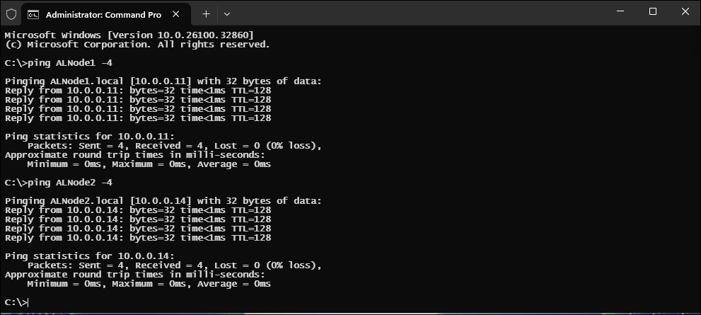

   > **Note:**: If name resolution does not work, add the names of ALNode1 and ALNode2 with their respective IP addresses to the local hosts file. Verify that the hosts are replying. The current Azure Local images allow inbound ICMP connectivity. It is important to confirm that the name resolution works.

#### Step 02: Check WinRM connectivity

1. Start Windows PowerShell ISE and run the following code:

   ```powershell
   $Servers="ALNode1","ALNode2"
   foreach ($Server in $Servers){
       Test-NetConnection -ComputerName $Server -CommonTCPPort WINRM
   }
   ```

   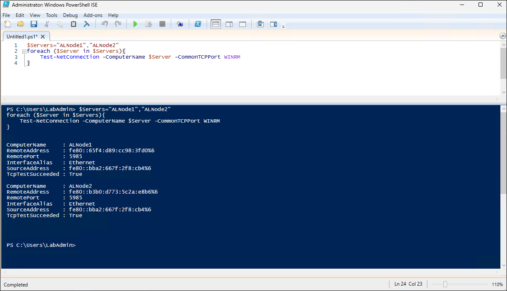

#### Step 03: Connect to servers using WinRM

1. From Windows PowerShell ISE, run the following code:

   ```powershell
   $Servers="ALNode1","ALNode2"
   $UserName="Administrator"
   $Password="Demo@pass12345"
   $SecuredPassword = ConvertTo-SecureString $password -AsPlainText -Force
   $Credentials= New-Object System.Management.Automation.PSCredential ($UserName,$SecuredPassword)

   #Configure trusted hosts to be able to communicate with servers
   $TrustedHosts=@()
   $TrustedHosts+=$Servers
   Set-Item WSMan:\localhost\Client\TrustedHosts -Value $($TrustedHosts -join ',') -Force

   #Send some command to servers
   Invoke-Command -ComputerName $Servers -ScriptBlock {
      Get-NetAdapter
   } -Credential $Credentials
   ```

   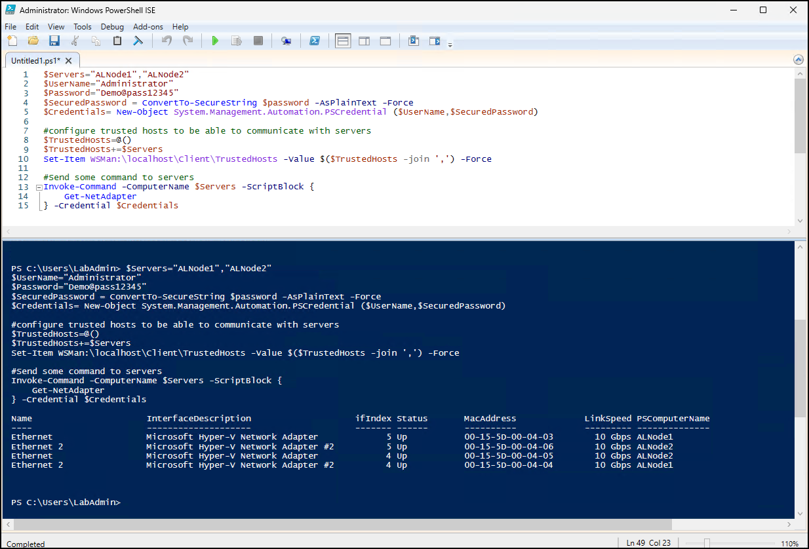

### Task 02: Validate environment by using Environment Checker tool

1. From Windows PowerShell ISE, run the following code:

   ```powershell
   #Validate environment
   $result=Invoke-Command -ComputerName $Servers -Scriptblock {
      Invoke-AzStackHciConnectivityValidation -PassThru
   } -Credential $Credentials

   $result | Out-GridView
   ```
   > **Note:**: Ignore warnings in the output of the output, but ensure that *Status* is listed as *SUCCESS* for all checks. For more information, refer to [Evaluate the deployment readiness of your environment for Azure Local](https://learn.microsoft.com/en-in/azure/azure-local/manage/use-environment-checker?view=azloc-2604&tabs=connectivity)

   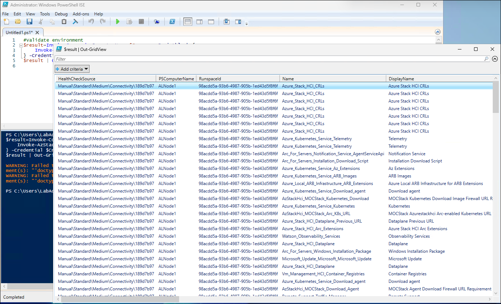

### Task 03: Configure Active Directory prerequisites

1. From Windows PowerShell ISE, run the following code:

   > **Note:**: In the name of the organizational unit and LCM user name, replace the `<xx>` placeholder with the numeric values assigned to the name of the Entra ID user account you are using in this lab. For example, if your user name is `aluser01`, use `01`. 

   ```powershell
   $AsHCIOUName="OU=ALClus<xx>,DC=Corp,DC=contoso,DC=com"
   $LCMUserName="ALClus<xx>-LCMUser"
   $LCMPassword="Demo@pass12345"

   #Create LCM credentials
   $SecuredPassword = ConvertTo-SecureString $LCMPassword -AsPlainText -Force
   $LCMCredentials= New-Object System.Management.Automation.PSCredential ($LCMUserName,$SecuredPassword)

   #create objects for Azure Local in Active Directory
   #install posh module for prestaging Active Directory
   Install-PackageProvider -Name NuGet -Force
   Install-Module AsHciADArtifactsPreCreationTool -Repository PSGallery -Force

   #make sure active directory module and GPMC is installed
   Install-WindowsFeature -Name RSAT-AD-PowerShell,GPMC

   #populate objects
   New-HciAdObjectsPreCreation -AzureStackLCMUserCredential $LCMCredentials -AsHciOUName $AsHCIOUName

   #to check OU (and future cluster) in GUI install management tools
   Install-WindowsFeature -Name "RSAT-ADDS","RSAT-Clustering"
   ```

   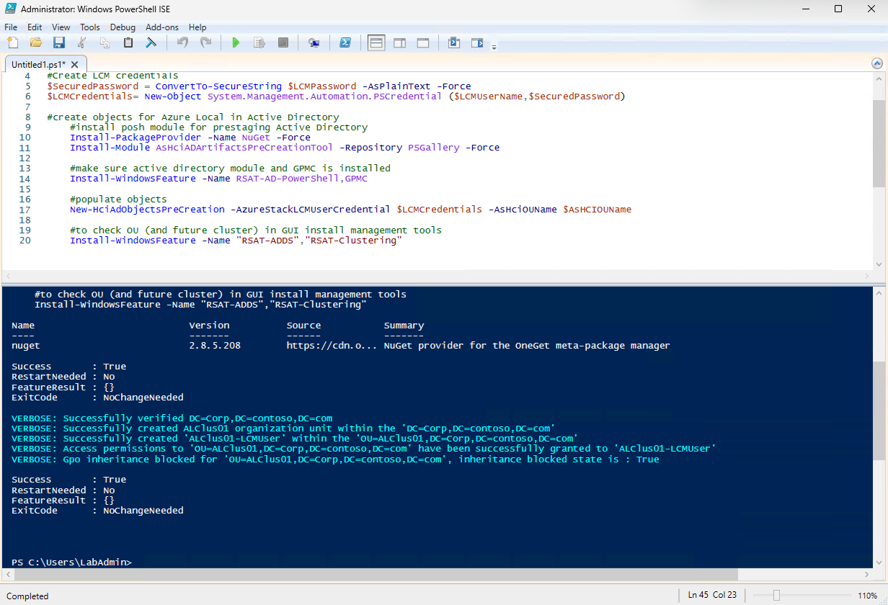

   > **Note:**: The script provisions the LifeCycle Management user account, which will be used to domain join machines and create CAU account.

1. Open the Active Directory Users and Computers console (dsa.msc) to view the newly created Organizational Unit and the LCM user account.

   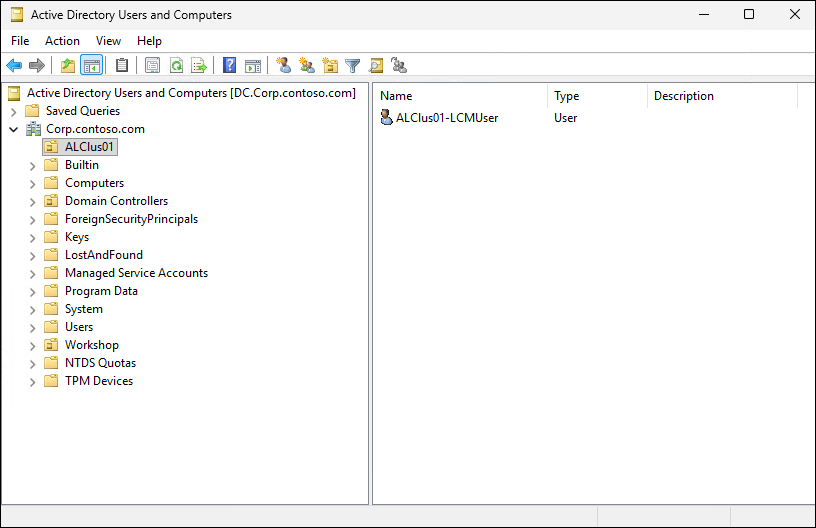

### Task 04: Create Azure resources

1. From Windows PowerShell ISE, run the following code:

   > **Note:**: The following script will use the pre-created Azure resource group that will host Azure Local resources (Arc Gateway is not used in the virtual lab environment)

   > **Note:**: In the value of the `$ResourceGroupName` variable, replace the `<username>` placeholder with the name of the Entra ID user account you are using in this lab.

   > **Note:**: In the name of the gateway replace the `<xx>` placeholder with the numeric values assigned to the name of the Entra ID user account you are using in this lab. For example, if your user name is `aluser01`, use `01`. 

   ```powershell
   $GatewayName="ALClus<xx>-ArcGW"
   $ResourceGroupName="ALClus-<username>"
   $Location="southeastasia"

   #for the list of supported regions, refer to https://learn.microsoft.com/en-us/azure/azure-local/concepts/system-requirements-23h2?view=azloc-2604&viewFallbackFrom=azloc-2507&tabs=azure-public#azure-requirements

   #Authenticate to Azure
   #Download Azure module
   Install-PackageProvider -Name NuGet -MinimumVersion 2.8.5.201 -Force
   if (!(Get-InstalledModule -Name az.accounts -ErrorAction Ignore)){
       Install-Module -Name Az.Accounts -Force 
   }
   #login using device authentication
   Connect-AzAccount -UseDeviceAuthentication

   #Assuming new az.accounts module was used and it asked you what subscription to use - then correct subscription is selected for context
   $Subscription=(Get-AzContext).Subscription

   #install az resources module
       if (!(Get-InstalledModule -Name az.resources -ErrorAction Ignore)){
           Install-Module -Name az.resources -Force
       }

   #create resource group
       if (-not(Get-AzResourceGroup -Name $ResourceGroupName -ErrorAction Ignore)){
           New-AzResourceGroup -Name $ResourceGroupName -Location $Location
       }
   #region (Optional) configure Arc Gateway
   <#
   #install az.arcgateway module
       if (!(Get-InstalledModule -Name az.arcgateway -ErrorAction Ignore)){
           Install-Module -Name az.arcgateway -Force
       }
   #make sure "Microsoft.HybridCompute" is registered (and possibly other RPs)
       Register-AzResourceProvider -ProviderNamespace "Microsoft.HybridCompute"
       Register-AzResourceProvider -ProviderNamespace "Microsoft.GuestConfiguration"
       Register-AzResourceProvider -ProviderNamespace "Microsoft.HybridConnectivity"
       Register-AzResourceProvider -ProviderNamespace "Microsoft.AzureStackHCI"

   #create GW
    if (Get-AzArcGateway -Name $gatewayname -ResourceGroupName $ResourceGroupName -ErrorAction Ignore){
       $ArcGWInfo=Get-AzArcGateway -Name $gatewayname -ResourceGroupName $ResourceGroupName
   }else{
       $ArcGWInfo=New-AzArcGateway -Name $GatewayName -ResourceGroupName $ResourceGroupName -Location $Location -SubscriptionID $Subscription.ID
   }
   #>
   #endregion

   #Generate variables for use in this window
   $SubscriptionID=$Subscription.ID
   $Region=$Location
   $TenantID=$Subscription.TenantID
   $ArcGatewayID=$ArcGWInfo.ID

   #Output variables (so you can just copy it and have powershell code to create variables in another session or you can copy it to WebUI deployment)
   Write-Host -ForegroundColor Cyan @"
      #Variables to copy
      `$SubscriptionID=`"$($Subscription.ID)`"
      `$ResourceGroupName=`"$ResourceGroupName`"
      `$Region=`"$Location`"
      `$TenantID=`"$($subscription.tenantID)`"
      `$ArcGatewayID=`"$(($ArcGWInfo).ID)`"
   "@
   ```

1. When prompted, authenticate using the device authentication flow and, if needed, select the Azure subscription to use for the deployment. Ignore any warnings.

   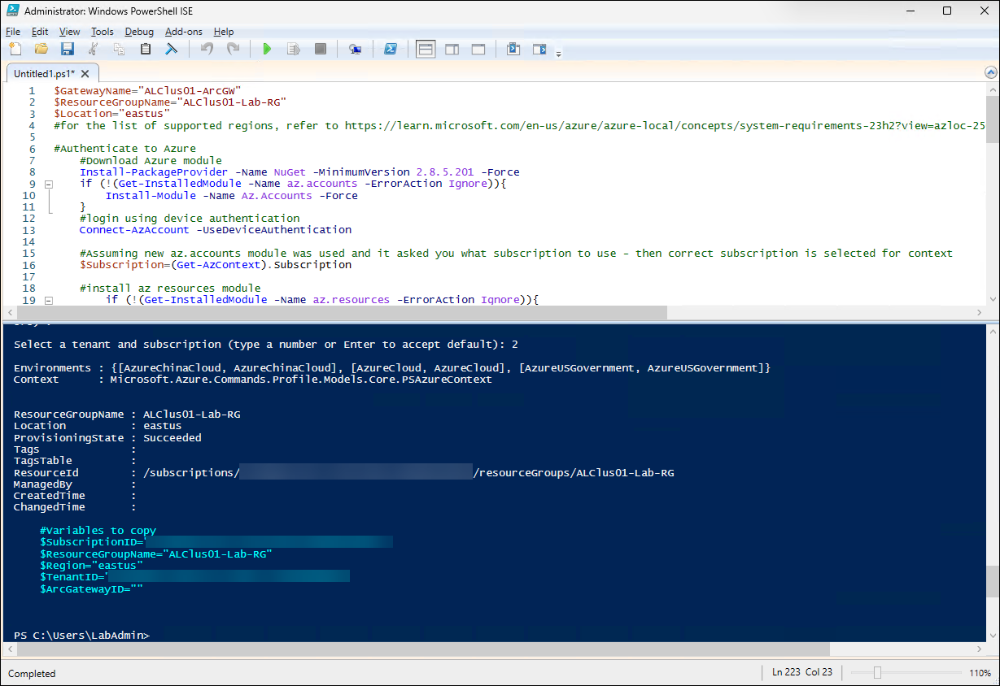
   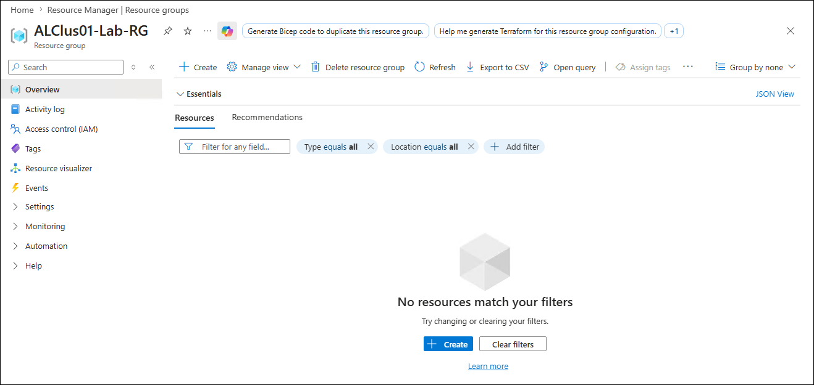

### Task 05: Connect nodes to Azure by using PowerShell

1. From Windows PowerShell ISE, run the following code:

   > **Note:**: For more information, refer to [Assign required permissions for Azure Local deployment](https://learn.microsoft.com/en-us/azure/azure-local/deploy/deployment-arc-register-server-permissions?view=azloc-2604&tabs=powershell)

   ```powershell
   #Make sure resource providers are registered
   Register-AzResourceProvider -ProviderNamespace "Microsoft.AzureArcData"
   Register-AzResourceProvider -ProviderNamespace "Microsoft.HybridCompute"
   Register-AzResourceProvider -ProviderNamespace "Microsoft.GuestConfiguration"
   Register-AzResourceProvider -ProviderNamespace "Microsoft.HybridConnectivity"
   Register-AzResourceProvider -ProviderNamespace "Microsoft.AzureStackHCI"
   Register-AzResourceProvider -ProviderNamespace "Microsoft.Kubernetes"
   Register-AzResourceProvider -ProviderNamespace "Microsoft.KubernetesConfiguration"
   Register-AzResourceProvider -ProviderNamespace "Microsoft.ExtendedLocation"
   Register-AzResourceProvider -ProviderNamespace "Microsoft.ResourceConnector"
   Register-AzResourceProvider -ProviderNamespace "Microsoft.HybridContainerService"
   Register-AzResourceProvider -ProviderNamespace "Microsoft.Attestation"
   Register-AzResourceProvider -ProviderNamespace "Microsoft.Storage"
   Register-AzResourceProvider -ProviderNamespace "Microsoft.Insights"

   #deploy Arc Agent
   $armtoken = (Get-AzAccessToken).Token
   $id = (Get-AzContext).Account.Id
   $Cloud="AzureCloud"

   #check if token is plaintext (older module version outputs plaintext, version 5 outputs secure string)
   # Check if the token is a SecureString
   if ($armtoken -is [System.Security.SecureString]) {
       # Convert SecureString to plaintext
       $armtoken = [System.Runtime.InteropServices.Marshal]::PtrToStringAuto([System.Runtime.InteropServices.Marshal]::SecureStringToBSTR($armtoken))
       Write-Output "Token converted to plaintext."
   }else {
       Write-Output "Token is already plaintext."
   }

   #Register servers (one at a time to avoid timeout issues)

   foreach ($Server in $Servers) {
       Invoke-Command -ComputerName $Server -ScriptBlock {
           Invoke-AzStackHciArcInitialization -SubscriptionID $using:SubscriptionID -ResourceGroup $using:ResourceGroupName -TenantID $using:TenantID -Cloud $using:Cloud -Region $using:Location -ArmAccessToken $using:ARMtoken -AccountID $using:id #-ArcGatewayID $using:ArcGatewayID
       } -Credential $Credentials
   }
   ```

   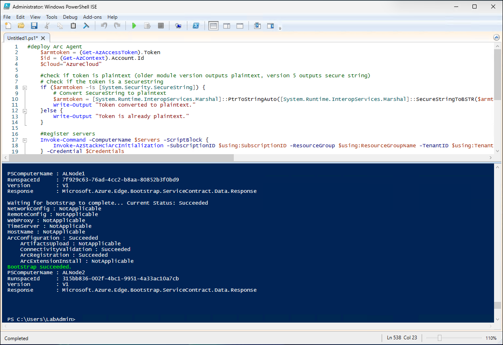
   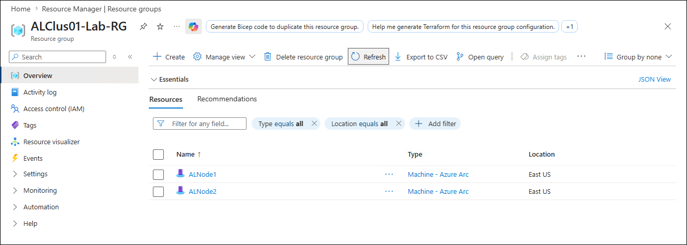

### Task 06: Validate prerequisites

#### Step 01: Validate IP configuration

1. From Windows PowerShell ISE, run the following code:

   > **Note:**: MSLab uses DHCP. The following script will ensure there's just one default gateway and convert DHCP-assigned addresses to static.

   ```powershell
   #region to successfully validate you need make sure there's just one default gateway
   #make sure there is only one management NIC with IP address (setup will complain if there are multiple default gateways)
   Invoke-Command -ComputerName $servers -ScriptBlock {
       Get-NetIPConfiguration | Where-Object IPV4defaultGateway | Get-NetAdapter | Sort-Object Name | Select-Object -Skip 1 | Set-NetIPInterface -Dhcp Disabled
   } -Credential $Credentials
   #endregion

   #region Convert DHCP address to Static (since 2411 there's a check for static IP)
   Invoke-Command -ComputerName $Servers -ScriptBlock {
       $InterfaceAlias=(Get-NetIPAddress -AddressFamily IPv4 | Where-Object {$_.IPAddress -NotLike "169*" -and $_.PrefixOrigin -eq "DHCP"}).InterfaceAlias
       $IPConf=Get-NetIPConfiguration -InterfaceAlias $InterfaceAlias
       $IPAddress=Get-NetIPAddress -AddressFamily IPv4 -InterfaceAlias $InterfaceAlias
       $IP=$IPAddress.IPAddress
       $Index=$IPAddress.InterfaceIndex
       $GW=$IPConf.IPv4DefaultGateway.NextHop
       $Prefix=$IPAddress.PrefixLength
       $DNSServers=@()
       $ipconf.dnsserver | ForEach-Object {if ($_.addressfamily -eq 2){$DNSServers+=$_.ServerAddresses}}
       Set-NetIPInterface -InterfaceIndex $Index -Dhcp Disabled
       New-NetIPAddress -InterfaceIndex $Index -AddressFamily IPv4 -IPAddress $IP -PrefixLength $Prefix -DefaultGateway $GW -ErrorAction SilentlyContinue
       Set-DnsClientServerAddress -InterfaceIndex $index -ServerAddresses $DNSServers
   } -Credential $Credentials
   #endregion
   ```

#### Step 02: Validate time synchronization

1. From Windows PowerShell ISE, run the following code:

   > **Note:**: This script tests if an offset between management machine and any of the servers is greater than 2s and, if so, it configures the domain controller as the NTP server.

   ```powershell
   $NTPServer="DC.corp.contoso.com"

   #test if there is an time offset on servers
   Foreach ($Server in $Servers){
      $localtime=get-date
      $delay=Measure-Command -Expression {
         $remotetime=Invoke-Command -ComputerName $Server -ScriptBlock {get-date} -Credential $Credentials
      }

      $Offset=$localtime-$remotetime+$Delay
      if ([math]::Abs($Offset.Seconds) -gt 10){
         $SyncNeeded=$True
      }else{
         $SyncNeeded=$false
      }
   }

   #if offset is greater than 10 seconds (I pulled this number out of thin air. I guess it should be less than 5 minutes or so), simply configure NTP servers

   If ($SyncNeeded){
      Write-Output "Time offset found, NTP Server needs to be configured."
      #Configure NTP
      Invoke-Command -ComputerName $servers -ScriptBlock {
         w32tm /config /manualpeerlist:$using:NTPServer /syncfromflags=manual /update
         Restart-Service w32time
      } -Credential $Credentials
   }
   ```

### Task 07: Deploy Azure Local from the Azure portal

1. Launch Microsoft Edge, navigate to the Azure portal (https://portal.azure.com), and sign in by using the lab credentials.
1. In the Azure portal, search for **Azure Local**.
1. On the **Azure Arc \| Azure Local** page, on the **Get started** tab, in the **Deploy Azure Local** section, select **Create instance**

   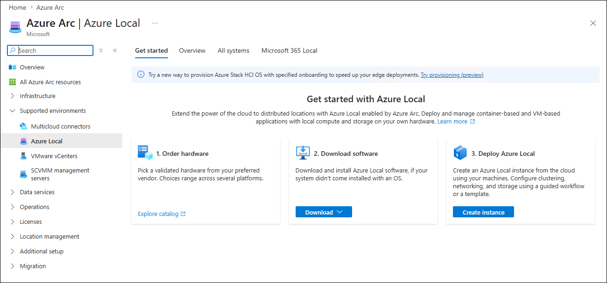

1. On the **Basics** tab of the **Deploy Azure Local** page, specify the following settings (leave others with their default values):

   > **Note:**: In the name of the **Resource group**, replace the **`<username>`** placeholder with the name of the Entra ID user account you are using in this lab.

   > **Note:**: In the cluster instance name, replace the **`<xx>`** placeholder with the numeric values assigned to the name of the Entra ID user account you are using in this lab. For example, if your user name is `aluser01`, use `01`. 

   > **Note:**: In the **Key vault name**, replace the **`<xx>`** and **`_____`** placeholders, respectively, with the numeric values assigned to the name of the Entra ID user account you are using in this lab and any random string of characters or digits to ensure its uniqueness.

   |Setting|Value|
   |---|---|
   |Resource group|**ALClus-`<username>`**|
   |Instance name|**ALClus`<xx>`**|
   |Region|**(Asia Pacific) SouthEast Asia**|
   |Cluster options|**Standard**|
   |Storage options|**Storage Spaces Direct (S2D)**|
   |Identity provider for cluster|**Active Directory**|
   |Select the machines to use and validate|**ALNode1** and **ALNode2**|
   |Key vault|**Create a new Key Vault**|
   |Key vault name|**ALClus`<xx>`-hcikv`_____`**|

   > **Note:** Ensure to adjust the key vault name to be globally unique and select the **Grant Key Vault permission** button.

1. Select **Validate selected machines** once the installation of the extension completes and then select **Next: Configuration**.
1. On the **Configuration** tab, ensure that the **New configuration** option is selected and then select **Next: Networking**.
1. On the **Networking** tab, specify the following settings (leave others with their default values):

   |Setting|Value|
   |---|---|
   |Storage connectivity|**Network switch for storage**|
   |Networking pattern|**Group all traffic**|
   |Network adapter 1|**Ethernet [Microsoft Hyper-V Network Adapter] (10.0.0.1x)**|
   |Storage Network 1 VLAN ID|**711**|
   |Network adapter 2|**Ethernet 2 [Microsoft Hyper-V Network Adapter] (169.254.x.x)**|
   |Storage Network 2 VLAN ID|**712**|

1. Select **Customize network settings**, in the **RDMA protocol** drop-down list, select **Disabled**, and then select **Save**.
1. Ensure that **Nodes and Instance IP assignments** are set to **Manual**. 
1. In the **Allocate IP addresses to the system and services** section, specify the following settings (leave others with their default values):

   |Setting|Value|
   |---|---|
   |Starting IP|**10.0.0.111**|
   |Ending IP|**10.0.0.116**|
   |Subnet mask|**255.255.255.0**|
   |Default Gateway|**10.0.0.1**|
   |DNS Server|**10.0.0.1**|

1. Select **Validate subnet** and then select **Next: Management**.
1. On the **Management** tab, specify the following settings (leave others with their default values):

   > **Note:**: In the custom location name, the name of the organizational unit, and the deployment account user name, the replace the **`<xx>`** placeholder with numeric values assigned to the name of the Entra ID user account you are using in this lab. For example, if your user name is `aluser01`, use `01`. 

   |Setting|Value|
   |---|---|
   |Custom location name|**ALClus`<xx>`**|
   |Azure storage account name|the name of a new storage account with the **Locally-redundant storage (LRS)** redundancy|
   |Domain|**corp.contoso.com**|
   |OU|**OU=ALClus`<xx>`,DC=Corp,DC=contoso,DC=com**|
   |Deployment account username|**ALClus`<xx>`-LCMUser**|
   |Deployment account password|**Demo@pass12345**|
   |Local administrator username|**Administrator**|
   |Local administrator password|**Demo@pass12345**|

1. Select **Next: Security**.
1. On the **Security** tab, select **Customized security settings** and, in the **Settings** section, clear the **Bitlocker for data volumes** checkbox (enabling BitLocker would consume too much disk space).
1. Select **Next: Advanced**.
1. On the **Advanced** tab, ensure that the **Create one workload volume and storage path per machine and one required infrastructure volume per system (Recommended)** option is selected.
1. Select **Next: Tags**.
1. On the **Tags** tab, select **Next: Validation**.

   > **Important:** Do **NOT** navigate away from the **Validation** tab. Doing so will force you to restart the entire process from the beginning.

1. On the **Validation** tab, wait until the validation of all objects listed in the **Resource Creation** section is successfully completed and then select the **Start validation** button.

   > **Note:** Wait for the validation tasks to complete. This might take about 30 minutes.

1. Select **Next: Review + create**.
1. On the **Review + create** tab, review the settings you specified and select **Create**.

   > **Note:** Do not wait for the deployment tasks to complete. This might take about 2.5 hours. You can use the **Refresh** button to monitor the progress of the deployment.
