# Network ATC Deep Dive

## About the lab

In this lab, you will explore Network ATC on Azure Local by using PowerShell to inspect and manage network intents, monitor configuration status, troubleshoot and trace provisioning issues, and apply, adjust, and reset network configuration overrides.

## Prerequisites

* Hydrated MSLab containing an Azure Local deployment 

## The lab

### Preparation

1. From the Hyper-V Manager on the lab VM, start the MSLab-DC.
1. Ensure that the OS on MSLab-DC VM is running and then start the MSLab-Mgmt, MSLab-ALNode1, and MSLab-ALNode2 VMs.
1. Connect to MSLab-Mgmt VM by using Virtual Machine Connection (using Enhanced Session and Full Screen Mode).
1. Sign in by using the following credentials:

   - Username: *CORP\LabAdmin*
   - Password: *Demo@pass12345*

   > **Note:**: You'll be using the same credentials to sign in throughout the workshop.

   > **Note:**: You'll be running all tasks in this lab from the MSLab-Mgmt VM.

### Task 01: Review Network ATC PowerShell cmdlets

1. Start Windows PowerShell ISE and run the following code:

   > **Note:**: Network ATC is available in Windows Server 2025 (which the MSLab-Mgmt VM is running) as an installable feature.

   > **Note:**: In the name of the cluster, replace the `<xx>` placeholder with the numeric value assigned to the name of the Entra ID user account you are using in this lab. For example, if your user name is `aluser01`, use `01`. 

   ```powershell
   #Install the Network ATC feature
   Add-WindowsFeature -Name NetworkATC

   #Once NetATC is installed, PowerShell commands are available
   Get-Command -Module NetworkATC

   #Identify available clusters in the domain
   #First make sure failover clustering PowerShell module is installed
   Add-WindowsFeature -Name RSAT-Clustering-PowerShell

   #And now find S2D enabled clusters
   $Clusters=Get-Cluster -Domain $env:USERDOMAIN | Where-Object S2DEnabled -eq $True
   $Clusters.Name

   #Grab Network ATC intents from the cluster
   $ClusterName="ALClus<xx>"
   Get-NetIntent -ClusterName $ClusterName
   ```

   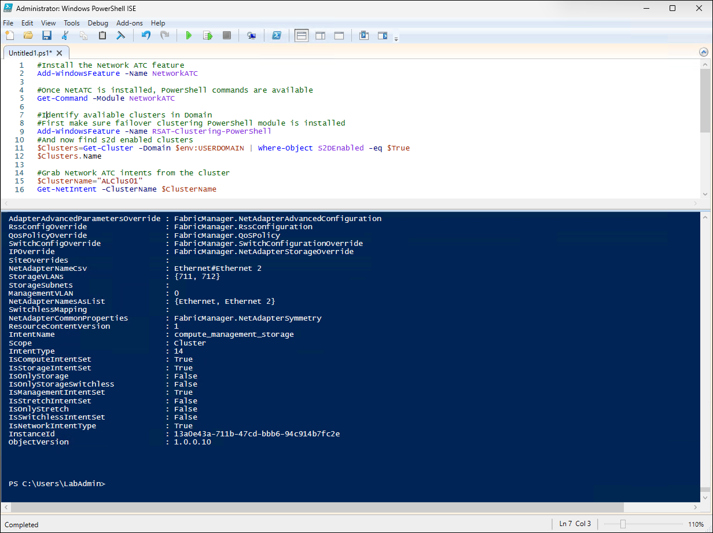


### Task 02: Review Network ATC status and default values

> **Note:**: Network Intent can be two types: Cluster and Server, so you can apply it to individual servers or the entire cluster. There is a corresponding service that applies the configuration and you can learn about its status by using Event Viewer. There are also numerous settings that Network ATC can configure.

> **Note:**: In the name of the cluster, replace the `<xx>` placeholder with the numeric value assigned to the name of the Entra ID user account you are using in this lab. For example, if your user name is `aluser01`, use `01`. 

1. From Windows PowerShell ISE, run the following code:

   ```powershell
   $ClusterName="ALClus<xx>"
   $ClusterNodes=(Get-ClusterNode -Cluster $ClusterName).Name

   #Check the status itself
   Get-NetIntentStatus -ClusterName $ClusterName

   #Check the service on nodes
   get-service -ComputerName $ClusterNodes -Name NetworkATC

   #check what was configured - Global NetIntent
   $NetIntentGlobal=Get-NetIntent -GlobalOverrides -ClusterName $ClusterName
   $NetIntentGlobal
   ```
   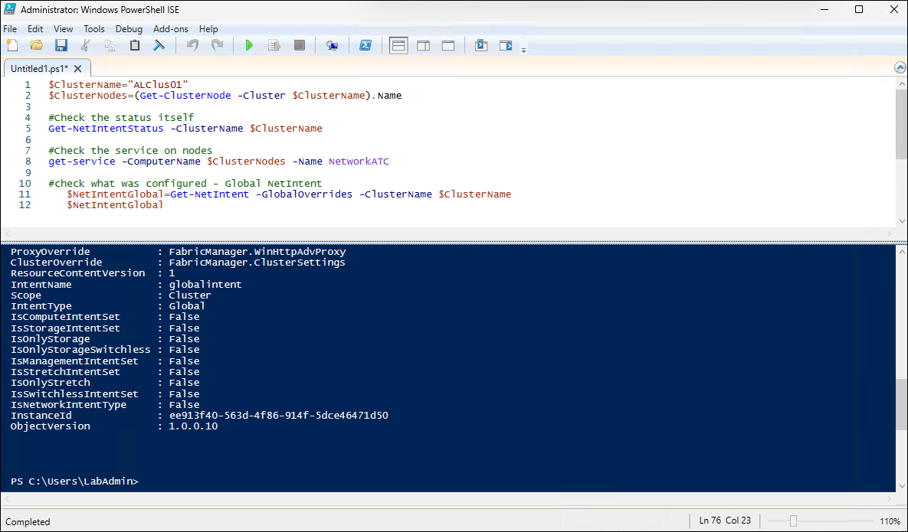

   > **Note:**: `Get-NetIntent -GlobalOverrides -ClusterName $ClusterName` retrieves the cluster-wide (global) Network ATC intent configuration overrides for the specified failover cluster, rather than workload-specific intents like compute, storage, or management.

1. Review the output 

   - ProxyOverride : FabricManager.WinHttpAdvProxy indicates that the cluster is configured to apply a proxy configuration override using the Fabric Manager's WinHTTP advanced proxy settings, meaning HTTP/HTTPS outbound connectivity settings are centrally controlled rather than locally defined on each node.
   - ClusterOverride : FabricManager.ClusterSettings shows that cluster-level configuration parameters are being managed or enforced through Fabric Manager's cluster settings framework, which can override or standardize certain cluster behaviors across nodes.
   - ResourceContentVersion : 1 represents the internal schema or content version of the intent resource, used by the system to ensure compatibility between the stored configuration and the Network ATC engine interpreting it.
   - IntentName : globalintent is the name assigned to this global override intent object, typically used as the default identifier for cluster-wide Network ATC configuration.
   - Scope : Cluster indicates that this intent object applies to the entire failover cluster rather than being limited to a single node, role, or workload type.
   - IntentType : Global confirms that this is a global override configuration object rather than a specific network intent type such as compute, storage, or management intent.
   - IsComputeIntentSet : False means no compute network intent (typically VM or workload traffic separation) has been defined in this configuration.
   - IsStorageIntentSet : False indicates that no storage-specific network intent (such as SMB or Storage Spaces Direct traffic separation) has been configured.
   - IsOnlyStorage : False confirms that the cluster is not operating in a storage-only networking mode where networking is dedicated exclusively to storage traffic.
   - IsOnlyStorageSwitchless : False indicates the cluster is not configured for a switchless storage architecture where nodes are directly connected without traditional switching infrastructure.
   - IsManagementIntentSet : False shows that no dedicated management network intent has been defined for host management traffic separation.
   - IsStretchIntentSet : False means the cluster is not configured as a stretch cluster spanning multiple physical locations for disaster recovery.
   - IsOnlyStretch : False confirms that the cluster is not operating exclusively in stretch-cluster mode.
   - IsSwitchlessIntentSet : False indicates that no switchless networking intent has been defined, meaning standard switched networking is expected.
   - IsNetworkIntentType : False shows that no general network intent configuration has been explicitly defined in this global override object.
   - InstanceId : ee913f40-563d-4f86-914f-5dce46471d50 is the unique GUID identifying this specific global intent object instance within the cluster configuration store.
   - ObjectVersion : 1.0.0.10 represents the version of the intent object itself, used for tracking changes and compatibility across updates to Network ATC or cluster configuration.

1. From Windows PowerShell ISE, run the following code:

   ```powershell
   #Check Proxy settings
   $NetIntentGlobal.ProxyOverride
   #Check Cluster settings
   $NetIntentGlobal.ClusterOverride
   ```
   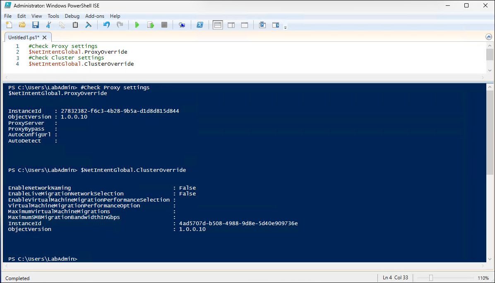

1. Review the output 

   > **Note:**: `$NetIntentGlobal.ProxyOverride` returns the cluster-wide proxy configuration override object defined in Network ATC global intent, which controls how the cluster handles outbound HTTP/HTTPS proxy behavior through centralized settings.

   - ProxyServer is empty, meaning no explicit proxy server address has been configured at the cluster level, so the system is not directing traffic through a defined proxy endpoint.
   - ProxyBypass is empty, indicating there are no specified domains, IP ranges, or addresses configured to bypass proxy usage, which effectively means no proxy exception rules exist.
   - AutoConfigUrl is empty, showing that no automatic proxy configuration script (PAC file) URL has been provided for dynamic proxy assignment.
   - AutoDetect is empty, meaning automatic proxy detection (such as WPAD) is not enabled or configured for this cluster-wide setting.

   > **Note:**: `$NetIntentGlobal.ClusterOverride` returns cluster-level operational behavior overrides managed through Network ATC, which influence how certain cluster networking features behave beyond basic intent definitions.

   - EnableNetworkNaming : False indicates that automatic or standardized network adapter naming conventions enforced by Network ATC are disabled, so NIC names are not being automatically standardized across cluster nodes.
   - EnableLiveMigrationNetworkSelection : False means the cluster is not automatically selecting or enforcing a dedicated network for live migration traffic, leaving that selection either manual or governed by other configuration methods.
   - EnableVirtualMachineMigrationPerformanceSelection is empty, showing that no policy has been defined to automatically optimize or select performance tiers for virtual machine migration traffic.
   - VirtualMachineMigrationPerformanceOption is empty, meaning no specific performance profile (such as bandwidth prioritization or traffic optimization mode) has been configured for live migration workloads.
   - MaximumVirtualMachineMigrations is empty, indicating there is no enforced limit defined here for concurrent virtual machine migrations per node.
   - MaximumSMBMigrationBandwidthInGbps is empty, showing no explicit cap has been configured for SMB-based migration traffic bandwidth at the cluster override level.

1. From Windows PowerShell ISE, run the following code:

   ```powershell
   #check Cluster Network Names
   Get-ClusterNetwork -Cluster $ClusterName
   #check Live Migration Networks (what networks are excluded)
   Get-ClusterResourceType -Cluster $clustername -Name "Virtual Machine" | Get-ClusterParameter -Name MigrationExcludeNetworks | Format-Table  @{Label="Name"; Expression={(Get-ClusterNetwork -Cluster $ClusterName | Where-Object ID -eq $_.Value)}}
   #check "UseAnyNetworkForMigration" setting
   get-vmhost -CimSession $ClusterNodes | Select Name,UseAnyNetworkForMigration
   #check LiveMigration performance setting
   get-vmhost -CimSession $ClusterNodes | Select-Object Name,VirtualMachineMigrationPerformanceOption
   #check number of live migrations
   get-vmhost -CimSession $ClusterNodes | Select Name,MaximumVirtualMachineMigrations
   #check SMB Bandwidth limit
   Get-SmbBandwidthLimit -Category LiveMigration -CimSession $ClusterNodes
   ```
1. Review the output 

   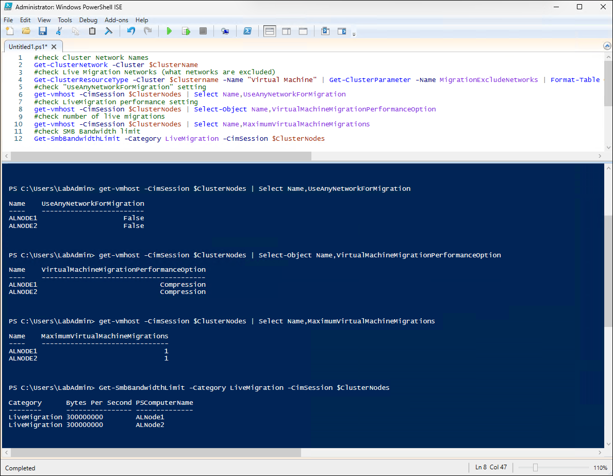

   - `Get-ClusterNetwork -Cluster $ClusterName` lists all cluster networks and their configuration; in this case, Cluster Network 1 is Up with role ClusterAndClient and a metric of 70240, while Cluster Networks 2 and 3 are Up with role Cluster only and metrics 30240 and 30241, showing how the cluster prioritizes and separates network usage.
   - `Get-ClusterResourceType -Cluster $clustername -Name "Virtual Machine" | Get-ClusterParameter -Name MigrationExcludeNetworks | Format-Table @{Label="Name"; Expression={(Get-ClusterNetwork -Cluster $ClusterName | Where-Object ID -eq $_.Value)}}` checks which cluster networks are excluded from live migration; the output is empty, meaning no networks are excluded and all cluster networks are available for migration traffic.
   - `Get-VMHost -CimSession $ClusterNodes | Select Name,UseAnyNetworkForMigration` checks whether Hyper-V hosts can use any available network for live migration; both ALNODE1 and ALNODE2 are set to False, meaning migrations are restricted to explicitly configured migration networks.
   - `Get-VMHost -CimSession $ClusterNodes | Select-Object Name,VirtualMachineMigrationPerformanceOption` shows the live migration performance mode; both ALNODE1 and ALNODE2 are configured to use Compression, meaning migration traffic is optimized through compression.
   - `Get-VMHost -CimSession $ClusterNodes | Select Name,MaximumVirtualMachineMigrations` shows the maximum number of concurrent live migrations allowed per host; both ALNODE1 and ALNODE2 are set to 1, limiting each node to a single active migration at a time.
   - `Get-SmbBandwidthLimit -Category LiveMigration -CimSession $ClusterNodes` displays SMB bandwidth limits for live migration traffic; both nodes are capped at 300000000 bytes per second (around 300 Mbps) to control migration bandwidth usage.

1. From Windows PowerShell ISE, run the following code:

   ```powershell
   #check what was configured - NetIntent
   $NetIntent=Get-NetIntent -ClusterName $ClusterName
   #Global settings
   $NetIntent
   ```
1. Review the output 

   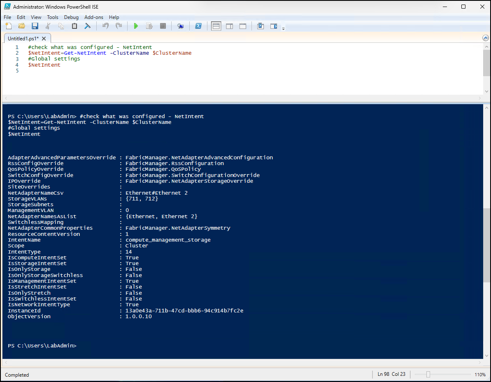

   - `Get-NetIntent -ClusterName $ClusterName` retrieves the Network ATC intents configured for the cluster, showing how networking for compute, management, and storage traffic is intended to be automatically configured and enforced.
   - AdapterAdvancedParametersOverride : FabricManager.NetAdapterAdvancedConfiguration indicates that advanced NIC settings are centrally managed through Fabric Manager policies.
   - RssConfigOverride : FabricManager.RssConfiguration shows that Receive Side Scaling (RSS) settings are being automatically configured for the adapters in this intent.
   - QosPolicyOverride : FabricManager.QoSPolicy indicates that QoS policies for traffic prioritization and bandwidth management are applied through Network ATC.
   - SwitchConfigOverride : FabricManager.SwitchConfigurationOverride means virtual switch configuration settings are centrally controlled by the intent.
   - IPOverride : FabricManager.NetAdapterStorageOverride shows that storage adapter IP-related settings are managed through Fabric Manager overrides.
   - NetAdapterNameCsv : Ethernet#Ethernet 2 and NetAdapterNamesAsList : {Ethernet, Ethernet 2} identify the two physical adapters included in this intent configuration.
   - StorageVLANs : {711, 712} indicates that VLANs 711 and 712 are assigned for storage traffic segmentation.
   - ManagementVLAN : 0 means no dedicated management VLAN is configured and untagged traffic is used for management communication.
   - IntentName : compute_management_storage identifies this as a combined intent handling compute, management, and storage networking together.
   - IntentType : 14 represents the internal enumeration value corresponding to the combined network intent type configured here.
   - IsComputeIntentSet : True, IsStorageIntentSet : True, and IsManagementIntentSet : True confirm that compute, storage, and management network intents are all enabled in this configuration.
   - IsOnlyStorage : False, IsOnlyStorageSwitchless : False, IsStretchIntentSet : False, IsOnlyStretch : False, and IsSwitchlessIntentSet : False indicate that this is not a storage-only, stretch-cluster, or switchless networking deployment.
   - IsNetworkIntentType : True confirms that this object represents an active network intent configuration rather than only a global override object.

   > **Note:**: `Get-NetIntent -ClusterName $ClusterName` retrieves the real network intent configurations applied to adapters and traffic types, defining how compute, management, and storage networking should be configured, including VLANs, QoS, RSS, switch settings, and which physical adapters participate in the intent. This is in contrast to `Get-NetIntent -GlobalOverrides -ClusterName $ClusterName`, which retrieves cluster-wide override settings that affect general Network ATC behavior, such as proxy configuration, migration policies, and cluster-level operational settings, but does not define actual workload networking. 

1. From Windows PowerShell ISE, run the following code:

   ```powershell
   #NetAdapters
   Get-VMSwitch -CimSession $ClusterNodes | Format-Table Name,ComputerName,@{
      Label="NetAdapters"
      Expression=
      {
          $AdapterDescriptions=$_.NetAdapterInterfaceDescriptions 
          Foreach($AdapterDescription in $AdapterDescriptions){
              (Get-NetAdapter -CimSession $_.ComputerName | Where-Object InterfaceDescription -eq $AdapterDescription).Name
         }
      }
   }

   #StorageVLANs
      Get-VMNetworkAdapterIsolation -CimSession $ClusterNodes -ManagementOS | Where-Object ParentAdapter -like *vSMB* | Select-Object ComputerName,DefaultIsolationID
   ```

1. Review the output 

   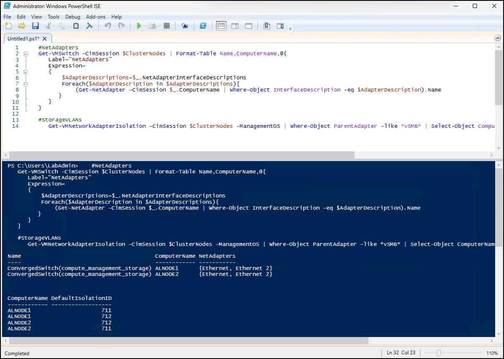

   - `Get-VMSwitch -CimSession $ClusterNodes | Format-Table Name,ComputerName,@{ Label="NetAdapters"; Expression={...}}` retrieves the Hyper-V virtual switches on each cluster node and maps them to their underlying physical adapters; both ALNODE1 and ALNODE2 have a converged virtual switch named ConvergedSwitch(compute_management_storage) built on the physical adapters Ethernet and Ethernet 2, confirming that the same converged networking configuration exists on both hosts.
   - `Get-VMNetworkAdapterIsolation -CimSession $ClusterNodes -ManagementOS | Where-Object ParentAdapter -like *vSMB* | Select-Object ComputerName,DefaultIsolationID` retrieves VLAN isolation settings for management OS vSMB adapters used for storage traffic; the output shows that both ALNODE1 and ALNODE2 are configured to use storage VLANs 711 and 712, matching the storage VLAN configuration defined in the Network ATC intent.

1. From Windows PowerShell ISE, run the following code:

   ```powershell
   #Common Properties
   $netintent.NetAdapterCommonProperties
   #LinkSpeed
   get-netadapter -CimSession $ClusterNodes | Select Name,Linkspeed
   #ComponentID
   get-netadapter -CimSession $ClusterNodes | Select Name,ComponentID
   ```
1. Review the output 

   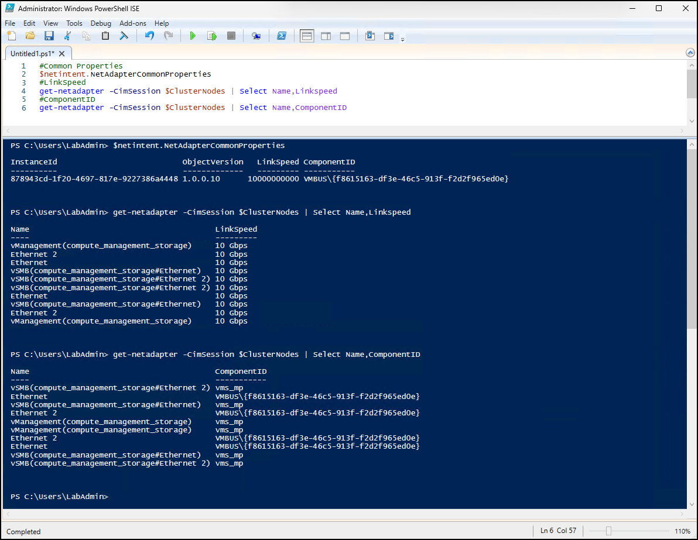

   - `$NetIntent.NetAdapterCommonProperties` displays the common physical adapter properties enforced by the Network ATC intent; the output shows a required link speed of 10000000000 (10 Gbps) and a shared ComponentID of VMBUS\{f8615163-df3e-46c5-913f-f2d2f965ed0e}, indicating the intent expects identical 10 Gb virtualized adapters across participating nodes.
   - `Get-NetAdapter -CimSession $ClusterNodes | Select Name,LinkSpeed` lists adapter link speeds on all cluster nodes; all physical adapters (Ethernet, Ethernet 2) and virtual adapters (vManagement and vSMB) are operating at 10 Gbps, confirming consistent network speed across the converged configuration.
   - `Get-NetAdapter -CimSession $ClusterNodes | Select Name,ComponentID` shows the adapter driver or component type; the physical adapters use the Hyper-V virtual bus component ID VMBUS\{f8615163-df3e-46c5-913f-f2d2f965ed0e}, while the vManagement and vSMB adapters use vms_mp, identifying them as Hyper-V virtual switch-based adapters.

1. From Windows PowerShell ISE, run the following code:

   ```powershell
   #AdapterAdvancedProperty
   $netintent.AdapterAdvancedParametersOverride
   ```

1. Review the output

   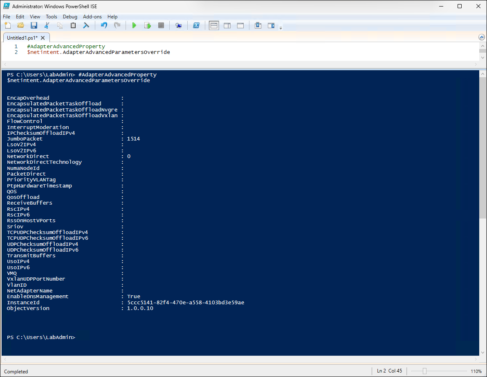

   - `$netintent.AdapterAdvancedParametersOverride` returns the Network ATC-defined overrides for advanced network adapter settings applied as part of the intent configuration.
   - JumboPacket : 1514 sets the MTU behavior for the network adapters, indicating standard Ethernet frame size with no jumbo frames enabled beyond the default value.
   - NetworkDirect : 0 disables Network Direct (RDMA-related functionality) at the adapter configuration level within this intent.
   - EnableDnsManagement : True enables automatic DNS management for the network adapters under this intent, allowing Network ATC to control DNS-related configuration.

   > **Note:**: You could use `Get-NetAdapterAdvancedProperty -CimSession $ClusterNodes | Sort-Object Name,DisplayName` to list all advanced properties of network adapters.

1. From Windows PowerShell ISE, run the following code:

   ```powershell
   #RssConfig
   $NetIntent.RssConfigOverride
   #QoS Policy
   $NetIntent.QosPolicyOverride
   #Priorities and NetDirectPortMatchCondition
   Get-NetQosPolicy -CimSession $ClusterNodes | Select PSComputerName,Name,PriorityValue,NetDirectPort
   #Bandwidth Percentages
   Get-NetAdapterQos -CimSession $ClusterNodes
   #SwitchConfig
   $netIntent.SwitchConfigOverride
   ```

   > **Note:**: You could use `Get-NetAdapterRss -CimSession $ClusterNodes` to retrieve the Receive Side Scaling (RSS) configuration and processor distribution settings for all network adapters on the cluster nodes.

1. Review the output 

   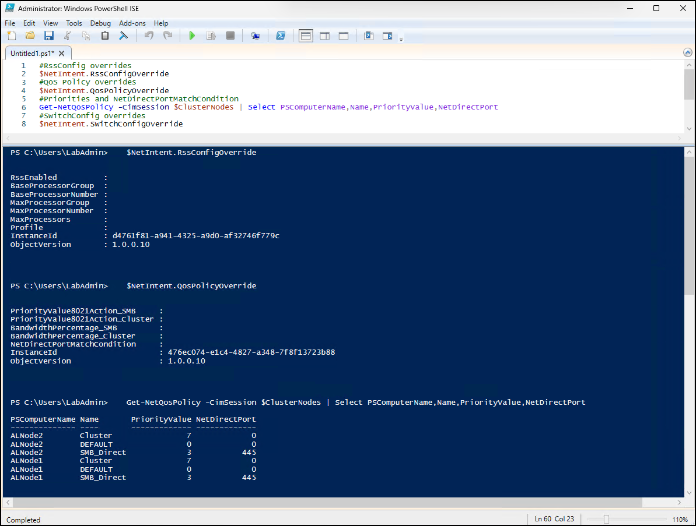

   - `$NetIntent.RssConfigOverride` displays RSS (Receive Side Scaling) override settings defined by the Network ATC intent; all operational RSS parameters are unset, meaning no custom RSS tuning is being enforced through the intent and default adapter behavior is being used.
   - `$NetIntent.QosPolicyOverride` shows QoS override settings configured through the intent; all QoS-specific parameters are unset, indicating that no custom bandwidth percentages, SMB priorities, or NetDirect port conditions are explicitly defined in the override object.
   - `Get-NetQosPolicy -CimSession $ClusterNodes | Select PSComputerName,Name,PriorityValue,NetDirectPort` lists the active QoS policies on each node; both hosts have a Cluster policy with priority 7, a DEFAULT policy with priority 0, and an SMB_Direct policy with priority 3 on port 445, showing that standard cluster and SMB traffic prioritization policies are active.
   - `$NetIntent.SwitchConfigOverride` displays Hyper-V virtual switch override settings defined by the intent; all switch tuning parameters are unset, meaning no custom switch-level overrides such as SR-IOV, embedded teaming, or load balancing adjustments are explicitly configured.

1. From Windows PowerShell ISE, run the following code:

   ```powershell
   #RSC Settings
   Get-VMSwitch -CimSession $ClusterNodes | Select Name,ComputerName,SoftwareRscEnabled
   #Vrss settings
   Get-VMSwitch -CimSession $ClusterNodes | Select Name,ComputerName,*Vrss*
   #IOV
   Get-VMSwitch -CimSession $ClusterNodes | Select Name,ComputerName,*Iov*
   #embedded teaming/Loadbalancing
   Get-VMSwitchTeam -CimSession $ClusterNodes 
   ```
1. Review the output 

   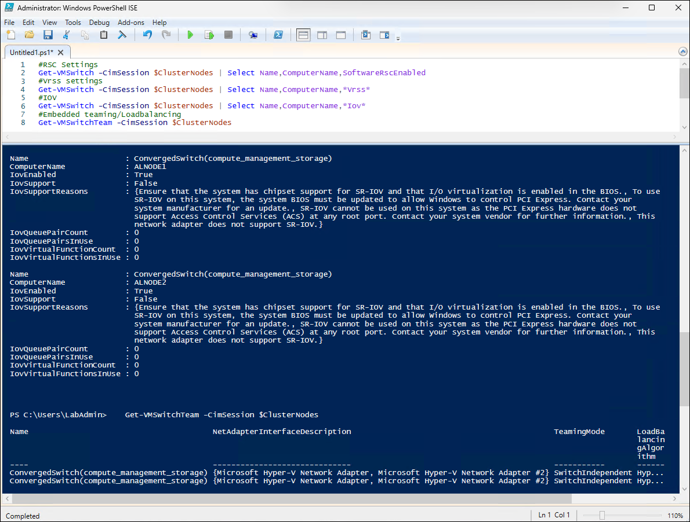

   - `Get-VMSwitch -CimSession $ClusterNodes | Select Name,ComputerName,SoftwareRscEnabled` shows that Software RSC (Receive Segment Coalescing) is enabled on the converged virtual switch on both cluster nodes.
   - `Get-VMSwitch -CimSession $ClusterNodes | Select Name,ComputerName,*Vrss*` displays vRSS (Virtual Receive Side Scaling) configuration and status for the converged switch; vRSS is requested with static settings, but the active values show it is not currently enabled and dynamic scheduling is in effect.
   - `Get-VMSwitch -CimSession $ClusterNodes | Select Name,ComputerName,*Iov*` retrieves SR-IOV configuration and capability information for the converged switch; SR-IOV is enabled in configuration but unsupported by the hardware and platform, so no virtual functions or queue pairs are active.
   - `Get-VMSwitchTeam -CimSession $ClusterNodes` displays the NIC teaming configuration for the converged switch; both nodes use SwitchIndependent teaming mode with two Hyper-V network adapters participating in the team.

### Task 03: Troubleshoot Network ATC

> **Note:**: The provided code is used to validate and troubleshoot Network ATC configuration by confirming that the required clustering and Network ATC components are installed, checking intent deployment status across nodes, verifying that the NetworkATC service is running, and displaying operational and administrative event logs for analysis of the ATC-related behavior. It also collects and exports the full desired state of all network intents in the cluster by using the `Get-NetIntentAllGoalStates` cmdlet, which provides the intended final configuration Network ATC is trying to apply across networking components.

1. From Windows PowerShell ISE, run the following code:

   > **Note:**: In the name of the cluster, replace the `<xx>` placeholder with the numeric value assigned to the name of the Entra ID user account you are using in this lab. For example, if your user name is `aluser01`, use `01`. 

   ```powershell
   $ClusterName="ALClus<xx>"

   #make sure failover clustering powershell and NetworkATC is installed and grab nodes
   Install-WindowsFeature -Name RSAT-Clustering-PowerShell,NetworkATC
   $ClusterNodes=(Get-ClusterNode -Cluster $ClusterName).Name

   #Check the status itself
   Get-NetIntentStatus -ClusterName $ClusterName

   #Check the service on nodes
   get-service -ComputerName $ClusterNodes -Name NetworkATC

   #Check event log https://learn.microsoft.com/en-us/powershell/scripting/samples/creating-get-winevent-queries-with-filterhashtable?view=powershell-7.6
   #You can list logs with following command
   #get-winevent -ListLog * -ComputerName $ClusterNodes[0]
   Invoke-command -ComputerName $ClusterNodes -ScriptBlock {Get-WinEvent -FilterHashtable @{LogName="Microsoft-Windows-Networking-NetworkAtc/Operational"}  -MaxEvents 100 }| Select TimeCreated,Level,Message,LogName,PSComputerName | Out-Gridview -Title "NetATC Operational"
   Invoke-command -ComputerName $ClusterNodes -ScriptBlock {Get-WinEvent -FilterHashtable @{LogName="Microsoft-Windows-Networking-NetworkAtc/Admin"}  -MaxEvents 100 }| Select TimeCreated,Level,Message,LogName,PSComputerName | Out-Gridview -Title "NetATC Admin"

   #displaying all settings
   $allgoalstates=Get-NetIntentAllGoalStates -ClusterName $ClusterName
   $allgoalstates.Values | ConvertTo-Json -Depth 4
   ```

1. Review the output

   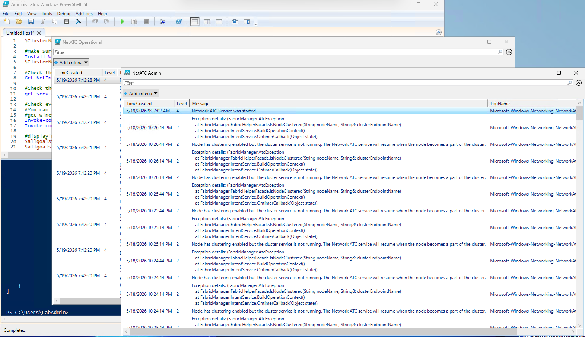

### Task 04: Troubleshoot Network ATC (advanced tracing)

> **Note:**: The provided code is meant to diagnose and debug Network ATC intent deployment issues on a specific cluster node by enabling detailed tracing, forcing a retry of a storage-related intent, and collecting the resulting trace logs for analysis. It starts Network ATC tracing on ALNode1, identifies the storage intent applied in the cluster, and triggers a retry state for that intent on the selected node to reproduce and capture configuration behavior. After a short wait, tracing is stopped and the generated ETL trace is converted into a readable text format using netsh, then retrieved locally.

1. From Windows PowerShell ISE, run the following code:

   > **Note:**: In the name of the cluster, replace the `<xx>` placeholder with the numeric value assigned to the name of the Entra ID user account you are using in this lab. For example, if your user name is `aluser01`, use `01`. 

   ```powershell
   $ClusterName="ALClus<xx>"
   $ComputerName="ALNode1"

   #start trace
   Set-NetIntentTracing -ComputerName $ComputerName

   #Grab Intent
   $IntentName=(Get-NetIntent -ClusterName $ClusterName | Where-Object IsStorageIntentSet).IntentName

   #set RetryState for first node
   Set-NetIntentRetryState -ClusterName $ClusterName -NodeName $ComputerName -Name $intentname
   #start sleep a bit
   Start-Sleep 10

   #Stop trace
   Set-NetIntentTracing -ComputerName $ComputerName -StopTracing

   #Convert to text
   Invoke-Command -ComputerName $ComputerName -ScriptBlock {netsh trace convert C:\Windows\NetworkAtcTrace.etl}
   #Grab text
   Invoke-Command -ComputerName $ComputerName -ScriptBlock {Get-Content C:\Windows\NetworkAtcTrace.txt}
   #or simply copy item locally
   Copy-Item -Path \\$ComputerName\C$\Windows\NetworkAtcTrace.txt -Destination $env:userprofile\Downloads\NetworkATCTrace_"$ComputerName".txt
   ```
1. Review the output

   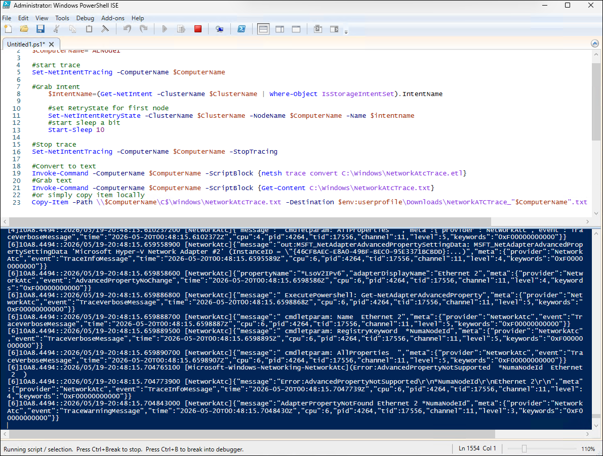

### Task 05: Adjust intents using overrides

> **Note:**: The provided code modifies and validates Network ATC intent configuration for the cluster by first creating and applying global overrides that adjust live migration behavior, specifically setting the maximum SMB migration bandwidth to 20 Gbps and allowing up to 4 concurrent virtual machine migrations, then applying storage intent changes including updating storage VLANs to 713 and 714 and enforcing a jumbo frame MTU size of 9014 bytes via adapter property overrides. It then waits for the Network ATC intent engine to finish provisioning or retrying until the configuration reaches a stable state, after which it re-queries the intent to confirm the applied settings and reviews the adapter-level advanced parameters, and finally collects recent Network ATC administrative event logs from all cluster nodes for validation and troubleshooting of the configuration changes.

1. From Windows PowerShell ISE, run the following code:

   > **Note:**: In the name of the cluster, replace the `<xx>` placeholder with the numeric value assigned to the name of the Entra ID user account you are using in this lab. For example, if your user name is `aluser01`, use `01`. 

   ```powershell
   $ClusterName="ALClus<xx>"
   $ClusterNodes=(Get-ClusterNode -Cluster $ClusterName).Name

   #Adjusting Global Overrides
   #to adjust LM settings you need to apply global override
   $override=New-NetIntentGlobalClusterOverrides
   $override
   $override.MaximumSMBMigrationBandwidthInGbps=20
   $override.MaximumVirtualMachineMigrations=4
   Set-NetIntent -GlobalClusterOverrides $override -ClusterName $ClusterName
   #check net intent
   Get-NetIntent -GlobalOverrides -ClusterName $ClusterName

   #adjusting storage intent
   $IntentName=(Get-NetIntent -ClusterName $ClusterName | Where-Object IsStorageIntentSet).IntentName
   #adjust Storage VLANs
   Set-NetIntent -Name $IntentName -ClusterName $ClusterName -StorageVlans 713,714
   #adjust AdapterAdvanced property - MTU Size 
   $override=New-NetIntentAdapterPropertyOverrides
   $override.JumboPacket=9014
   #disable RDMA (required for a virtual lab)
   $override.NetworkDirect=0
   Set-NetIntent -Name $IntentName -ClusterName $ClusterName -AdapterPropertyOverrides $override

   #wait intent to finish applying
   Write-Output "waiting for intent"
   do {
       Write-Host "." -NoNewline
       Start-Sleep 5
       $status=Get-NetIntentStatus -ClusterName $ClusterName
   } while ($status.ConfigurationStatus -contains "Provisioning" -or $status.ConfigurationStatus -contains "Retrying")

   #check the settings
   Get-NetIntent -ClusterName $ClusterName
   (Get-NetIntent -ClusterName $ClusterName).AdapterAdvancedParametersOverride

   #check the provisioning status
   Get-NetIntentStatus -ClusterName $ClusterName

   #check log
   Invoke-command -ComputerName $ClusterNodes -ScriptBlock {Get-WinEvent -FilterHashtable @{LogName="Microsoft-Windows-Networking-NetworkAtc/Admin"}  -MaxEvents 100 }| Select TimeCreated,Level,Message,LogName,PSComputerName | Out-Gridview -Title "NetATC Admin"
   ```
1. Review the output

   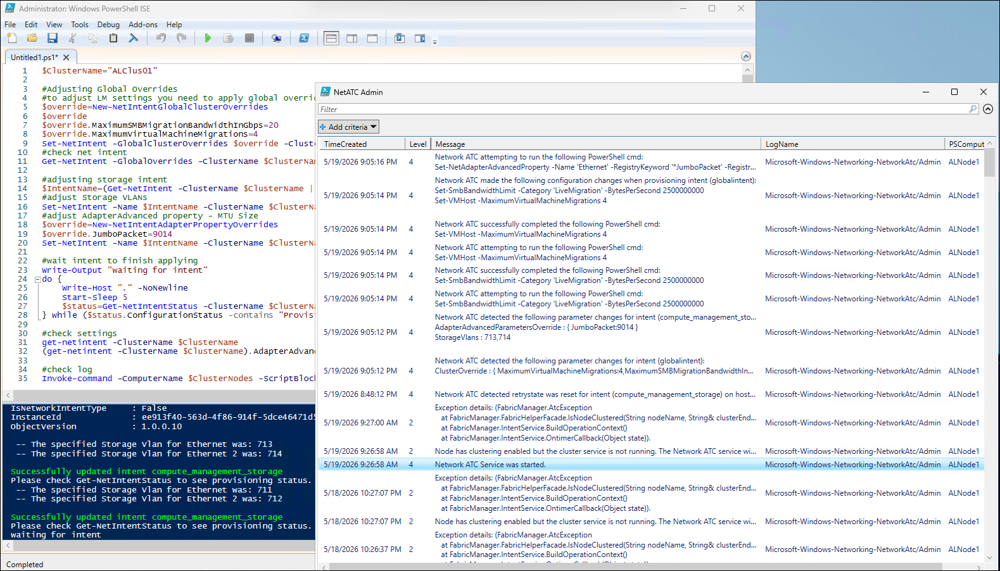

   > **Note:**: To identify the new values of the maximum SMB migration bandwidth and concurrent virtual machine migrations, you can run the following commands:
   - `Get-SmbBandwidthLimit -Category LiveMigration -CimSession $ClusterNodes`
   - `Get-VMHost -CimSession $ClusterNodes | Select Name,MaximumVirtualMachineMigrations`

### Task 06: Review Network ATC functionality in Windows Admin Center

1. Start Microsoft Edge and navigate to [Windows Admin Center download page](https://www.microsoft.com/en-us/evalcenter/download-windows-admin-center).
1. Download and install Windows Admin Center download with the following settings: 

   |Setting|Value|
   |---|---|
   |Installation mode|**Custom setup**|
   |Network access|**Remote access**|
   |Login Authentication/Authorization Selection|**HTML Form Login**|
   |Port Numbers|**8443**|
   |Select TLS certificate|**Generate a self-signed certificate (expires in 60 days**|
   |Fully qualified domain name|**Mgmt.Corp.contoso.com**|
   |Trusted Hosts|**Allow access to any computer**|
   |WinRM over HTTPS|**HTTP. Default communication mechanism**|
   |Automatic updates|**Install updates automatically (recommended)**|
   |Send diagnostic data to Microsoft|**Required diagnostic data**|

1. Connect to Windows Admin Center in Microsoft Edge via https://mgmt.corp.contoso.com:8443.

   > **Note:**: Due to the use of self-signed certificate, you'll need to ignore the message *Your connection isn't private*, switch to the *Advanced settings* and select the link *Continue to mgmt.corp.contoso.com (unsafe)*.

1. When prompted to sign in to Windows Admin Center, authenticate by using the following credentials:

   - Username: *CORP\LabAdmin*
   - Password: *Demo@pass12345*

1. From the Windows Admin Center landing page, select **+ Add** followed by **+ Add manually**. 
1. In the **Add or create resources** pane, in the **Server clusters** section, select **Add**.
1. On the **Add cluster** tab, in the **Cluster name** text box, enter **ALClus`<xx>`.corp.contoso.com** (in the name of the cluster, replace the **`<xx>`** placeholder with the numeric value assigned to the name of the Entra ID user account you are using in this lab) and select **Add**.
1. Back on the Windows Admin Center landing page, select the **alclus`<xx>`.corp.contoso.com** link (where the **`<xx>`** represents the numeric value assigned to the name of the Entra ID user account you are using in this lab).
1. In the vertical menu on the left side, select **Network ATC intents**.
1. Review the configuration of the **compute_management_storage** intent.
1. In the vertical menu on the left side, select **Network ATC cluster settings**.
1. Note the values of the **Maximum virtual machine migrations** (set to 4) and **Maximum SMB migration bandwidth in Gbps** (set to 20).

### Task 07: Revert Network ATC settings

> **Note:**: The provided code reverts previously applied override settings. It retrieves the cluster nodes and the existing storage intent, then explicitly resets adapter property overrides by setting JumboPacket to 1514. It also re-applies the storage intent with specific VLANs (711 and 712). In addition, it resets global cluster overrides by removing any SMB migration bandwidth cap (setting it to $null) and limiting live migrations to a single concurrent operation. The script then applies these reverted intent settings, waits until the configuration is fully provisioned (exiting when status is no longer "Provisioning" or "Retrying"), and finally validates the resulting state by querying intent status, adapter overrides, VLAN assignments, VM host migration limits, and SMB bandwidth limits across the cluster nodes.

1. From Windows PowerShell ISE, run the following code:

   > **Note:**: In the name of the cluster, replace the `<xx>` placeholder with the numeric value assigned to the name of the Entra ID user account you are using in this lab. For example, if your user name is `aluser01`, use `01`. 

   ```powershell
   $ClusterName="ALClus<xx>"
   $ClusterNodes=(Get-ClusterNode -Cluster $ClusterName).Name

   $IntentName=(Get-NetIntent -ClusterName $ClusterName | Where-Object IsStorageIntentSet).IntentName

   $override=New-NetIntentAdapterPropertyOverrides
   #Set the values to replace the previous ones
   $override.JumboPacket=1514
   $override.NetworkDirect=0
   Set-NetIntent -Name $IntentName -ClusterName $ClusterName -AdapterPropertyOverrides $override
   Set-NetIntent -Name $IntentName -ClusterName $ClusterName -StorageVlans 711,712

   $override = New-NetIntentGlobalClusterOverrides
   #Set the values to replace the previous ones
   $override.MaximumSMBMigrationBandwidthInGbps = $null
   $override.MaximumVirtualMachineMigrations = 1
   Set-NetIntent -ClusterName $ClusterName -GlobalClusterOverrides $override 

   #wait intent to finish applying
   Write-Output "waiting for intent"
   do {
      Write-Host "." -NoNewline
      Start-Sleep 5
      $status=Get-NetIntentStatus -ClusterName $ClusterName
   } while ($status.ConfigurationStatus -contains "Provisioning" -or $status.ConfigurationStatus -contains "Retrying")

   #check settings
   Get-NetIntentStatus -ClusterName $ClusterName
   Get-NetIntent -ClusterName $ClusterName
   ((Get-NetIntent -ClusterName $ClusterName).AdapterAdvancedParametersOverride).JumboPacket
   (Get-NetIntent -ClusterName $ClusterName | Where-Object IsStorageIntentSet).StorageVLANs | Select-Object @{Name="Storage VLANs"; Expression={$_}} 
   Get-VMHost -CimSession $ClusterNodes | Select Name,MaximumVirtualMachineMigrations
   Get-SmbBandwidthLimit -Category LiveMigration -CimSession $ClusterNodes
   ```

1. Review the output

   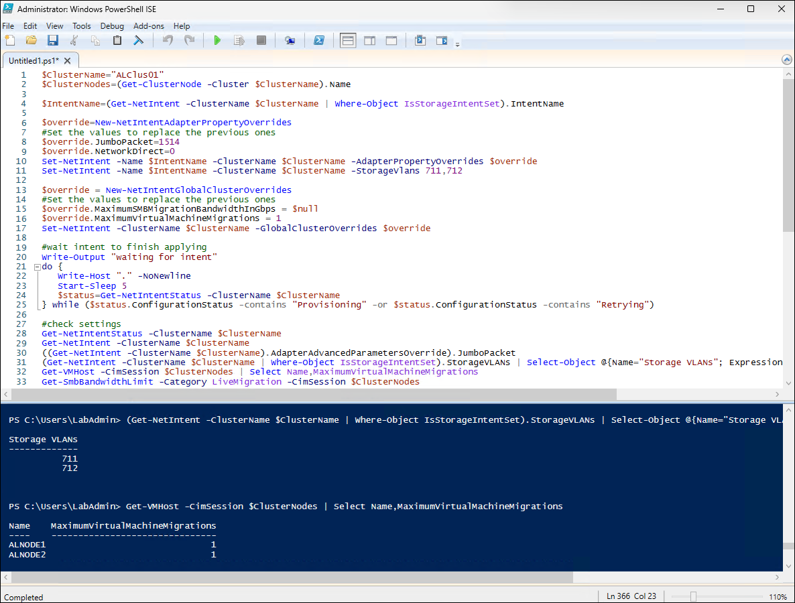

   > **Note:**: Alternatively, you could revert to the defaults by running the following code:

   ```powershell
   # Remove the existing intent
   Remove-NetIntent -Name "compute_management_storage" -ClusterName $ClusterName

   # Create an adapter property override to disable RDMA
   $AdapterOverride = New-NetIntentAdapterPropertyOverrides
   $AdapterOverride.NetworkDirect = 0

   # Recreate the intent using the override
   Add-NetIntent `
       -ClusterName $ClusterName `
       -Name "compute_management_storage" `
       -Compute `
       -Management `
       -Storage `
       -AdapterName "Ethernet","Ethernet 2" `
       -AdapterPropertyOverrides $AdapterOverride

   # Verify status
   Get-NetIntentStatus -ClusterName $ClusterName
   ```

### Task 08: Retry failed intents

> **Note:**: The provided code detects and retries failed network intent operations. It first queries all intent statuses on the cluster and filters for any entries with a "Failed" configuration state, storing them in a collection. It then iterates through each failed intent and remotely invokes a command on the corresponding host to reset its retry state using `Set-NetIntentRetryState`, effectively triggering a reprocessing of the failed intent on a per-node basis. After initiating retries, the script pauses briefly to allow the remediation process to begin, and finally re-queries the cluster's intent status to verify whether the previously failed configurations have transitioned out of the failed state or are progressing through re-application.

1. From Windows PowerShell ISE, run the following code:

   > **Note:**: In the name of the cluster, replace the `<xx>` placeholder with the numeric value assigned to the name of the Entra ID user account you are using in this lab. For example, if your user name is `aluser01`, use `01`. 

   ```powershell
   $ClusterName="ALClus<xx>"

   #grab Intent
   $FailedIntents=Invoke-Command -ComputerName $ClusterName -ScriptBlock {
      Get-NetIntentStatus | Where-Object ConfigurationStatus -eq Failed
   }

   #retry failed intents
   Foreach ($FailedIntent in $FailedIntents){
       Invoke-Command -ComputerName $FailedIntent.Host -ScriptBlock {
           Set-NetIntentRetryState -NodeName  $using:FailedIntent.Host -Name $using:FailedIntent.IntentName
       }
   }

   Start-Sleep 10

   #check intents again
   Invoke-Command -ComputerName $ClusterName -ScriptBlock {
      Get-NetIntentStatus
   }
   ```
