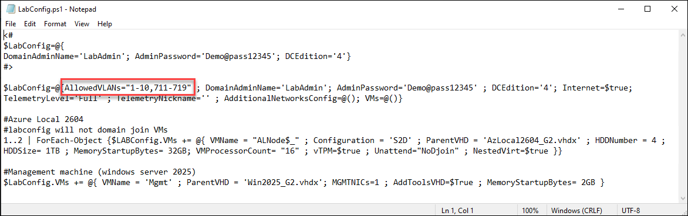
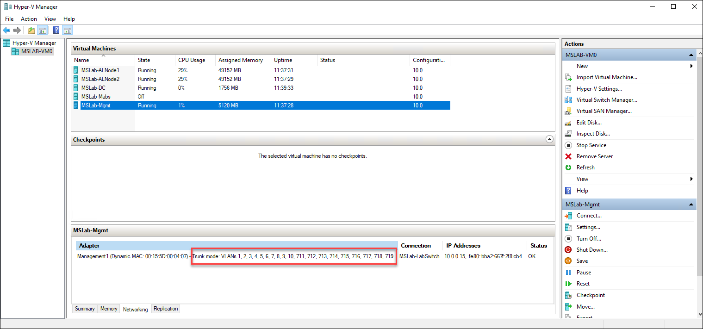
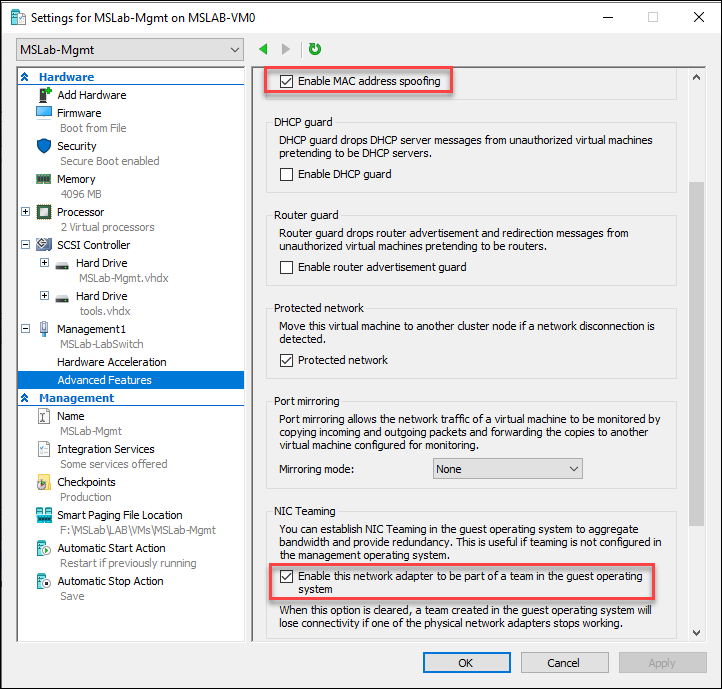
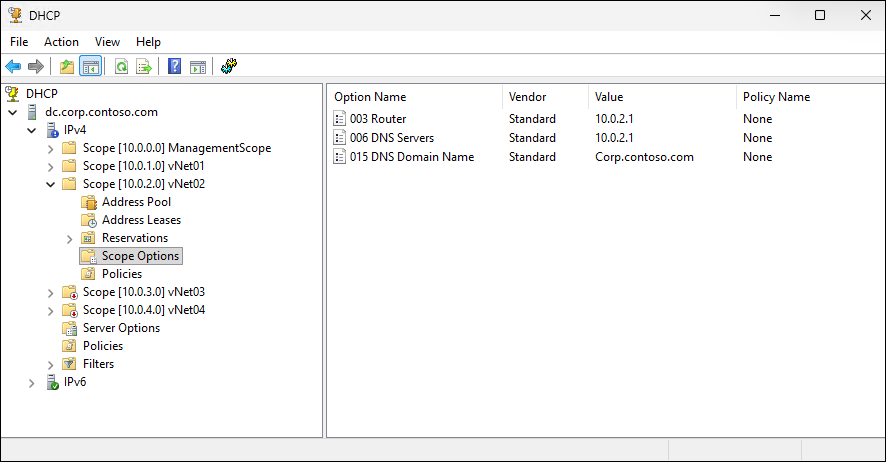
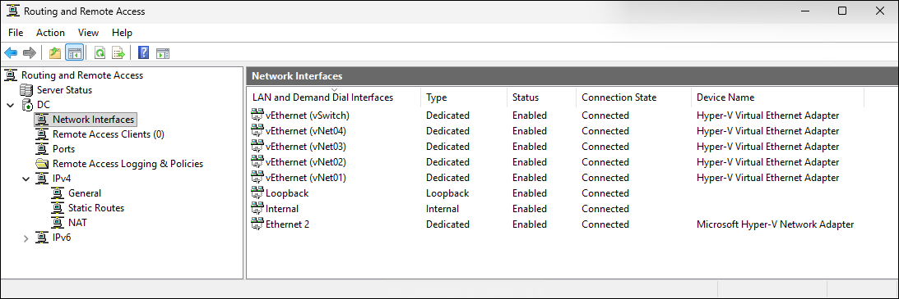
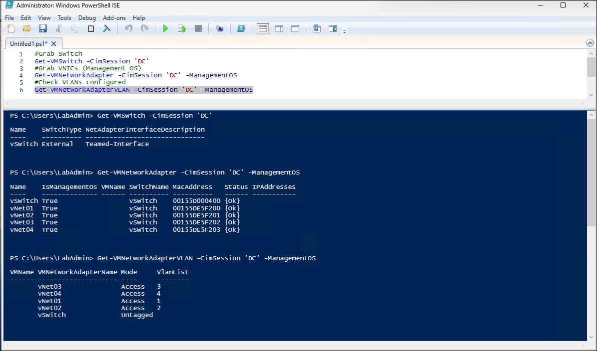
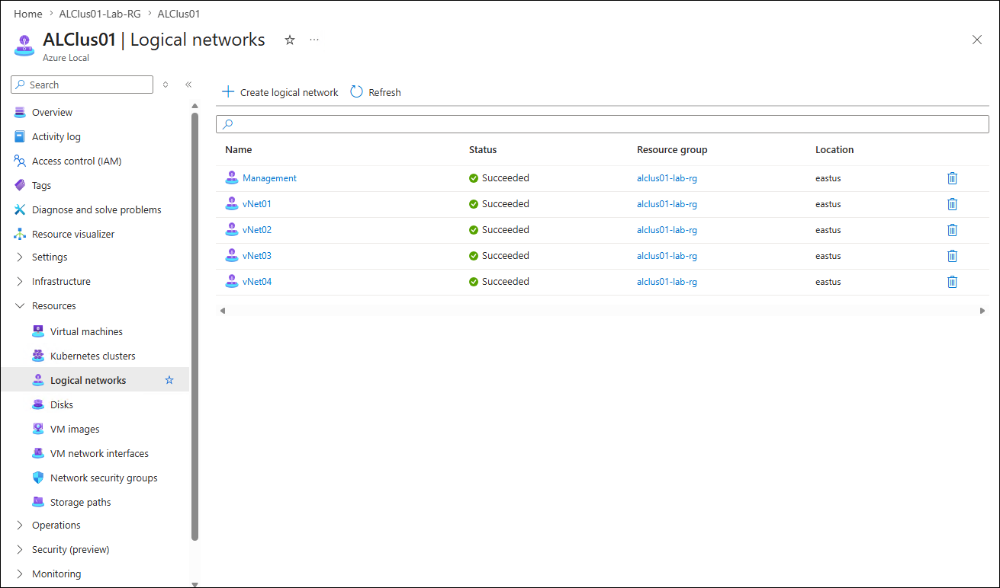

# Implementing Logical Networks

## About the lab

In this lab you will learn how to implement Azure Local VLAN-based [logical networks](https://learn.microsoft.com/en-us/azure/azure-local/manage/tenant-logical-networks?view=azloc-2604) that you can manage via the Azure portal.

## About the lab environment

MSLab configures the NIC of the Mgmt VM in the trunk mode with a number of VLANs pre-assigned. The LabConfig file sets AllowedVLANs to "1-10,711-719".





To implement VLANs, you will attach multiple vNICs to the DC VM, with each associated to a different VLAN. For this to work, it's also necessary to enable MAC address spoofing and NIC Teaming on the Mgmt VM. This is already pre-configured by MSLab.



You will create a virtual switch in the DC VM in order to be able to create multiple vNICs in multiple VLANs. To enable this, you will install the Hyper-V and Routing and Remote Access roles.

## Prerequisites

* Hydrated MSLab containing an Azure Local deployment 

## The lab

### Preparation

1. From the Hyper-V Manager on the lab VM, start the MSLab-DC.
1. Ensure that the OS on MSLab-DC VM is running and then start the MSLab-Mgmt, MSLab-ALNode1, and MSLab-ALNode2 VMs.
1. Connect to MSLab-Mgmt VM by using Virtual Machine Connection (using Enhanced Session and Full Screen Mode).
1. Sign in by using the following credentials:

   - Username: *CORP\LabAdmin*
   - Password: *Demo@pass12345*

   > **Note:**: You'll be using the same credentials to sign in throughout the workshop.

   > **Note:**: You'll be running all tasks in this lab from the MSLab-Mgmt VM.

### Task 01: Set up virtual networking

1. Start Windows PowerShell ISE and run the following code:

   > **Note:**: The provided code configures Windows Server 2025 VM (DC) as a virtualized network hub using Hyper-V and DHCP. It defines four virtual networks (vNet01–vNet04) with associated VLAN IDs, IP subnets, gateway/DNS IPs, and DHCP settings, then ensures required management tools are installed (Hyper-V PowerShell, DHCP/Remote Access RSAT, routing components). For each network, it creates a corresponding management OS vNIC on the Hyper-V virtual switch, assigns VLAN tagging, and configures a static IP address. It then creates or updates DHCP scopes for each subnet, enabling or disabling them based on configuration, and sets DHCP options such as DNS server (Option 6), default gateway (Option 3), and domain name (Option 15). Finally, it enables IP routing on the server by installing RRAS components and setting the registry flag for IP forwarding, restarting routing services so the DC can route traffic between the defined virtual networks.

   ```powershell
   $Server="DC"
   $vSwitchName="vSwitch"
   
   #define networks
   $Networks=@()
   $Networks+= @{ Name='vNet01'; VLANID=1; NICIP='10.0.1.1'; PrefixLength=24; ScopeID = '10.0.1.0'; StartRange='10.0.1.10'; EndRange='10.0.1.254'; SubnetMask='255.255.255.0'; DomainName="Corp.contoso.com"; DHCPEnabled=$True }
   $Networks+= @{ Name='vNet02'; VLANID=2; NICIP='10.0.2.1'; PrefixLength=24; ScopeID = '10.0.2.0'; StartRange='10.0.2.10'; EndRange='10.0.2.254'; SubnetMask='255.255.255.0'; DomainName="Corp.contoso.com"; DHCPEnabled=$True }
   $Networks+= @{ Name='vNet03'; VLANID=3; NICIP='10.0.3.1'; PrefixLength=24; ScopeID = '10.0.3.0'; StartRange='10.0.3.10'; EndRange='10.0.3.254'; SubnetMask='255.255.255.0'; DomainName="Corp.contoso.com"; DHCPEnabled=$False }
   $Networks+= @{ Name='vNet04'; VLANID=4; NICIP='10.0.4.1'; PrefixLength=24; ScopeID = '10.0.4.0'; StartRange='10.0.4.10'; EndRange='10.0.4.254'; SubnetMask='255.255.255.0'; DomainName="Corp.contoso.com"; DHCPEnabled=$False }

   #create vSwitch
       #make sure hyper-v management tools are installed
       Install-WindowsFeature -Name Hyper-V-PowerShell
       #assuming there's just one NIC "ethernet"
       New-VMSwitch -CimSession $Server -Name $vSwitchName -NetAdapterName "Ethernet" -EnableEmbeddedTeaming $true
       #rename vNIC "management
       Rename-VMNetworkAdapter -Name $vSwitchName -NewName Management -CimSession $Server -ManagementOS
   
   #create networks
   #make sure DHCP management tools are installed. To view routing on DC you can also install RSAT-RemoteAccess
   Install-WindowsFeature -Name RSAT-DHCP,RSAT-RemoteAccess
   
   foreach ($Network in $Networks){
       #create NIC
       if (-not (Get-VMNetworkAdapter -ManagementOS -Name $network.Name -CimSession $Server -ErrorAction Ignore)){
           Add-VMNetworkAdapter -CimSession $Server -ManagementOS -Name $network.name
       }
       #configure VLAN
       #Set-VMNetworkAdapterIsolation -CimSession $Server -ManagementOS -VMNetworkAdapterName $Network.name -IsolationMode Vlan -DefaultIsolationID $network.vlanID
       Set-VMNetworkAdapterVlan -CimSession $Server -ManagementOS -VMNetworkAdapterName $Network.name -Access -VlanId $network.vlanID
   
       #configure Static IP
       if ((Get-NetIPAddress -CimSession $Server -InterfaceAlias "vEthernet ($($Network.name))" -AddressFamily IPv4).IPAddress -ne $Network.NicIP){
           New-NetIPAddress -CimSession $Server -InterfaceAlias "vEthernet ($($Network.name))" -IPAddress $Network.NICIP -PrefixLength $Network.PrefixLength
       }
       #Add DHCP Scope
       if (-not (Get-DhcpServerv4Scope -CimSession $Server -ScopeId $network.ScopeID -ErrorAction Ignore)){
               Add-DhcpServerv4Scope -CimSession $Server -StartRange $Network.StartRange -EndRange $Network.EndRange -Name $Network.Name -State Active -SubnetMask $Network.SubnetMask
       }
       #disable/enable
       if ($Network.DHCPEnabled){
           Set-DhcpServerv4Scope -CimSession $Server -ScopeId $Network.ScopeID -State Active
       }else{
           Set-DhcpServerv4Scope -CimSession $Server -ScopeId $Network.ScopeID -State InActive
       }
   
       #Configure dhcp options
           #6 - Domain Name Server
           Set-DhcpServerv4OptionValue -CimSession $Server -OptionId 6 -Value $Network.NICIP -ScopeId $Network.ScopeID
           #3 - Gateway
           Set-DhcpServerv4OptionValue -CimSession $Server -OptionId 3 -Value $Network.NICIP -ScopeId $Network.ScopeID
           #15 - Domain Name
           Set-DhcpServerv4OptionValue -CimSession $Server -OptionId 15 -Value $Network.DomainName -ScopeId $Network.ScopeID
   }
   
   #make sure routing is enabled on DC
   Invoke-Command -ComputerName $Server -ScriptBlock {
       #installRRAS
       Install-WindowsFeature -Name Routing,RSAT-RemoteAccess -IncludeAllSubFeature
       #Install Hyper-v Tools
       Install-WindowsFeature -Name RSAT-Hyper-V-Tools
       #enable routing
       Write-Output "`t`t  Making sure routing is enabled"
       $routingEnabled = (Get-ItemProperty HKLM:\SYSTEM\CurrentControlSet\Services\Tcpip\Parameters -Name IPEnableRouter).IPEnableRouter
       if ($routingEnabled -match "0") {
           New-ItemProperty HKLM:\SYSTEM\CurrentControlSet\Services\Tcpip\Parameters -Name IPEnableRouter -value 1 -Force
       }
       #restart routing... just to make sure
       Restart-Service RemoteAccess
   }
   ```

## Task 02: Explore resulting configuration

1. Start DHCP management console and connect to DC.corp.contoso.com.
1. Review the configuration of DHCP scopes, including scope options. Note that the ones where DHCPEnabled was set to $False are disabled. 

   

1. Start Routing and Remote Access management console and connect to DC.corp.contoso.com. Note that routing is enabled and additional interfaces are present.

   

1. Switch to the Windows PowerShell ISE window and run the following code to verify that vSwitch and VMNics have been created:

   ```powershell
   #Grab Switch
   Get-VMSwitch -CimSession 'DC'
   #Grab VNICs (Management OS)
   Get-VMNetworkAdapter -CimSession 'DC' -ManagementOS
   #Check VLANs configured
   Get-VMNetworkAdapterVLAN -CimSession 'DC' -ManagementOS
   ```

   

## Task 03: Configure logical networks

1. Start Windows PowerShell ISE and run the following code:

   > **Note:**: The provided code automates creation of Azure Local logical networks by first gathering configuration details from an existing failover cluster and Hyper-V virtual switch, defining several virtual networks with VLANs and either dynamic or static IP allocation settings, and prepares ARM deployment templates for both network types. The code checks whether each logical network already exists in the specified Azure resource group and, if not, deploys it using the `New-AzResourceGroupDeployment` cmdlet against the microsoft.azurestackhci/logicalnetworks resource type. Dynamic networks are deployed directly with inline parameters, while static networks use a generated ARM parameter file containing subnet prefixes, IP pools, DNS servers, and default gateway information.

   > **Note:**: In the name of the cluster and the resource group, replace the `<xx>` placeholder with the numeric values assigned to the name of the Entra ID user account you are using in this lab. For example, if your user name is `aluser01`, use `01`. 

   ```powershell
   #Make sure failover clustering and Hyper-V PowerShell is installed
   Install-WindowsFeature -Name RSAT-Clustering,Hyper-V-PowerShell

   #download Azure modules
   $Modules="az.resources","Az.CustomLocation","Az.Accounts"
   foreach ($Module in $Modules){
       if (!(Get-InstalledModule -Name $Module -ErrorAction Ignore)){
           Install-Module -Name $Module -Force
       }
   }

   #Login to azure
   if (-not (Get-AzContext)){
       Connect-AzAccount -UseDeviceAuthentication
   }

   #Select subscription
   #$SubscriptionID=(Get-AzContext).subscription.id

   #define variables
   $ClusterName="ALClus<xx>"
   $ClusterNodes=(Get-ClusterNode -Cluster $ClusterName).Name
   $VirtualSwitchName=(Get-VMSwitch -CimSession $ClusterNodes[0]).Name
   $Location="SouthEastAsia"
   $ResourceGroupName="ALClus-aluser<xx>"
   $CustomLocationID=(Get-AzCustomLocation -ResourceGroupName $ResourceGroupName).ID

   $Networks=@()
   $Networks+= @{ Name='Management'; ipAllocationMethod="Dynamic"; vlan=0 ; tags=[PSCustomObject]@{}}
   $Networks+= @{ Name='vNet01'; ipAllocationMethod="Dynamic"; vlan=1 ; tags=[PSCustomObject]@{}}
   $Networks+= @{ Name='vNet02'; ipAllocationMethod="Dynamic"; vlan=2 ; tags=[PSCustomObject]@{}}
   $Networks+= @{ Name='vNet03'; ipAllocationMethod="Static"; addressPrefix="10.0.3.0/24" ; vlan=3 ; ipPools=@("10.0.3.10","10.0.3.255") ; dnsServers=@("10.0.3.1") ; defaultGateway="10.0.3.1" ; tags=[PSCustomObject]@{}}
   $Networks+= @{ Name='vNet04'; ipAllocationMethod="Static"; addressPrefix="10.0.4.0/24" ; vlan=4 ; ipPools=@("10.0.4.10","10.0.4.255") ;dnsServers=@("10.0.4.1") ; defaultGateway="10.0.4.1" ; tags=[PSCustomObject]@{}}

   #create templates
   $staticTemplate = @"
   {
       "`$schema": "https://schema.management.azure.com/schemas/2019-04-01/deploymentTemplate.json#",
       "contentVersion": "1.0.0.0",
       "parameters": {
           "name": {
               "type": "String"
           },
           "ipAllocationMethod": {
               "type": "String"
           },
           "addressPrefix": {
               "type": "String"
           },
           "vlan": {
               "type": "Int"
           },
           "location": {
               "type": "String"
           },
           "customLocationId": {
               "type": "String"
           },
           "vmSwitchName": {
               "type": "String"
           },
           "tags": {
               "type": "Object"
           },
           "ipPools": {
               "type": "Array"
           },
           "dnsServers": {
               "type": "Array"
           },
           "defaultGateway": {
               "type": "String"
           }
       },
       "resources": [
           {
               "type": "microsoft.azurestackhci/logicalnetworks",
               "apiVersion": "2023-09-01-preview",
               "name": "[parameters('name')]",
               "location": "[parameters('location')]",
               "extendedLocation": {
                   "type": "CustomLocation",
                   "name": "[parameters('customLocationId')]"
               },
               "tags": {},
               "properties": {
                   "subnets": [
                       {
                           "name": "[parameters('name')]",
                           "properties": {
                               "ipAllocationMethod": "[parameters('ipAllocationMethod')]",
                               "addressPrefix": "[parameters('addressPrefix')]",
                               "vlan": "[parameters('vlan')]",
                               "ipPools": "[parameters('ipPools')]",
                               "routeTable": {
                                   "properties": {
                                       "routes": [
                                           {
                                               "name": "[parameters('name')]",
                                               "properties": {
                                                   "addressPrefix": "0.0.0.0/0",
                                                   "nextHopIpAddress": "[parameters('defaultGateway')]"
                                               }
                                           }
                                       ]
                                   }
                               }
                           }
                       }
                   ],
                   "vmSwitchName": "[parameters('vmSwitchName')]",
                   "dhcpOptions": {
                       "dnsServers": "[parameters('dnsServers')]"
                   }
               }
           }
       ],
       "outputs": {}
   }
   "@

   $DynamicTemplate=@"
   {
       "`$schema": "https://schema.management.azure.com/schemas/2019-04-01/deploymentTemplate.json#",
       "contentVersion": "1.0.0.0",
       "parameters": {
           "name": {
               "type": "String"
           },
           "ipAllocationMethod": {
               "type": "String"
           },
           "vlan": {
               "type": "Int"
           },
           "location": {
               "type": "String"
           },
           "customLocationId": {
               "type": "String"
           },
           "vmSwitchName": {
               "type": "String"
           },
           "tags": {
               "type": "Object"
           }
       },
       "resources": [
           {
               "type": "microsoft.azurestackhci/logicalnetworks",
               "apiVersion": "2023-09-01-preview",
               "name": "[parameters('name')]",
               "location": "[parameters('location')]",
               "extendedLocation": {
                   "type": "CustomLocation",
                   "name": "[parameters('customLocationId')]"
               },
               "tags": {},
               "properties": {
                   "subnets": [
                       {
                           "name": "[parameters('name')]",
                           "properties": {
                               "ipAllocationMethod": "[parameters('ipAllocationMethod')]",
                               "vlan": "[parameters('vlan')]"
                           }
                       }
                   ],
                   "vmSwitchName": "[parameters('vmSwitchName')]"
               }
           }
       ],
       "outputs": {}
   }

   "@

   $templateFileStatic = New-TemporaryFile
   Set-Content -Path $templateFileStatic.FullName -Value $staticTemplate

   $templateFileDynamic = New-TemporaryFile
   Set-Content -Path $templateFileDynamic.FullName -Value $DynamicTemplate

   $ExistingNetworks=Get-AzResource -ResourceGroupName $ResourceGroupName -ResourceType microsoft.azurestackhci/logicalNetworks

   foreach ($Network in $Networks){
       if (-not ($ExistingNetworks.Name -Contains $Network.Name)){
           if ($Network.ipAllocationMethod -eq "Dynamic"){
               $templateParameterObject = @{
                   name = $network.name
                   ipAllocationMethod = "Dynamic"
                   vlan=$Network.VLAN
                   location=$Location
                   customLocationId=$CustomLocationID
                   vmSwitchName=$VirtualSwitchName
                   tags=$Network.Tags
               }
               New-AzResourceGroupDeployment -ResourceGroupName $ResourceGroupName -TemplateFile $templateFileDynamic.FullName -TemplateParameterObject $templateParameterObject
           }else{
               #this dows not work
               <#
               $TemplateParameterObject = @{
                   name = $network.name
                   ipAllocationMethod = "Static"
                   addressPrefix = $Network.addressPrefix
                   vlan=$Network.VLAN
                   location=$Location
                   customLocationId=$CustomLocationID
                   vmSwitchName=$VirtualSwitchName
                   ipPools=$Network.IPPools
                   dnsServers=$Network.DNSServers
                   defaultGateway=$Network.DefaultGateway
                   tags=$Network.Tags
               }
               New-AzResourceGroupDeployment -ResourceGroupName $ResourceGroupName -TemplateFile $templateFileStatic.FullName -TemplateParameterObject $templateParameterObject
               #>
               #Create parameter file
               $ParamFile=@"
   {
       "`$schema": "https://schema.management.azure.com/schemas/2015-01-01/deploymentParameters.json#",
       "contentVersion": "1.0.0.0",
       "parameters": {
           "name": {
               "value": "$($network.name)"
           },
           "ipAllocationMethod": {
               "value": "Static"
           },
           "addressPrefix": {
               "value": "$($Network.addressPrefix)"
           },
           "vlan": {
               "value": $($Network.VLAN)
           },
           "location": {
               "value": "$Location"
           },
           "customLocationId": {
               "value": "$CustomLocationID"
           },
           "vmSwitchName": {
               "value": "$VirtualSwitchName"
           },
           "tags": {
               "value": {}
           },
           "ipPools": {
               "value": [
                   {
                       "start": "$($Network.IPPools[0])",
                       "end": "$($Network.IPPools[1])"
                   }
               ]
           },
           "dnsServers": {
               "value": [
                   "$($Network.DNSServers)"
               ]
           },
           "defaultGateway": {
               "value": "$($Network.DefaultGateway)"
           }
       }
   }
   "@
           $parameterfile = New-TemporaryFile
           Set-Content -Path $parameterfile.FullName -Value $ParamFile
           New-AzResourceGroupDeployment -ResourceGroupName $ResourceGroupName -TemplateFile $templateFileStatic.FullName -TemplateParameterFile $parameterfile.FullName
           #Remove-Item $parameterfile.FullName
           }

       }else{
           Write-Output "$($Network.Name) network already exists"
       }
   }
   #Remove-Item $templateFileStatic.FullName
   #Remove-Item $templateFileDynamic.FullName   ```
   ```

1. Start Microsoft Edge and navigate to [the Azure portal](https://portal.azure.com). Sign in by using the credentials granting you access to the Azure subscription.
1. In the Azure portal, navigate to the **Azure Local** page, on the **Azure Arc \| Azure Local** page, select the **All systems** tab, and then select the **ALClus`<xx>`** entry, where the **`<xx>`** placeholder designates the numeric values assigned to the name of the Entra ID user account you are using in this lab.
1. In the left navigation menu, expand the **Resources** section and select the **Logical networks** entry.
1. On the **Logical networks** page, verify that all logical networks are listed with the **Succeeded** status.

   
