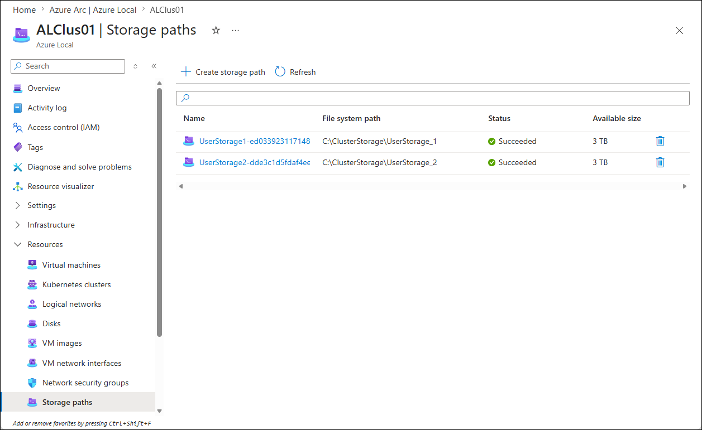
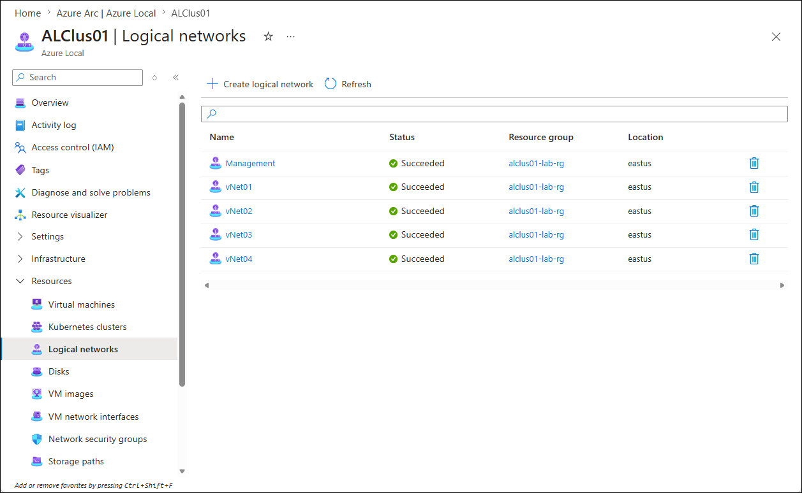
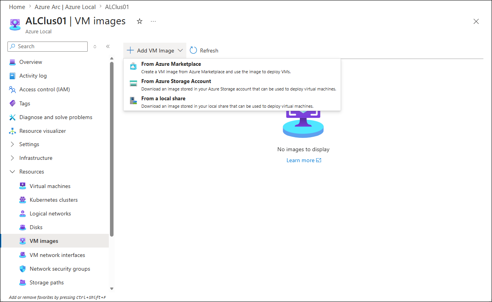

# Deploying Azure Local VMs

## About the lab

In this lab, you will deploy an Azure Local VM by using the Azure portal.

## Prerequisites

* Hydrated MSLab containing an Azure Local deployment, including user storage paths and Azure Local logical networks 

## The lab

### Preparation

1. From the Hyper-V Manager on the lab VM, start the MSLab-DC.
1. Ensure that the OS on MSLab-DC VM is running and then start the MSLab-Mgmt, MSLab-ALNode1, and MSLab-ALNode2 VMs.
1. Connect to MSLab-Mgmt VM by using Virtual Machine Connection (using Enhanced Session and Full Screen Mode).
1. Sign in by using the following credentials:

   - Username: *CORP\LabAdmin*
   - Password: *Demo@pass12345*

   > **Note:**: You'll be using the same credentials to sign in throughout the workshop.

   > **Note:**: You'll be running all tasks in this lab from the MSLab-Mgmt VM.

### Task 01: Identify storage paths

1. In the Virtual Machine Connection to MSLab-Mgmt VM, start Microsoft Edge and navigate to [the Azure portal](https://portal.azure.com). Sign in by using the credentials granting you access to the Azure subscription that is used for this lab.
1. In the Azure portal, navigate to the **Azure Local** page, on the **Azure Arc \| Azure Local** page, select the **All systems** tab, and then select the **ALClus`<xx>`** entry, where the **`<xx>`** placeholder designates the numeric values assigned to the name of the Entra ID user account you are using in this lab.
1. In the left navigation menu, expand the **Resources** section and select the **Storage paths** entry.
1. On the **Storage paths** page, verify that there is at least one storage path listed with the **Succeeded** status.

   

### Task 02: Identify logical networks

1. In the Azure portal, on the **Storage paths** page, in the left navigation menu, in the **Resources** section, select the **Logical networks** entry.
1. On the **Logical networks** page, verify that all logical networks are listed with the **Succeeded** status.

   

### Task 03: Provision Azure Local VM image by using an Azure Marketplace image

> **Note:**: Azure Local offers several options for provisioning VM images based on your environment and operational needs. You can download managed disks directly from Azure to reuse existing cloud VM images locally, or deploy trusted operating system and application images from Azure Marketplace. If you want centralized image management with versioning and sharing capabilities, you can use Azure Compute Gallery to distribute standardized images across environments. You can also store custom VHDs or image files in Azure Storage and import them into Azure Local as needed. For disconnected or tightly controlled environments, you can provision VMs using images stored on a local file share, allowing you to deploy workloads entirely within your on-premises infrastructure without requiring internet connectivity.

1. In the Azure portal, on the **Logical networks** page, in the left navigation menu, in the **Resources** section, select the **VM Images** entry.
1. On the **VM Images** page, select **+ Add VM Image** and, in the drop-down list, select **From Azure Marketplace**.

   

1. On the **Basics** tab of the **Create an image** page, specify the following settings (leave others with their default values):

   > **Note:**: In the name of the **Resource group**, replace the **`<username>`** placeholder with the name of the Entra ID user account you are using in this lab.

   > **Note:**: In the custom location name, replace the **`<xx>`** placeholder with the numeric values assigned to the name of the Entra ID user account you are using in this lab. For example, if your user name is `aluser01`, use `01`. 

   |Setting|Value|
   |---|---|
   |Resource group|**ALClus-`<username>`**|
   |Save image as|**2025-image-01***|
   |Custom location|**ALClus`<xx>`**|
   |Image to download|**[smalldisk] Windows Server 2025 Datacenter Azure Edition - Gen2**|
   |Storage path|**Choose automatically**|

1. On the **Basics** tab, select **Review + create** and, on the **Review + create** tab, select **Create**.

   > **Note:** Wait for the deployment tasks to complete. This might take about 2.5 hours.

1. Once the deployment completes, select **Go to resource** to navigate to the **Azure Local Marketplace Gallery image** page displaying properties of the **22025-image-01*** image and verify that its status is listed as **Available**.

 > **Note:** In case you run into issues with the Azure Marketplace image download, use the following procedure instead.

 1. Switch back to the lab VM and launch File Explorer.
 1. In File Explorer, navigate to the `F:\MSLab\ParentDisks` folder and copy the file `Win2025Core_G2.vhdx`.
 1. Switch to the Virtual Machine Connection to MSLab-Mabs VM and paste the copied file to the C:\Source folder (you might need to create the folder first).
 1. Within the Virtual Machine Connection to MSLab-Mabs VM, launch Windows PowerShell ISE in the privileged mode (as administrator) and run the following code to provision the Scale-Out File Server role install:

    > **Note:**: In the value of the `$SoFsName` variable and the Cluster parameter, replace the `<xx>` placeholder with the numeric values assigned to the name of the Entra ID user account you are using in this lab. For example, if your user name is `aluser01`, use `01`. 

   ```powershell
   $SoFsName = "ALClus<xx>SoFS"
if (-not (Get-ClusterGroup -Name $SoFsName -Cluster "ALClus<xx>" -ErrorAction SilentlyContinue)) {
    Add-ClusterScaleOutFileServerRole -Name $SoFsName -Cluster "ALClus<xx>"
}
   ```

1. In Windows PowerShell ISE, run the following code to determine the current owner node of the CSV disk hosting the `UserStorage_1` storage path:

   > **Note:**: In the value of the `-Cluster` parameter, replace the `<xx>` placeholder with the numeric values assigned to the name of the Entra ID user account you are using in this lab. 

   ```powershell
   $OwnerNode = (Get-ClusterSharedVolume -Name "Cluster Virtual Disk (UserStorage_1)" -Cluster "ALClus<xx>").OwnerNode
   ```

1. In Windows PowerShell ISE, run the following code to create a folder named `Images` on the CSV volume hosted by the `UserStorage_1` storage path:

   ```powershell
   Invoke-Command -ComputerName $OwnerNode -ScriptBlock {
      $PhysicalPath = "C:\ClusterStorage\UserStorage_1\Images"
      if (-not (Test-Path -Path $PhysicalPath)) {
         New-Item -Path $PhysicalPath -ItemType Directory | Out-Null
      }
   }
   ```

1. In Windows PowerShell ISE, run the following code to create a highly available file share using the `Images` folder:

   ```powershell
   $ShareParams = @{
      Name                  = "Images"
      Path                  = "C:\ClusterStorage\UserStorage_1\Images"
      ScopeName             = $SoFsName               
      FullAccess            = "Everyone"              
      ContinuouslyAvailable = $true                   
   }

   Invoke-Command -ComputerName $OwnerNode -ScriptBlock {
      New-SmbShare @Using:ShareParams
   }
   ```

1. In Windows PowerShell ISE, run the following code to copy the Windows Server 2025 ISO image to the `Images` share:

   ```powershell
   Copy-Item -Path 'C:\Source\Win2025Core_G2.vhdx' -Destination '\\$SoFsName\Images\' -Force
   ```
1. . In the Virtual Machine Connection to MSLab-Mgmt VM, switch to the Microsoft Edge window displaying the Azure portal.
1. In the Azure portal, on the **Logical networks** page, in the left navigation menu, in the **Resources** section, select the **VM Images** entry.
1. On the **VM Images** page, select **+ Add VM Image** and, in the drop-down list, select **Add VM image from a local share**.
1. On the **Basics** tab of the **Create an image** page, specify the following settings (leave others with their default values):

   > **Note:**: In the name of the **Resource group**, replace the **`<username>`** placeholder with the name of the Entra ID user account you are using in this lab.

   > **Note:**: In the custom location name and local file share path, replace the **`<xx>`** placeholder with the numeric values assigned to the name of the Entra ID user account you are using in this lab. For example, if your user name is `aluser01`, use `01`. 

   |Setting|Value|
   |---|---|
   |Resource group|**ALClus-`<username>`**|
   |Save image as|**2025-image-01**|
   |Custom location|**ALClus`<xx>`**|
   |OS type|**Windows**|
   |VM generation|***Gen 2**|
   |Local file share path|**\\ALClus`<xx>`SoFS\Images\Win2025Core_G2.vhdx**|
   |Storage path|**Choose automatically**|

1. On the **Basics** tab, select **Review + create** and, on the **Review + create** tab, select **Create**.

   > **Note:** Wait for the deployment tasks to complete. This might take about 20 minutes.

### Task 04: Create an Azure Local VM

1. In the Azure portal, navigate to the **Azure Local** page, on the **Azure Arc \| Azure Local** page, select the **All systems** tab, and then select the **ALClus`<xx>`** entry, where the **`<xx>`** placeholder designates the numeric values assigned to the name of the Entra ID user account you are using in this lab.
1. In the left navigation menu, expand the **Resources** section and select the **Virtual machines** entry.
1. On the **Virtual machines** page, select **+ Create VM**.
1. On the **Basics** tab of the **Create an Azure Arc virtual machine** page, specify the following settings (leave others with their default values):

   > **Note:**: In the name of the **Resource group**, replace the **`<username>`** placeholder with the name of the Entra ID user account you are using in this lab.

   > **Note:**: In the **Virtual machine name**, replace the **`<xx>`** placeholder with numeric values assigned to the name of the Entra ID user account you are using in this lab. For example, if your user name is `aluser01`, use `01`. 

   |Setting|Value|
   |---|---|
   |Resource group|**ALClus-`<username>`**|
   |Virtual machine name|**ALClus`<xx>`LabVM0**|
   |Security type|**Standard**|
   |Storage path|**Choose automatically**|
   |Image|**2025-image-01***|
   |Virtual processor count|**4**|
   |Memory (MB)|**8192**|
   |Memory type|**Static**|
   |Enable guest management|Enabled|
   |Connectivity method|**Public endpoint**|
   |Administrator account username|**VMAdmin**|
   |Administrator account password|**Demo@pass12345**|
   |Enable domain join|Disabled|

1. On the **Basics** tab, select **Next**.
1. On the **Disks** tab, select **Next**.
1. On the **Networking** tab, select **+ Add network interface**.
1. In the **Add network interface** tab, specify the following settings (leave others with their default values):

   > **Note:**: In the network interface name, replace the **`<xx>`** placeholder with numeric values assigned to the name of the Entra ID user account you are using in this lab. For example, if your user name is `aluser01`, use `01`. 

   |Setting|Value|
   |---|---|
   |Name|**ALClus`<xx>`VM0-NIC0**|
   |Network|**vNet02**|

1. In the **Add network interface** tab, select **Add** and then select **Next**.
1. On the **Tags** tab, select **Next**.
1. On the **Review + create** tab, select **Create**.

   > **Note:** Wait for the deployment tasks to complete. This might take about 5 minutes.

1. Once the deployment completes, select **Go to resource** to navigate to the **ALClus`<xx>`LabVM0** page, where the **`<xx>`** placeholder designates the numeric values assigned to the name of the Entra ID user account you are using in this lab.
1. In the vertical menu on the left side, expand the **Settings** section, select **Configuration** and ensure that **Guest management** is enabled.