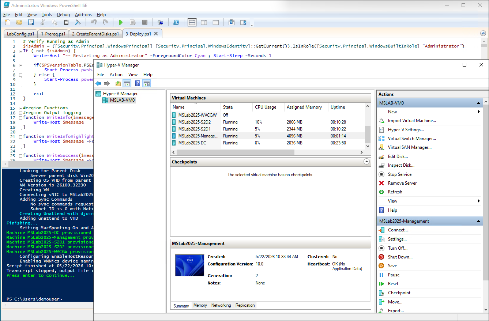
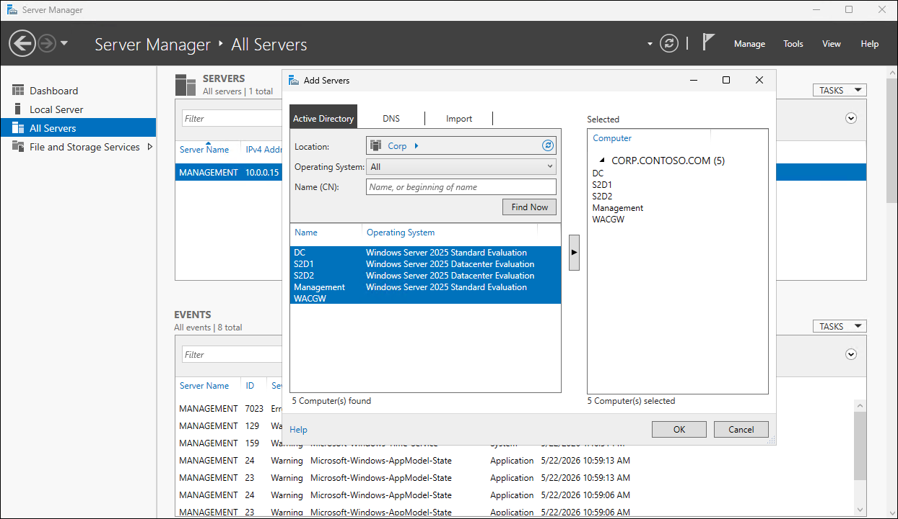
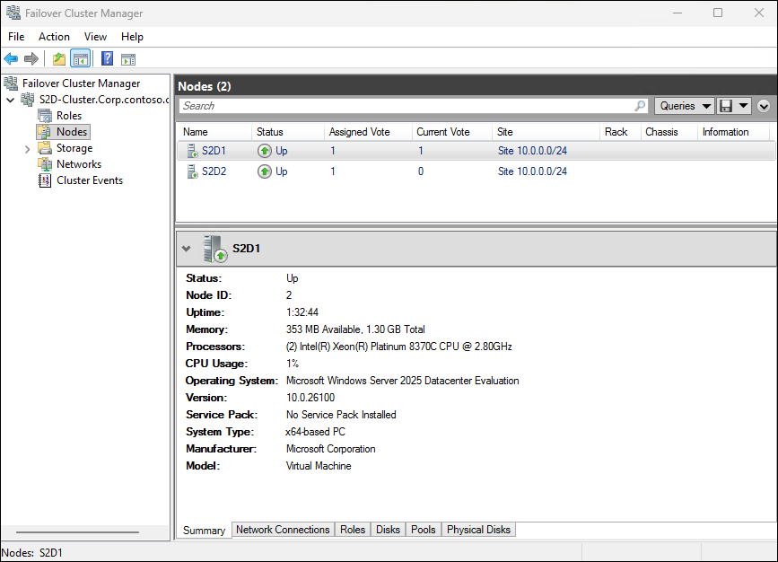
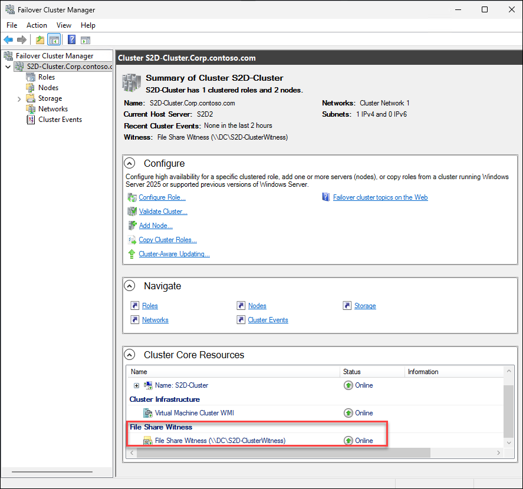
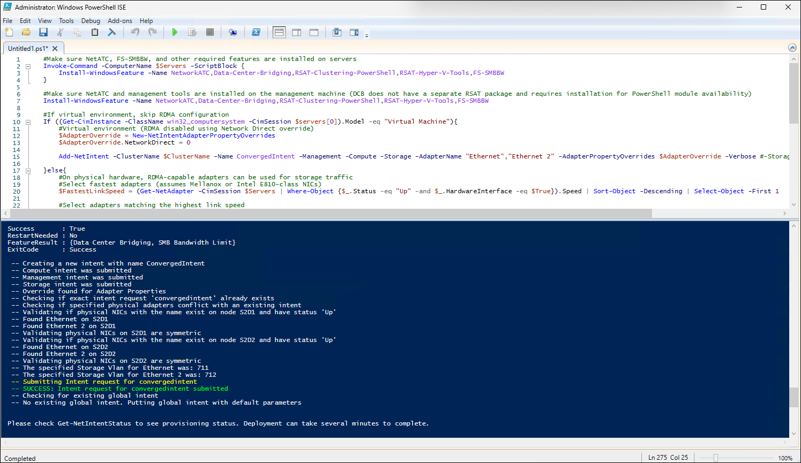
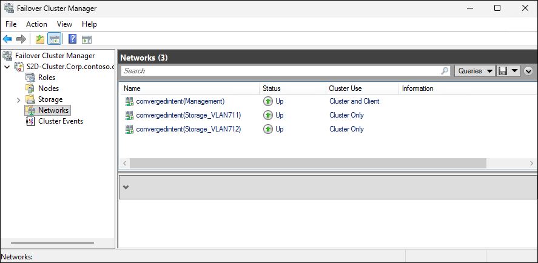
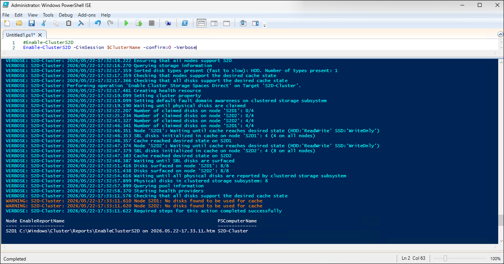
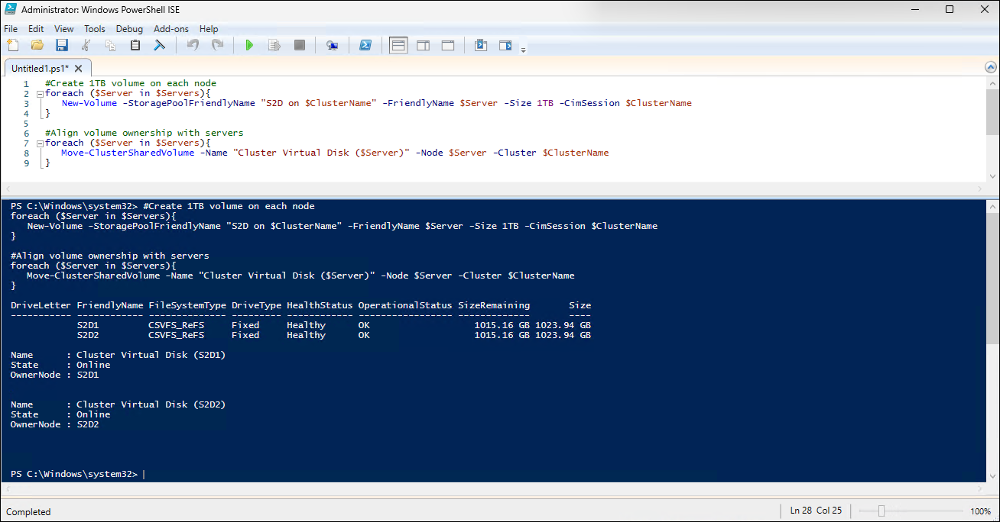

# Testing Windows Server 2025

## About the lab

In this lab you will deploy 2 node Windows Server 2025 S2D cluster by using MSLab environment.

## Prerequisites

* Hydrated MSLab with Windows Server 2025 images

## LabConfig

The following LabConfig will be used to deploy 2 cluster nodes with nested virtualization disabled. To implement nested virtualization, uncomment lines with `nestedvirt` S2D Nodes and adjust memory/CPUs. The lab includes VLANs 711-719 to support default Network ATC VLANs.

```powershell
$LabConfig=@{AllowedVLANs="1-10,711-719" ; DomainAdminName='LabAdmin'; AdminPassword='Demo@pass12345' ; DCEdition='4'; Internet=$true ; AdditionalNetworksConfig=@(); VMs=@()}

#S2D Nodes
1..2 | ForEach-Object {$LABConfig.VMs += @{ VMName="S2D$_" ; Configuration='S2D' ; ParentVHD='Win2025Core_G2.vhdx' ; HDDNumber=4 ; HDDSize=2TB ; MemoryStartupBytes=1GB; VMProcessorCount=4 ; vTPM=$true}}

#S2D Nodes (nested virt)
#1..2 | ForEach-Object {$LABConfig.VMs += @{ VMName="S2D$_" ; Configuration='S2D' ; ParentVHD='Win2025Core_G2.vhdx' ; HDDNumber=4 ; HDDSize=2TB ; MemoryStartupBytes=8GB ; VMProcessorCount=4 ; vTPM=$true ; NestedVirt=$true}}

#DC
$LabConfig.VMs += @{ VMName='DC' ; ParentVHD='Win2025_G2.vhdx' ; MemoryStartupBytes=8GB }

#Management machine
$LabConfig.VMs += @{ VMName = 'Management' ; ParentVHD = 'Win2025_G2.vhdx'; MGMTNICs=1 ; AddToolsVHD=$True ; MemoryStartupBytes=8GB}
```

## The lab

### Preparation

1. While signed in to the lab VM, launch Microsoft Edge, on the web browser page, navigate to the Azure portal at [https://portal.azure.com](https://portal.azure.com), and sign in using the Entra ID credentials you are using in this lab.
1. In the Azure portal, navigate to the **Virtual machines** page.
1. On the **Virtual machines** page, select the **mslab-vm`<xx>`** entry (where the **`<xx>`** placeholder represents the numeric value assigned to the name of the Entra ID user account you are using in this lab). 
1. On the virtual machine page, in the vertical menu on the left side, expand the **Settings** section and then select **Disks**.
1. In the **Data disks** section, select **+ Create and attach a new disk**.
1. In the row representing the newly added disk, specify the following settings (leave others with their defalts) and then select **Apply**.

   > **Note:**: In the disk name, replace the **`<xx>`** placeholder with the numeric value assigned to the name of the Entra ID user account you are using in this lab. For example, if your user name is `aluser01`, use `01`. 

   |Setting|Value|
   |---|---|
   |Disk name|**mslab-vm`<xx>`_DataDisk_3**|
   |Storage type|**Premium_SSD_LRS**|
   |Size (GiB)|**512**|
   |Host caching|**Read-only**|

1. While connected to the lab VM, switch to **Server Manager**.
1. In **Server Manager**, in the vertical menu on the left side, select **File and Storage Services** and then select **Disks**.
1. In the list of disks attached to the lab VM, right-click the disk entry listed with the **Unknown** partition, in the context-sensitive menu, select **Initialize** and select **Yes** when prompted whether to proceed.
1. Right-click the same disk again and, in the context-sensitive menu, select **New Volume** to launch **New Volume Wizard**.
1. On the **Select the server and disk** tab, accept the default settings and select **Next >**.
1. On the **Select the size of the volume** tab, accept the default size (512 GB) and select **Next >**.
1. On the **Assign to a drive letter or folder** tab, select the drive letter **S** and then select **Next >**.
1. On the **Select file system settings** tab, ensure that the file system is set to **ReFS**, keep the **Allocation unit size** set to **Default**, in the **Volume label** text box, enter **MSLab2025** and select **Next >**.
1. On the **Confirmation** tab, select **Create** and then select **Close**.
1. Open File Explorer and copy the following content from the `F:\MSLab` directory to `S:\MSLab2025\` directory (you'll need to create the target directory first):

   - 1_Prereq.ps1
   - 2_CreateParentDisks.ps1
   - 3_Deploy.ps1
   - Cleanup.ps1
   - LabConfig.ps1

1. Copy the following content from the `F:\MSLab\ParentDisks` directory to `S:\MSLab2025\ParentDisks` directory (you'll need to create the target directory first):

   - Convert-WindowsImage.ps1
   - CreateParentDisk.ps1
   - CreateVMFleetDisk.ps1
   - DownloadLatestCUs.ps1
   - PatchParentDisks.ps1
   - tools.vhdx
   - Win2025Core_G2.vhdx
   - Win2025_G2.vhdx

1. Replace the content of the `S:\MSLab2025\LabConfig.ps` file with the following code:

   ```powershell
   $LabConfig=@{AllowedVLANs="1-10,711-719" ; DomainAdminName='LabAdmin'; AdminPassword='Demo@pass12345' ; DCEdition='4'; Internet=$true ; AdditionalNetworksConfig=@(); VMs=@()}

   #S2D Nodes
   1..2 | ForEach-Object {$LABConfig.VMs += @{ VMName="S2D$_" ; Configuration='S2D' ; ParentVHD='Win2025Core_G2.vhdx' ; HDDNumber=4 ; HDDSize=2TB ; MemoryStartupBytes=1GB; VMProcessorCount=4 ; vTPM=$true}}

   #S2D Nodes (nested virt)
   #1..2 | ForEach-Object {$LABConfig.VMs += @{ VMName="S2D$_" ; Configuration='S2D' ; ParentVHD='Win2025Core_G2.vhdx' ; HDDNumber=4 ; HDDSize=2TB ; MemoryStartupBytes=8GB ; VMProcessorCount=4 ; vTPM=$true ; NestedVirt=$true}}

   #DC
   $LabConfig.VMs += @{ VMName='DC' ; ParentVHD='Win2025_G2.vhdx' ; MemoryStartupBytes=8GB }

   #Management machine
   $LabConfig.VMs += @{ VMName = 'Management' ; ParentVHD = 'Win2025_G2.vhdx'; MGMTNICs=1 ; AddToolsVHD=$True ; MemoryStartupBytes=8GB}
   ```

1. Launch Windows PowerShell ISE, open `S:\MSLab2025\1_Prereq.ps1`, and run it.

   > **Note:** Wait for the script execution to complete. This might take about 2 minutes.

1. From the same Windows PowerShell ISE window, open `S:\MSLab2025\2_CreateParentDisks.ps1`, and run it.

   > **Note:** When prompted to choose a telemetry level, select **None**.

   > **Note:** When prompted to provide the location of the ISO file for the parent disk, point to `C:\Source\26100.32230.260111-0550.lt_release_svc_refresh_SERVER_EVAL_x64FRE_en-us.iso`

   > **Note:** When prompted to provide the location of the corresponding MSU file, select **Cancel**.

   > **Note:** Wait for the script execution to complete. This might take about 40 minutes.

   > **Note:** When prompted whether to clean up unnecessary files and folders, select **No**.

1. From the same Windows PowerShell ISE window, open `S:\MSLab2025\3_Deploy.ps1`, and run it.

   > **Note:** When prompted to choose a telemetry level, select **None**.

   > **Note:** Wait for the script execution to complete. This might take about 10 minutes.

1. When prompted whether to start lab virtual machines, select **All**.
1. Launch the Hyper-V Manager console.
1. Review the results:

   

1. Connect to MSLab2025-Management VM by using Virtual Machine Connection (using Enhanced Session and Full Screen Mode).
1. Sign in by using the following credentials:

   - Username: *CORP\LabAdmin*
   - Password: *Demo@pass12345*

   > **Note:**: You'll be running all tasks in this lab from the MSLab2025-Management VM.

### Task 01: Explore the lab environment

1. Once you signed in, within the Virtual Machine Connection session, in Server Manager, right-click on **All Servers**, select **Add Servers**, from the **Active Directory** tab, select **Find Now**, and add all servers (all servers are domain joined and S2D1 and S2D2 have multiple NICs).

   

### Task 02: Deploy S2D cluster

> **Note:** As a shortcut, you could use the [scenario.ps1](./scenario.ps1) PowerShell script to automate the deployment. In this lab, you will use the simplified deployment approach.

#### Step 01: Install OS features

1. In the Virtual Machine Connection to MSLab2025-Management VM, launch Windows PowerShell ISE in the privileged mode (as administrator) and run the following code to install locally the RSAT tools needed during the lab to manage the environment:

   ```powershell
   #Install features for management
   Install-WindowsFeature -Name NetworkATC,RSAT-Clustering,RSAT-Clustering-Mgmt,RSAT-Clustering-PowerShell,RSAT-Hyper-V-Tools,RSAT-Feature-Tools-BitLocker-BdeAducExt,RSAT-AD-PowerShell,RSAT-AD-AdminCenter,RSAT-DHCP,RSAT-DNS-Server
   ```
1. From the **Administrator: Windows PowerShell ISE** window, run the following code to install required roles and features on the **S2D1** and **S2D2** servers:

   ```powershell
   #Servers list
   $Servers="S2D1","S2D2"
   #Alternatively you can generate server names
       #$Servers=1..2 | ForEach-Object {"S2D$_"}

   #Install roles and features on servers
   #Install Hyper-V using DISM if Install-WindowsFeature fails (if nested virtualization is not enabled Install-WindowsFeature fails)
   Invoke-Command -ComputerName $servers -ScriptBlock {
       $Result=Install-WindowsFeature -Name "Hyper-V" -ErrorAction SilentlyContinue
       if ($result.ExitCode -eq "failed"){
           Enable-WindowsOptionalFeature -FeatureName Microsoft-Hyper-V -Online -NoRestart 
       }
   }
   #Define and install other features
   $features="Failover-Clustering","RSAT-Clustering-PowerShell","Hyper-V-PowerShell","NetworkATC","Data-Center-Bridging","RSAT-DataCenterBridging-LLDP-Tools","FS-SMBBW","System-Insights","RSAT-System-Insights"
   #Optional - these features can affect performance even when not enabled on volumes, because their filter drivers are loaded (Storage Replica, Data Deduplication). BitLocker can also have a small performance impact.
   #$features+="Storage-Replica","RSAT-Storage-Replica","FS-Data-Deduplication","BitLocker","RSAT-Feature-Tools-BitLocker"
   Invoke-Command -ComputerName $servers -ScriptBlock {Install-WindowsFeature -Name $using:features}
   ```

#### Step 02: Configure OS reliability and performance-related settings

1. From the Administrator: Windows PowerShell ISE window, run the following code to configure memory dump and power plan settings: 

   > **Note:** Active memory dump will create full memory dump and will filter the VMs data. Default power plan is Balanced. Configuring high performance power plan is recommended. This does not play any role in a virtualized environment, so the script is checking if it is running on a VM or a physical system before configuring it.

   ```powershell
   #region Configure OS settings
   #Configure Active Memory Dump https://learn.microsoft.com/en-us/windows-hardware/drivers/debugger/varieties-of-kernel-mode-dump-files
   Invoke-Command -ComputerName $servers -ScriptBlock {
       Set-ItemProperty -Path HKLM:\System\CurrentControlSet\Control\CrashControl -Name CrashDumpEnabled -value 1
       Set-ItemProperty -Path HKLM:\System\CurrentControlSet\Control\CrashControl -Name FilterPages -value 1
   }

   #Configure High Performance power plan
   #Set High Performance if not running in a VM
   Invoke-Command -ComputerName $servers -ScriptBlock {
       if ((Get-ComputerInfo).CsSystemFamily -ne "Virtual Machine"){
           powercfg /SetActive 8c5e7fda-e8bf-4a96-9a85-a6e23a8c635c
       }
   }
   #Check settings
   Invoke-Command -ComputerName $servers -ScriptBlock {powercfg /list}
   ```

1. Run the following code to configure Max Evenlope size and max timeout value.

   > **Note:** Max Envelope Size controls how much data can be transferred in a single PowerShell remoting message (WSMan/PSSession). Increasing it is useful when copying larger objects or data between systems using PSSessions, especially in environments where SMB file transfer is blocked by firewall rules. However, this method is significantly slower than using SMB-based transfer.

   > **Note:** Max Timeout (HwTimeout) defines how long storage operations can take before Windows considers them failed. The default value is around 6 seconds. Dell recommends increasing this to 10 seconds for physical hardware, particularly systems with slower disks. In virtualized environments, Microsoft recommends increasing it further to 30 seconds to accommodate virtualization overhead and storage latency.

   ```powershell
   #Configure max envelope size to 8 KB to allow larger data transfer via PSSession (useful for Dell driver updates and Windows Admin Center scenarios)
   Invoke-Command -ComputerName $servers -ScriptBlock {Set-Item -Path WSMan:\localhost\MaxEnvelopeSizekb -Value 8192}

   #Configure MaxTimeout (10s for Dell hardware, especially with HDDs; 30s for virtual environments https://learn.microsoft.com/en-us/windows-server/storage/storage-spaces/storage-spaces-direct-in-vm)
   if ((Get-CimInstance -ClassName win32_computersystem -CimSession $servers[0]).Manufacturer -like "*Dell Inc."){
       Invoke-Command -ComputerName $servers -ScriptBlock {Set-ItemProperty -Path HKLM:\SYSTEM\CurrentControlSet\Services\spaceport\Parameters -Name HwTimeout -Value 0x00002710}
   }
   if ((Get-CimInstance -ClassName win32_computersystem -CimSession $servers[0]).Model -eq "Virtual Machine"){
       Invoke-Command -ComputerName $servers -ScriptBlock {Set-ItemProperty -Path HKLM:\SYSTEM\CurrentControlSet\Services\spaceport\Parameters -Name HwTimeout -Value 0x00007530}
   }
   ```

#### Step 03: Configure OS security settings

1. From the Administrator: Windows PowerShell ISE window, run the following code to configure security settings: 

   > **Note:** Virtualization-based protection configuration is documented at https://learn.microsoft.com/en-us/windows/security/hardware-security/enable-virtualization-based-protection-of-code-integrity?tabs=reg

   > **Note:** Some settings, such as `HypervisorEnforcedCodeIntegrity\Locked` and `DeviceGuard\Locked`, are intentionally not enabled. When these values are enabled, Windows prevents changes to these configurations at runtime. This means that disabling features like Virtualization-Based Security (VBS) or HVCI (Hypervisor Enforced Code Integrity) would require an additional confirmation during boot (for example, a physical key press during POST), depending on firmware and security policy.

   ```powershell
   #Enable Secured-core features (Virtualization-Based Security and related protections)
   Invoke-Command -ComputerName $servers -ScriptBlock {
       #Device Guard (VBS core configuration)
       #REG ADD "HKLM\SYSTEM\CurrentControlSet\Control\DeviceGuard" /v "Locked" /t REG_DWORD /d 1 /f 
       REG ADD "HKLM\SYSTEM\CurrentControlSet\Control\DeviceGuard" /v "EnableVirtualizationBasedSecurity" /t REG_DWORD /d 1 /f

       #Platform security requirements differ between virtual machines and physical hardware
       if ((Get-CimInstance -ClassName win32_computersystem).Model -eq "Virtual Machine"){
           REG ADD "HKLM\SYSTEM\CurrentControlSet\Control\DeviceGuard" /v "RequirePlatformSecurityFeatures" /t REG_DWORD /d 1 /f
       }else{
           REG ADD "HKLM\SYSTEM\CurrentControlSet\Control\DeviceGuard" /v "RequirePlatformSecurityFeatures" /t REG_DWORD /d 3 /f
       }

       #Require Microsoft-signed boot chain (prevents unsigned or tampered boot components)
       REG ADD "HKLM\SYSTEM\CurrentControlSet\Control\DeviceGuard" /v "RequireMicrosoftSignedBootChain" /t REG_DWORD /d 1 /f

       #Credential Guard (isolates LSASS using virtualization-based security to protect credentials from theft)
       REG ADD "HKLM\SYSTEM\CurrentControlSet\Control\Lsa" /v "LsaCfgFlags" /t REG_DWORD /d 1 /f

       #System Guard Secure Launch (bare metal only; protects early boot and firmware trust chain)
       #https://learn.microsoft.com/en-us/windows/security/hardware-security/system-guard-secure-launch-and-smm-protection
       #REG ADD "HKLM\SYSTEM\CurrentControlSet\Control\DeviceGuard\Scenarios\SystemGuard" /v "Enabled" /t REG_DWORD /d 1 /f

       #Hypervisor-Enforced Code Integrity (HVCI)
       #With HVCI, the hypervisor enforces kernel-mode code integrity policies, ensuring that only trusted, signed code can execute in kernel mode
       #It protects against kernel-level malware by validating drivers and system components before they are loaded or executed
       REG ADD "HKLM\SYSTEM\CurrentControlSet\Control\DeviceGuard\Scenarios\HypervisorEnforcedCodeIntegrity" /v "Enabled" /t REG_DWORD /d 1 /f

       #REG ADD "HKLM\SYSTEM\CurrentControlSet\Control\DeviceGuard\Scenarios\HypervisorEnforcedCodeIntegrity" /v "Locked" /t REG_DWORD /d 1 /f

       #Require Memory Integrity-compatible drivers (enforces HVCI driver compatibility checks at boot and runtime)
       REG ADD "HKLM\SYSTEM\CurrentControlSet\Control\DeviceGuard\Scenarios\HypervisorEnforcedCodeIntegrity" /v "HVCIMATRequired" /t REG_DWORD /d 1 /f
   }
   ```

#### Step 04: Restart the servers

> **Note:** The changes applied in the previous steps require a restart of the operating system to take effect. 

1. From the Administrator: Windows PowerShell ISE window, run the following code to restart S2D1 and S2D2: 

   > **Note:** There are two reboots when installing Hyper-V, so the code includes the `Start-Sleep` command to apply an extra delay.

   ```powershell
   Restart-Computer $servers -Protocol WSMan -Wait -For PowerShell -Force
   Start-Sleep 20 #Failsafe as Hyper-V needs 2 reboots and sometimes it happens, that during the first reboot the restart-computer evaluates the machine is up
   #Make sure computers are restarted
   Foreach ($Server in $Servers){
       do{$Test= Test-NetConnection -ComputerName $Server -CommonTCPPort WINRM}while ($test.TcpTestSucceeded -eq $False)
   }
   ```

#### Step 05: Create a cluster

> **Note:** Generally, before creating a cluster, you should first validate the existing configuration. Note that in this case, the network has not been yet configured. Instead, you will use for this purpose Network ATC intent once the cluster is created.

1. From the Administrator: Windows PowerShell ISE window, run the following code to validate the existing configuration.

   ```powershell
   Test-Cluster -Node $Servers -Verbose
   ```

1. Review the output generated by the `Test-Cluster` cmdlet and ensure that validation completed successfully.
1. From the Administrator: Windows PowerShell ISE window, run the following code to create a new cluster:

   > **Note:** There are a couple of ways to configure IP addressing of the Cluster Name Object (CNO). The cluster can use a dedicated IP address (either static or DHCP-assigned), or it can be configured to use a Distributed Management Point (DMP). When using DMP, no dedicated cluster IP address is required. Instead, you would need to create DNS records for the cluster name that resolve to the IP addresses of all cluster nodes. Clients connecting to the cluster by using its name would then be redirected to any of its nodes.

   ```powershell
   $CLusterName="S2D-Cluster"
   $ClusterIP=""
   $DistributedManagementPoint=$false


   #region Create cluster
   #Create cluster
   If ($DistributedManagementPoint){
       New-Cluster -Name $ClusterName -Node $servers -ManagementPointNetworkType "Distributed"
   }else{
       if ($ClusterIP){
           New-Cluster -Name $ClusterName -Node $servers -StaticAddress $ClusterIP
       }else{
           New-Cluster -Name $ClusterName -Node $servers
       }
   }
   Start-Sleep 5
   Clear-DnsClientCache
   if ((Get-CimInstance -ClassName win32_computersystem -CimSession $Servers[0]).Manufacturer -like "*Dell Inc."){
       #Enable USB NIC used by iDRAC
       Enable-NetAdapter -CimSession $Servers -InterfaceDescription "Remote NDIS Compatible Device"
   }

   Start-Sleep 5
   Clear-DnsClientCache
   ```

1. To verify that the cluster has been succesfully created, open the **Failover Cluster Manager** console and connect to **S2D-Cluster**.

   

#### Step 06: Configure CSV Cache

1. From the Administrator: Windows PowerShell ISE window, run the following code to configure CSV Cache: 

   > **Note:** By default is CSV cache 512MB. It is not recommended to use CSV cache in Storage Class Memory (SCM) and virtualized scenarios (since it will only increase RAM usage), so it will be disabled in the virtual lab.

   > **Note:** SCM (Storage Class Memory) is a class of non-volatile memory technology that provides byte-addressable, low-latency storage with performance characteristics closer to DRAM than NAND flash, typically exposed to the system as persistent memory or high-speed storage.

   ```powershell
   #Configure CSV Cache (value is in MB) - disable if SCM or VM is used. For VM it's just for labs - to save some RAM.
   if (Get-PhysicalDisk -cimsession $servers[0] | Where-Object bustype -eq SCM){
       #Disable CSV cache if SCM storage is used
       (Get-Cluster $ClusterName).BlockCacheSize = 0
   }elseif ((Invoke-Command -ComputerName $servers[0] -ScriptBlock {(get-wmiobject win32_computersystem).Model}) -eq "Virtual Machine"){
       #Disable CSV cache for virtual environments
       (Get-Cluster $ClusterName).BlockCacheSize = 0
   }
   ```

#### Step 07: Configure witness

1. From the Administrator: Windows PowerShell ISE window, run the following code to configure cluster witness: 

   > **Note:** In this case we will use a file share on DC as a witness. In real world scenario, the witness should be hosted on a separate, independent failure domain (for example, a dedicated file server, a cloud witness in Azure, or a different physical site) to ensure quorum availability during site or host failures.

   > **Note:** Disk witness is not available in S2D scenarios (it does not make sense as disk would go offline together with storage pool)

   ```powershell
   $WitnessType="FileShare" #Or Cloud
   $WitnessServer="DC" #Name of the server where the witness will be configured

   #If Cloud is used, configure the following settings (use your own values; these are examples only)
   <#
   $CloudWitnessStorageAccountName="<storageaccountname>"
   $CloudWitnessStorageKey="<qi8QB/VSHHiA..................xxxxxxxxxxxx=="
   $CloudWitnessEndpoint="core.windows.net"
   #>

   #Configure witness
   If ($WitnessType -eq "FileShare"){
       #Configure file share witness on the witness server

       #Create witness directory
       $WitnessName=$Clustername+"Witness"
       Invoke-Command -ComputerName $WitnessServer -ScriptBlock {
           New-Item -Path c:\Shares -Name $using:WitnessName -ItemType Directory -ErrorAction Ignore
       }

       $accounts=@()
       $accounts+="$env:userdomain\$ClusterName$"
       $accounts+="$env:userdomain\$env:USERNAME"
       #$accounts+="$env:userdomain\Domain Admins"

       New-SmbShare -Name $WitnessName -Path "c:\Shares\$WitnessName" -FullAccess $accounts -CimSession $WitnessServer

       #Configure NTFS permissions
       Invoke-Command -ComputerName $WitnessServer -ScriptBlock {
           (Get-SmbShare $using:WitnessName).PresetPathAcl | Set-Acl
       }

       #Configure cluster quorum
       Set-ClusterQuorum -Cluster $ClusterName -FileShareWitness "\\$WitnessServer\$WitnessName"

   } elseif ($WitnessType -eq "Cloud"){
       Set-ClusterQuorum -Cluster $ClusterName -CloudWitness -AccountName $CloudWitnessStorageAccountName -AccessKey $CloudWitnessStorageKey -Endpoint $CloudWitnessEndpoint 
   }

   #endregion
   ```

1. To verify that the witness has been succesfully configured, use the **Failover Cluster Manager** console.

   

### Task 03: Configure network by using Network ATC

> **Note:** In this task, you will configure the cluster networking by using Network ATC to create a converged network intent, apply it to the selected network adapters, and validate that the configuration is successfully provisioned. 

#### Step 01: Create cluster network intent

1. From the Administrator: Windows PowerShell ISE window, run the following code to create a cluster network intent: 

   > **Note:** You will use **Ethernet** and **Ethernet 2** NICs. In virtual environment you also need to disable RDMA (by creating an override to disable Network Direct). In case of a physical hardware, the script would create a converged intent and use the fastest NICs that are available.

   > **Note:** The commented parameter `-StorageVlans 1,2` is only an example showing how to override default storage VLAN ranges if you need to use custom VLAN IDs instead of the default 711–718 range.

   ```powershell
   > **Note:** You will use **Ethernet** and **Ethernet 2** NICs. In a virtual environment, RDMA must be disabled by creating a Network Direct override, because vSwitch-based adapters do not support RDMA. On physical hardware, the intent will automatically select the fastest available NICs and can use RDMA-capable adapters where supported.

   > **Note:** The commented parameter `-StorageVlans 1,2` is only an example showing how to override default storage VLAN ranges. It can be used if your environment requires custom VLAN IDs instead of the default 711–718 range.

   ```powershell
   #Make sure NetATC, FS-SMBBW, and other required features are installed on servers
   Invoke-Command -ComputerName $Servers -ScriptBlock {
       Install-WindowsFeature -Name NetworkATC,Data-Center-Bridging,RSAT-Clustering-PowerShell,RSAT-Hyper-V-Tools,FS-SMBBW
   }

   #Make sure NetATC and management tools are installed on the management machine (DCB does not have a separate RSAT package and requires installation for PowerShell module availability)
   Install-WindowsFeature -Name NetworkATC,Data-Center-Bridging,RSAT-Clustering-PowerShell,RSAT-Hyper-V-Tools,FS-SMBBW

   #If virtual environment, skip RDMA configuration
   If ((Get-CimInstance -ClassName win32_computersystem -CimSession $servers[0]).Model -eq "Virtual Machine"){
       #Virtual environment (RDMA disabled using Network Direct override)
       $AdapterOverride = New-NetIntentAdapterPropertyOverrides
       $AdapterOverride.NetworkDirect = 0

       Add-NetIntent -ClusterName $ClusterName -Name ConvergedIntent -Management -Compute -Storage -AdapterName "Ethernet","Ethernet 2" -AdapterPropertyOverrides $AdapterOverride -Verbose #-StorageVlans 1,2

   }else{
       #On physical hardware, RDMA-capable adapters can be used for storage traffic
       #Select fastest adapters (assumes Mellanox or Intel E810-class NICs)
       $FastestLinkSpeed = (Get-NetAdapter -CimSession $Servers | Where-Object {$_.Status -eq "Up" -and $_.HardwareInterface -eq $True}).Speed | Sort-Object -Descending | Select-Object -First 1

       #Select adapters matching the highest link speed
       $AdapterNames = (Get-NetAdapter -CimSession $Servers[0] | Where-Object {$_.Status -eq "Up" -and $_.HardwareInterface -eq $True} | Where-Object Speed -eq $FastestLinkSpeed | Sort-Object Name).Name

       #$AdapterNames="SLOT 3 Port 1","SLOT 3 Port 2"

       Add-NetIntent -ClusterName $ClusterName -Name ConvergedIntent -Management -Compute -Storage -AdapterName $AdapterNames -Verbose #-StorageVlans 1,2
   }
   ```
1. Review the output of the code execution: 

   

#### Step 02: Wait for intent to complete the provisioning process

1. From the Administrator: Windows PowerShell ISE window, run the following code to initiate wait for the intent to complete the provisioning process:

   ```powershell
   #Check
   Start-Sleep 20 #let intent propagate a bit
   Write-Output "applying intent"
   do {
       $status=Get-NetIntentStatus -ClusterName $ClusterName
       Write-Host "." -NoNewline
       Start-Sleep 5
   } while ($status.ConfigurationStatus -contains "Provisioning" -or $status.ConfigurationStatus -contains "Retrying")
   ```
   > **Note:** Wait for the script execution to complete. This might take about 3 minutes.

1. Run the following code to verify the provisioning status:

   ```powershell
   Get-NetIntentStatus -ClusterName $ClusterName
   ```
1. Switch over to the Failover Cluster Manager console and review the resulting cluster networks:

   

#### Step 03: Validate global settings

1. From the Administrator: Windows PowerShell ISE window, run the following code to validate global settings (and modify if needed):

   > **Note:** The following code illustrates what other values can be adjusted when fine tuning Network ATC global intent settings. It might be helpful, for example, to increase number of simultaneous Live Migrations (by default set to 1) or enable the use of the Management network for Live Migration (for cluster to cluster Live Migrations).

   ```powershell
   #region Check Settings Before Applying NetATC
   #Check What Networks Were Excluded From Live Migration
   $Networks=(Get-ClusterResourceType -Cluster $clustername -Name "Virtual Machine" | Get-ClusterParameter -Name MigrationExcludeNetworks).Value -split ";"
   foreach ($Network in $Networks){Get-ClusterNetwork -Cluster $ClusterName | Where-Object ID -Match $Network}

   #Check Live Migration Option (Likely a Bug, as It Should Default to SMB - Version Tested 1366)
   Get-VMHost -CimSession $Servers | Select-Object *Migration*

   #Check SMB Bandwidth Limit Cluster Settings (Note: SetSMBBandwidthLimit Is 1)
   Get-Cluster -Name $ClusterName | Select-Object *SMB*

   #Check SMB Bandwidth Limit Settings (Should Already Be Populated With Defaults on Physical Cluster - Calculated ~1,562,500,000 Bytes/Sec for 2x25Gbps NICs)
   Get-SmbBandwidthLimit -CimSession $Servers

   #Check VLAN Settings (Uses Adapter Isolation, Not VLAN)
   Get-VMNetworkAdapterIsolation -CimSession $Servers -ManagementOS

   #Check Number of Live Migrations (Default Is 1)
   Get-VMHost -CimSession $Servers | Select-Object Name,MaximumVirtualMachineMigrations
   #endregion

   #region Adjust NetATC Global Overrides (Assuming a Single vSwitch; Example Only, Defaults Are Usually Sufficient)
   $vSwitchNics=(Get-VMSwitch -CimSession $Servers[0]).NetAdapterInterfaceDescriptions
   $LinkCapacityInGbps=(Get-NetAdapter -CimSession $Servers[0] -InterfaceDescription $vSwitchNics | Measure-Object Speed -Sum).sum/1000000000

   $overrides=New-NetIntentGlobalClusterOverrides
   $overrides.MaximumVirtualMachineMigrations=4
   $overrides.MaximumSMBMigrationBandwidthInGbps=$LinkCapacityInGbps*0.4 #40% Ensures Live Migration Does Not Saturate Bandwidth If a Single Switch Fails
   $overrides.VirtualMachineMigrationPerformanceOption="SMB" #In VMs, Compression Is Typically Selected
   Set-NetIntent -GlobalClusterOverrides $overrides -Cluster $CLusterName

   Start-Sleep 20 #Allow Intent to Propagate
   Write-Output "Applying Overrides Intent"
   do {
       $status=Get-NetIntentStatus -Globaloverrides -Cluster $CLusterName
       Write-Host "." -NoNewline
       Start-Sleep 5
   } while ($status.ConfigurationStatus -contains "Provisioning" -or $status.ConfigurationStatus -contains "Retrying")
   #endregion

   #region Verify Settings Again
   #Check Cluster Global Overrides
   $GlobalOverrides=Get-Netintent -GlobalOverrides -Cluster $CLusterName
   $GlobalOverrides.ClusterOverride

   #Check Live Migration Option
   Get-VMHost -CimSession $Servers | Select-Object *Migration*

   #Check Live Migration Performance Option And Limit (SetSMBBandwidthLimit Was 1, Now Is 0)
   Get-Cluster -Name $ClusterName | Select-Object *SMB*

   #Check SMB Bandwidth Limit Settings
   Get-SmbBandwidthLimit -CimSession $Servers

   #Check Number of Live Migrations
   Get-VMHost -CimSession $Servers | Select-Object Name,MaximumVirtualMachineMigrations

   #Check Cluster Configuration (Expected Value Is 1)
   Get-Cluster -Name $ClusterName | Select-Object Name,MaximumParallelMigrations
   #endregion
   ```

### Task 04: Enable Storage Spaces Direct and Create Volumes

> **Note:** In this task, you will enable S2D in the newly created cluster and create a 1TB CSV volume on each node.

### Step 01: Enable S2D

1. From the Administrator: Windows PowerShell ISE window, run the following code to enable S2D on the cluster:

   ```powershell
   #Enable-ClusterS2D
   Enable-ClusterS2D -CimSession $ClusterName -confirm:0 -Verbose
   ```

   

### Step 02: Create volumes

1. From the Administrator: Windows PowerShell ISE window, run the following code to create a 1TB CSV volume on each node:

   ```powershell
   #Create 1TB volume on each node
   foreach ($Server in $Servers){
      New-Volume -StoragePoolFriendlyName "S2D on $ClusterName" -FriendlyName $Server -Size 1TB -CimSession $ClusterName
   }

   #Align volume ownership with servers
   foreach ($Server in $Servers){
      Move-ClusterSharedVolume -Name "Cluster Virtual Disk ($Server)" -Node $Server -Cluster $ClusterName
   }
   ```

   