# Bitlocker Deep Dive

## About the lab

In this lab you will learn about the use BitLocker to protect Azure Local storage, how to encrypt volumes, and how to protect BitLocker recovery keys. For more information, refer to the MS Learn article [Manage BitLocker encryption on Azure Local](https://learn.microsoft.com/en-us/azure/azure-local/manage/manage-bitlocker?view=azloc-2604)

## Prerequisites

* Hydrated MSLab containing an Azure Local deployment, including user storage paths
* Windows Admin Center installed on the MSLab-Mgmt VM (accessible via `https://mgmt.corp.contoso.com:8443` and configured to connect to the Azure Local deployment)

## The lab

### Preparation

1. From the Hyper-V Manager on the lab VM, start the MSLab-DC.
1. Ensure that the OS on MSLab-DC VM is running and then start the MSLab-Mgmt, MSLab-ALNode1, and MSLab-ALNode2 VMs.
1. Connect to MSLab-Mgmt VM by using Virtual Machine Connection (using Enhanced Session and Full Screen Mode).
1. Sign in by using the following credentials:

   - Username: *CORP\LabAdmin*
   - Password: *Demo@pass12345*

   > **Note:**: You'll be running all tasks in this lab from the MSLab-Mgmt VM.

### Task01: Review standard BitLocker cmdlets

1. In the Virtual Machine Connection to MSLab-Mgmt VM, launch Windows PowerShell ISE and run the following code to list standard BitLocker cmdlets:

   > **Note:**: Standard BitLocker PowerShell cmdlets are part of the BitLocker module.

   > **Note:**: In the name of the cluster, replace the `<xx>` placeholder with the numeric values assigned to the name of the Entra ID user account you are using in this lab. For example, if your user name is `aluser01`, use `01`. 

   ```powershell
   $ClusterName="ALClus<xx>"
   Invoke-Command -ComputerName $ClusterName -ScriptBlock {Get-Command -Module BitLocker}
   ```

   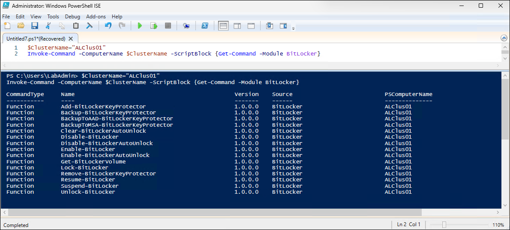

1. From the Administrator: Windows PowerShell ISE window, run the following code to list BitLocker status on volumes hosted by the cluster nodes: 

   > **Note:** Using this approach will provide some information, but the output is not particularly clear because mountpoints are listed using GUID

   ```powershell
   Invoke-Command -ComputerName $ClusterName -ScriptBlock {Get-BitlockerVolume}
   ```

   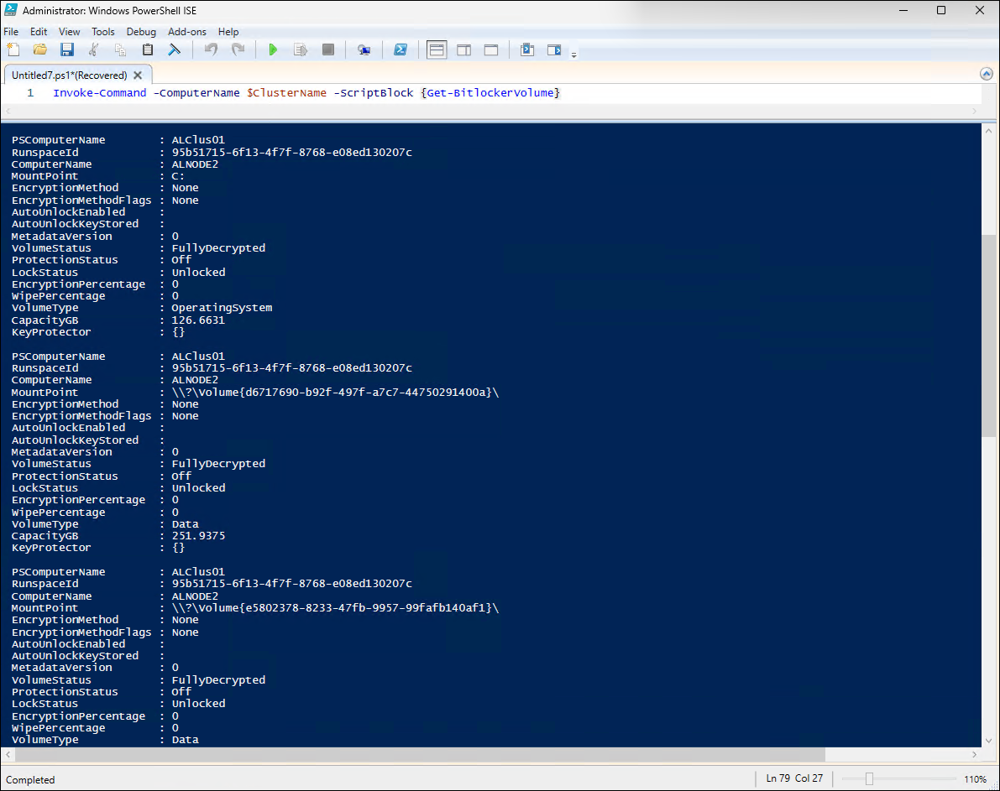

1. From the Administrator: Windows PowerShell ISE window, run the following code to generate a more meaningful output:

   > **Note:** The following code queries all CSV volumnes in the cluster to retrieve BitLocker encryption status. For each CSV, it connects to the owning node, collects volume details such as encryption percentage, method, protection status, and mount point, and extracts the recovery key protector ID. The results are aggregated into a structured output table for easy review of encryption state across all cluster storage volumes.

   ```powershell
   #Install Failover Clustering PowerShell module
   Install-WindowsFeature -Name RSAT-Clustering-PowerShell

   #Retrieve BitLocker status for all Cluster Shared Volumes (CSV) in the cluster
   $Output=@()
   $CSVs=Get-ClusterSharedVolume -Cluster $clustername
   foreach ($CSV in $CSVs){
       $owner=$csv.ownernode.name
       $CsvPath = ($CSV).SharedVolumeInfo.FriendlyVolumeName

       #Query BitLocker status from the node that owns the CSV
       $Status=Invoke-Command -ComputerName $owner -ScriptBlock {Get-BitLockerVolume -MountPoint $using:CSVPath}
       $KeyProtectorID=Invoke-Command -ComputerName $owner -ScriptBlock {
           ((Get-BitLockerVolume -MountPoint $using:CSVPath).KeyProtector |
           Where-Object KeyProtectorType -eq RecoveryPassword).KeyProtectorId
       }

       #Collect results in a structured output object
       $Output += [PSCustomObject]@{
           "CSVPath"              = $CSVPath
           "VolumeStatus"         = $Status.VolumeStatus
           "KeyProtectorID"      = $KeyProtectorID
           "EncryptionPercentage" = $Status.EncryptionPercentage
           "EncryptionMethod"     = $Status.EncryptionMethod
           "MountPoint"           = $Status.MountPoint
           "ProtectionStatus"     = $Status.ProtectionStatus
       }
   }

   $Output
   ```

   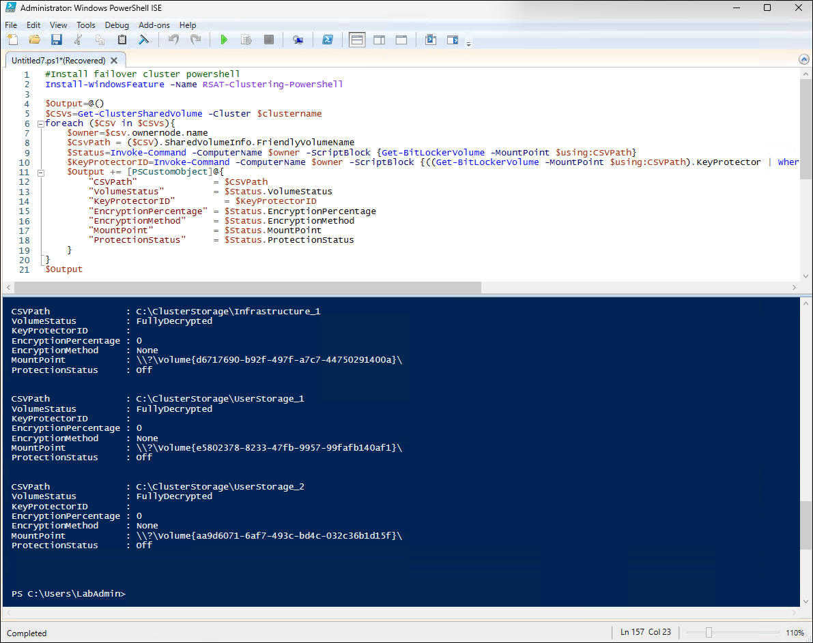

   > **Note:** Encrypting volumes adds another level of complexity. This is documented in the MSLab scenario [Enabling BitLocker on S2D cluster](https://github.com/microsoft/MSLab/tree/master/Scenarios/BitLocker%20on%20S2D%20cluster). Fortunately this can be avoided because Azure Local has its own set of BitLocker cmdlets.

### Task02: Explore Azure Local BitLocker cmdlets

1. From the Administrator: Windows PowerShell ISE window, run the following code to review the Azure Local BitLocker cmdlets:

   > **Note:**: In the name of the cluster, replace the `<xx>` placeholder with the numeric values assigned to the name of the Entra ID user account you are using in this lab. For example, if your user name is `aluser01`, use `01`. 

   ```powershell
   $ClusterName="ALClus<xx>"

   Invoke-Command -ComputerName $ClusterName -ScriptBlock {
       Get-Command -module AzureStackBitlockerAgent
   }
   ```

   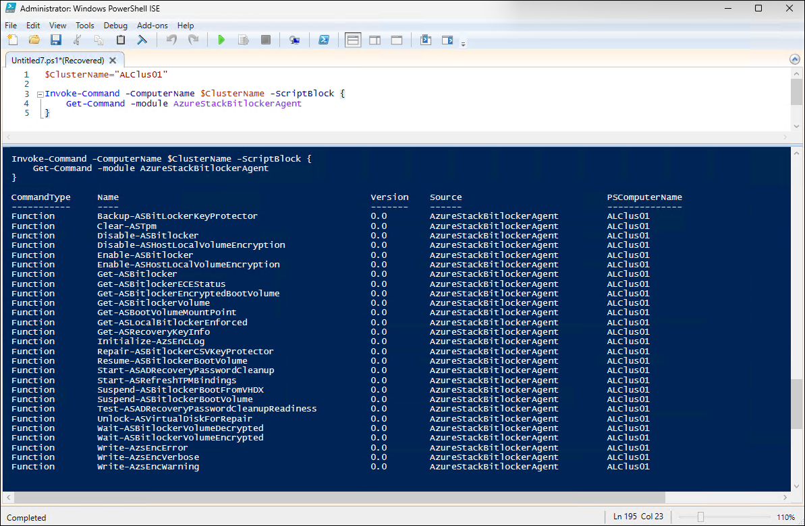


1. For example, you can run the following code to list BitLocker status on volumes hosted by cluster nodes:

   > **Note:** VolumeType can be either BootVolume or ClusterSharedVolume

   > **Note:** You need to run command against all nodes since the cmdlet only collects information about volumes owned by the target node.

   ```powershell
   #Grab cluster nodes
   $ClusterNodes=(Get-ClusterNode -Cluster $ClusterName).Name

   Invoke-Command -ComputerName $ClusterNodes -ScriptBlock {
       Get-ASBitlocker -VolumeType ClusterSharedVolume
   }
   ```

   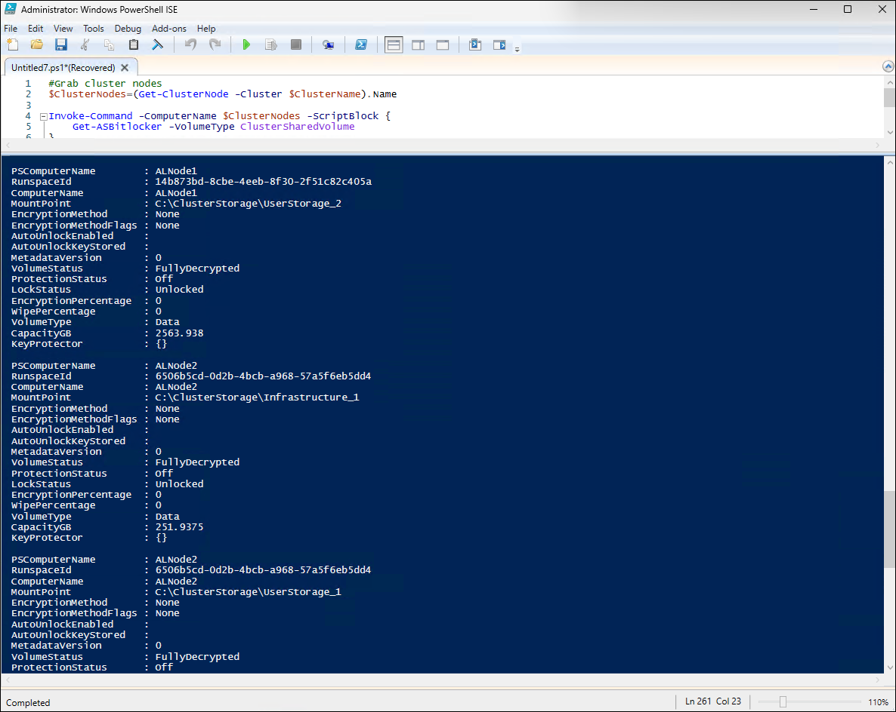

1. You can also run the following code to list by volumes by their mountpoints:

   ```powershell
   Invoke-Command -ComputerName $ClusterName -ScriptBlock {
       $MountPoints=(Get-ClusterSharedVolume).SharedVolumeInfo.FriendlyVolumeName
       foreach ($MountPoint in $MountPoints){
           Get-ASBitlockerVolume -MountPoint $MountPoint
       }
   }
   ```

   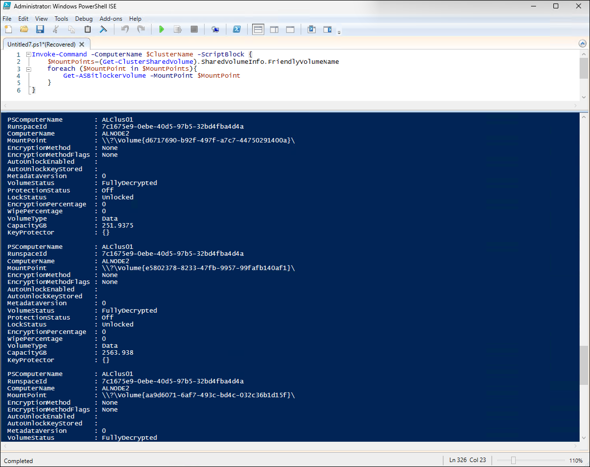

### Task03: Retrieve BitLocker recovery keys from cluster nodes

> **Note:** One of the challenges of working with BitLocker recovery keys involves the ability retrieve them without having to sign in directly into the cluster nodes. To accomplish this, you will use CredSSP to pass credentials to the node (since they needs to be delegated to DC to pull the password, resulting in so-called *double-hop* authentication). Implementing CredSSP has changed slightly in Windows Server 2025. You'll use registry to allow credential delegation to cluster nodes.

> **Note:** To illustrate this scenario, you'll first create a CSV volume and encrypt it with BitLocker.

1. In the Virtual Machine Connection to MSLab-Mgmt VM, launch the web browser, navigate to the Windows Admin Center logon page at `https://mgmt.corp.contoso.com:8443`, and, when prompted, sign in by using the following credentials:

   - Username: *CORP\LabAdmin*
   - Password: *Demo@pass12345*

1. On the **All connections** page, select **alclus`<xx>`.corp.contoso.com**, where the **`<xx>`** placeholder designates the numeric values assigned to the name of the Entra ID user account you are using in this lab.
1. In the vertical menu on the left side, in the **Cluster resources** section, select **Volumes**.
1. On the **Volumes** page, select the **Inventory** tab and then select **+ Create**.
1. In the **Create volume** pane, select **More options** and specify the following settings (leave others with their default values):

   |Setting|Value|
   |---|---|
   |Name|**BitLocker-Volume_1**|
   |Resiliency|**Two-way mirror**|
   |Size on HDD|**10**|
   |Size units|**GB**|
   |Provision as|**Fixed**|
   |Use encryption|Enabled|
   |Cluster AD account can unlock|Enabled|
   |Back up the recovery password to AD|Enabled|

1. Select **Create**.
1. In the **Specify your credentials for PowerShell double hop** pane, specify the following settings:

   |Setting|Value|
   |---|---|
   |Username|**CORP\LabAdmin**|
   |Password|**Demo@pass12345**|

1. Back on the **Inventory** tab, select **Refresh** to confirm that the new volume was created.

   > **Note:** With the encrypted volume created, you'll next run code that retrieves its BitLocker recovery keys.

1. In the Virtual Machine Connection to MSLab-Mgmt VM, from the Administrator: Windows PowerShell ISE window, run the following code to enable CredSSP, retrieve BitLocker recovery keys, and disable CredSSP afterwards: 

   > **Note:**: In the name of the cluster, replace the `<xx>` placeholder with the numeric values assigned to the name of the Entra ID user account you are using in this lab. For example, if your user name is `aluser01`, use `01`. 

   ```powershell
   $ClusterName="ALClus<xx>"

   $CredSSPUserName="Corp\LabAdmin"
   $CredSSPPassword="Demo@pass12345"

   #Capture credentials
       $SecureStringPassword = ConvertTo-SecureString $CredSSPPassword -AsPlainText -Force
       $Credentials = New-Object System.Management.Automation.PSCredential ($CredSSPUserName, $SecureStringPassword)

   #or just
   #Credentials=Get-Credential

   #Configure CredSSP first
       #Since Enable-WSManCredSSP no longer works in WS2025, configure it through the registry
       $CredSSPServers=$ClusterName

       $key = 'hklm:\SOFTWARE\Policies\Microsoft\Windows\CredentialsDelegation'
       if (!(Test-Path $key)) {
           New-Item $key
       }

       #New-ItemProperty -Path $key -Name AllowFreshCredentialsWhenNTLMOnly -Value 1 -PropertyType Dword -Force
       #New-ItemProperty -Path $key -Name AllowFreshCredentials -Value 1 -PropertyType Dword -Force

       $keys = 'hklm:\SOFTWARE\Policies\Microsoft\Windows\CredentialsDelegation\AllowFreshCredentialsWhenNTLMOnly','hklm:\SOFTWARE\Policies\Microsoft\Windows\CredentialsDelegation\AllowFreshCredentials'
       foreach ($Key in $keys){
           if (!(Test-Path $key)) {
               New-Item $key
           }

           $i=1
           foreach ($Server in $CredSSPServers){
               New-ItemProperty -Path $key -Name $i -Value "WSMAN/$Server" -PropertyType String -Force
               $i++
           }
       }

   #Enable CredSSP Server on remote machine
   Invoke-Command -ComputerName $CredSSPServers -ScriptBlock { Enable-WSManCredSSP Server -Force }

   #Send command to remote server
   Invoke-Command -ComputerName $ClusterName -Credential $Credentials -Authentication Credssp -ScriptBlock {
       Get-ASRecoveryKeyInfo
   }

   #Disable CredSSP
       Disable-WSManCredSSP -Role Client
       Remove-Item -Path 'hklm:\SOFTWARE\Policies\Microsoft\Windows\CredentialsDelegation' -Recurse
       Invoke-Command -ComputerName $CredSSPServers -ScriptBlock {Disable-WSManCredSSP Server}
   ```

   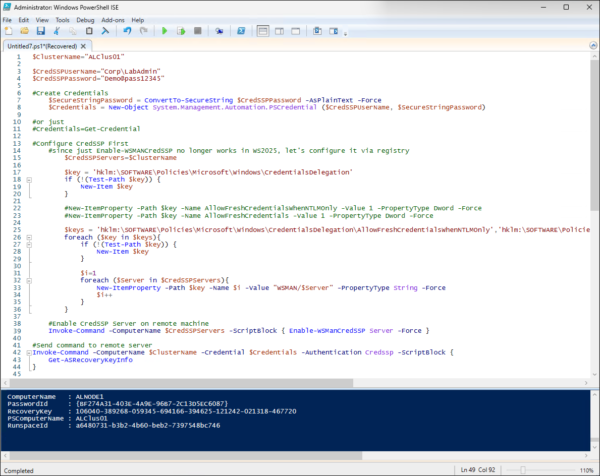

### Task04: Retrieve BitLocker recovery keys from Active Directory

> **Note:** You can also retrieve BitLocker recovery keys from Active Directory (once you install management tools)

1. In the Virtual Machine Connection to MSLab-Mgmt VM, from the Administrator: Windows PowerShell ISE window, run the following code to install the BitLocker and Active Directory management tools: 

   ```powershell
   Install-WindowsFeature -Name RSAT-Feature-Tools-BitLocker-BdeAducExt
   Install-WindowsFeature -Name RSAT-AD-PowerShell
   ```
1. From the Administrator: Windows PowerShell ISE window, run the following code to retrieve the BitLocker recovery keys:

   ```powershell
   Get-ADObject -Filter 'objectClass -eq "msFVE-RecoveryInformation"' -Properties whencreated,msFVE-RecoveryPassword | Select-Object WhenCreated,DistinguishedName,msFVE-RecoveryPassword | Out-GridView
    ```

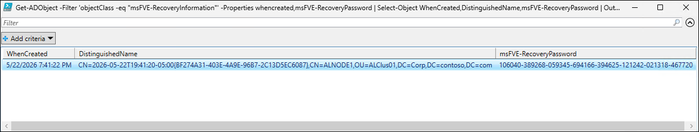

   > **Note:** Alternatively, you can use Active Directory management tools to view the recovery key via GUI.

1. From the Virtual Machine Connection to MSLab-Mgmt VM, start the Active Directory Users and Computers console.
1. In the Active Directory Users and Computers console, in the **View** menu, select the **Advanced Features** entry.
1. In the tree pane of the console, expand the **Corp.contoso.com** node and select the **ALClus`<xx>`** organizational unit (OU), where the **`<xx>`** placeholder designates the numeric values assigned to the name of the Entra ID user account you are using in this lab.

1. In the details pane, in the list of objects, select **ALNODE1** and, in its context-sensitive menu, select **Properties**.
1. In the **ALNODE1 Properties** dialog box, select the **BitLocker Recovery** tab and verify that the key is listed there. 
1. Repeat the same process to view BitLocker recovery keys stored in the **ALNODE2** computer account and verify that the key is *not* listed there. 

   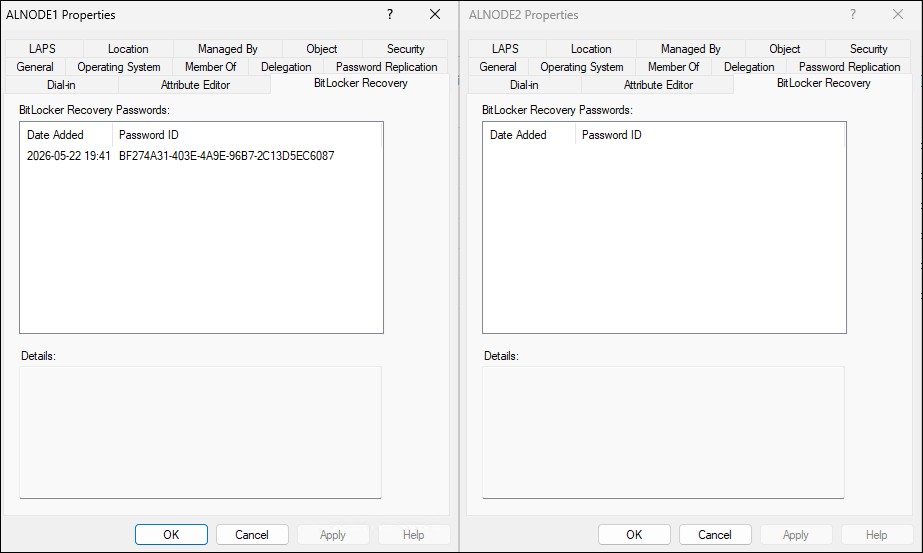

### Task04: Back up recovery key to other AD objects

> **Note:** As illustrated in the previous task, the BitLocker recovery key is present only in the AD computer object corresponding to the single cluster node, which was the owner of the volume at the time of its encryption. This is suboptimal, since the loss of computer object would result in a loss of the recovery keys. To remediate this shortcoming, you will distribute the key to computer objects associated with other cluster nodes.

1. In the Virtual Machine Connection to MSLab-Mgmt VM, from the Administrator: Windows PowerShell ISE window, run the following code to distribute the key to computer objects associated with other cluster nodes: 

   > **Note:**: In the name of the cluster, replace the `<xx>` placeholder with the numeric values assigned to the name of the Entra ID user account you are using in this lab. For example, if your user name is `aluser01`, use `01`. 

   ```powershell
   $ClusterName="ALClus<xx>"

   #Install Failover Clustering PowerShell module
   Install-WindowsFeature -Name RSAT-Clustering-PowerShell

   #Grab CSVs
   $CSVs=Get-ClusterSharedVolume -Cluster $clustername

   #Grab cluster nodes
   $ClusterNodes=(Get-ClusterNode -Cluster $ClusterName).Name

   Foreach ($CSV in $CSVs){
       $owner=$csv.ownernode.name
       $CsvPath = ($CSV).SharedVolumeInfo.FriendlyVolumeName

       Write-Output "Backing up recovery key to other node AD objects"

       foreach ($ClusterNode in $ClusterNodes){
           if ($Clusternode -ne $owner){
               Write-Output "Moving ownership to $ClusterNode and initializing backup"

               $CSV | Move-ClusterSharedVolume -Node $ClusterNode

               Invoke-Command -ComputerName $ClusterNode -ScriptBlock {
                   $KeyProtectorId=((Get-BitLockerVolume $using:CsvPath).KeyProtector | Where-Object KeyProtectorType -Eq "RecoveryPassword").KeyProtectorId

                   if ($KeyProtectorId){
                       Backup-BitLockerKeyProtector -MountPoint $using:CsvPath -KeyProtectorId $KeyProtectorId
                   }
               }
           }
       }
   }
   ```
1. Switch to the Active Directory Users and Computers console and examine the **BitLocker Recovery** tab of the **ALNODE2** computer account. Verify that the key is now listed there. 

   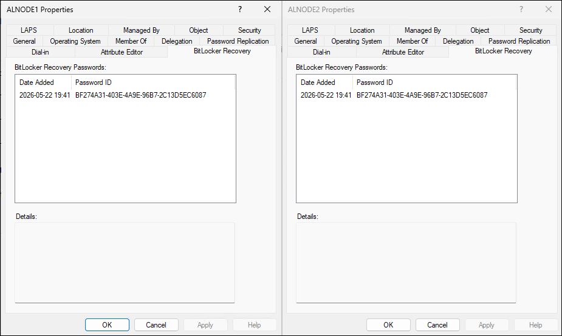

### Task05: Encrypt volumes by using PowerShell

> **Note:** In this task, you will step through the process of encrypting CSV volumes with BitLocker.

1. In the Virtual Machine Connection to MSLab-Mgmt VM, switch to the web browser window displaying Windows Admin Center.
1. If needed, navigate to the **Inventory** tab on the **Volumes** page of the **alclus`<xx`>.corp.contoso.com** cluster (where the **`<xx>`** placeholder designates the numeric values assigned to the name of the Entra ID user account you are using in this lab) and then select **+ Create**.
1. In the **Create volume** pane, select **More options** and specify the following settings (leave others with their default values):

   |Setting|Value|
   |---|---|
   |Name|**BitLocker-Volume_2**|
   |Resiliency|**Two-way mirror**|
   |Size on HDD|**10**|
   |Size units|**GB**|
   |Provision as|**Fixed**|
   |Use encryption|Disabled|

1. Select **Create**.
1. From the Administrator: Windows PowerShell ISE window, run the following code to encrypt the newly created volume (when prompted, make sure to select **BitLocker-Volume_2**, which you should be able to identify based on its **MountPoint** value):

   > **Note:**: In the name of the cluster, replace the `<xx>` placeholder with the numeric values assigned to the name of the Entra ID user account you are using in this lab. For example, if your user name is `aluser01`, use `01`. 

   ```powershell
   $ClusterName="ALClus<xx>"

   #Install Failover Clustering PowerShell module
   Install-WindowsFeature -Name RSAT-Clustering-PowerShell

   #Grab cluster nodes
   $ClusterNodes=(Get-ClusterNode -Cluster $ClusterName).Name

   #Select the volume you want to encrypt
   $CSV=Invoke-Command -ComputerName $ClusterNodes -ScriptBlock {Get-ASBitlocker -VolumeType ClusterSharedVolume} | Out-GridView -OutputMode Single -Title "Please Select CSV"

   #Check which VMs are running on the selected volume
   $VHDs=Get-VMHardDiskDrive -CimSession $ClusterNodes -VMName * | Where-Object Path -Like "$($CSV.MountPoint)*"

   #If VMs are running from this volume, ensure they are shut down before encryption
   $VMNames=$VHDs.VMName | Select-Object -Unique
   if ($VMNames){
       $RunningVMs=Get-VM -CimSession $ClusterNodes -Name $VMNames | Where-Object State -eq Running
       $RunningVMs
   }

   #Suspend running VMs
   if ($RunningVMs){
       $RunningVMs | Stop-VM -Save
   }

   #Encrypt the volume
   Invoke-Command -ComputerName $CSV.PSComputerName -ScriptBlock {
       Enable-ASBitlocker -VolumeType ClusterSharedVolume -MountPoint $using:CSV.MountPoint
   }

   #Start VMs again
   if ($RunningVMs){
       $RunningVMs | Start-VM
   }

   #Back up recovery keys to other cluster node AD objects
   $CSV=Get-ClusterSharedVolume -Cluster $ClusterName | Where-Object {$_.SharedVolumeInfo.FriendlyVolumeName -eq $CSV.MountPoint}
   $owner=$csv.ownernode.name
   $CsvPath = ($CSV).SharedVolumeInfo.FriendlyVolumeName

   Write-Output "Backing up recovery key to other node AD objects"

   foreach ($ClusterNode in $ClusterNodes){
       if ($Clusternode -ne $owner){
           Write-Output "Moving ownership to $ClusterNode and initializing backup"

           $CSV | Move-ClusterSharedVolume -Node $ClusterNode

           Invoke-Command -ComputerName $ClusterNode -ScriptBlock {
               $KeyProtectorId=((Get-BitLockerVolume $using:CsvPath).KeyProtector | Where-Object KeyProtectorType -Eq "RecoveryPassword").KeyProtectorId

               if ($KeyProtectorId){
                   Backup-BitLockerKeyProtector -MountPoint $using:CsvPath -KeyProtectorId $KeyProtectorId
               }
           }
       }
   }
   ```

   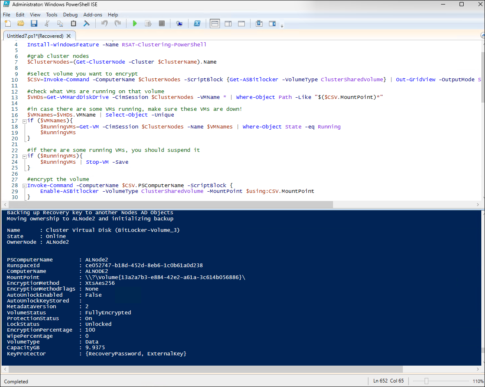

### Task06: Simulate recovery from failure

1. In the Virtual Machine Connection to MSLab-Mgmt VM, from the Administrator: Windows PowerShell ISE window, run the following code to simulate BitLocker recovery from a failure: 

   > **Note:** The following code demonstrates a BitLocker recovery scenario of an encrypted CSV volume. It creates and encrypts a new volume, simulates a failure by removing the volume from cluster management, and then attempts to re-add it, which fails because the volume is BitLocker-protected. The script then retrieves BitLocker recovery key from Active Directory, identifies the recovery key associated with the missing volume, unlocks the disk by using that recovery key, and restores the volume to its original clustered and CSV configuration.

   > **Note:**: In the name of the cluster and the OU path, replace the `<xx>` placeholder with the numeric values assigned to the name of the Entra ID user account you are using in this lab. For example, if your user name is `aluser01`, use `01`. 

   ```powershell
   $ClusterName="ALClus<xx>"
   $VolumeName="BitLocker-Volume_Test"
   $OUPath="OU=ALClus<xx>,DC=Corp,DC=contoso,DC=com"

   #Install required roles
   Install-WindowsFeature -Name "RSAT-Clustering-Powershell","RSAT-AD-PowerShell"

   #Grab servers
   [object[]]$Servers=(Get-ClusterNode -Cluster $CLusterName).Name

   #Create volume
   New-Volume -FriendlyName $VolumeName -Size 10GB -StoragePoolFriendlyName SU* -CimSession $CLusterName

   #Encrypt volume
   $OwnerNode=(Get-ClusterSharedVolume -Cluster $CLusterName -Name *$VolumeName*).OwnerNode
   $OwnerNode
   Invoke-Command -ComputerName $OwnerNode.Name -ScriptBlock {
       Enable-ASBitlocker -VolumeType ClusterSharedVolume -Local -MountPoint c:\ClusterStorage\$using:VolumeName
   }

   #Simulate failure
   #Remove from CSV
   Get-ClusterSharedVolume -Name "Cluster Virtual Disk ($VolumeName)" -Cluster $CLusterName | Remove-ClusterSharedVolume

   #Remove from Cluster Resources
   Get-ClusterResource -Cluster $CLusterName -Name "Cluster Virtual Disk ($VolumeName)" | Remove-ClusterResource -Force

   #Add volume back to cluster (will fail!)
   Get-ClusterAvailableDisk -Cluster $CLusterName | Add-ClusterDisk

   #Validate (it's really failed)
   Get-ClusterResource -Cluster $CLusterName -Name "Cluster Disk 1"

   #Find recovery keys in AD
   $RecoveryInfo=Get-ADObject -Filter { (objectClass -eq "msFVE-recoveryInformation") } -SearchBase "$OUPath" -Properties msFVE-RecoveryPassword, whenCreated
   $RecoveryPasswordsAD=$RecoveryInfo.'msFVE-RecoveryPassword'

   #Grab all existing volumes and its recovery keys, so we can find the missing key in AD
   $RecoveryPasswordsVolumes=Invoke-Command -ComputerName $Servers[0] -ScriptBlock {(Get-BitlockerVolume | Select-Object -ExpandProperty KeyProtector).RecoveryPassword}

   #Find the recovery key for the missing volume
   $RecoveryKey=(Compare-Object -ReferenceObject $RecoveryPasswordsAD -DifferenceObject $RecoveryPasswordsVolumes | Where-Object SideIndicator -eq "<=").InputObject

   #Unlock BitLocker volume
   $RecoveryKeyCollection = [System.Collections.Specialized.StringCollection]::new()
   $RecoveryKeyCollection.Add($RecoveryKey)
   Start-ClusterPhysicalDiskResource -Name "Cluster Disk 1" -RecoveryPassword ($RecoveryKeyCollection -split '\s+')[-1] -Cluster $CLusterName

   #Rename volume to the correct name
   $ClusterResource=Get-ClusterResource -Cluster $CLusterName -Name "Cluster Disk 1"
   $Name=($ClusterResource | Get-ClusterParameter -Name "VirtualDiskName").Value
   $ClusterResource.Name="Cluster Virtual Disk ($Name)"

   #Add to CSV
   Add-ClusterSharedVolume -Name "Cluster Virtual Disk ($Name)" -Cluster $CLusterName
   ```

   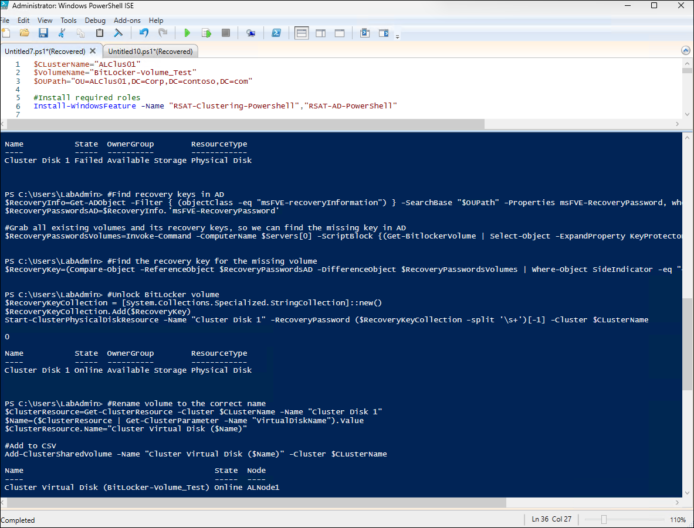


