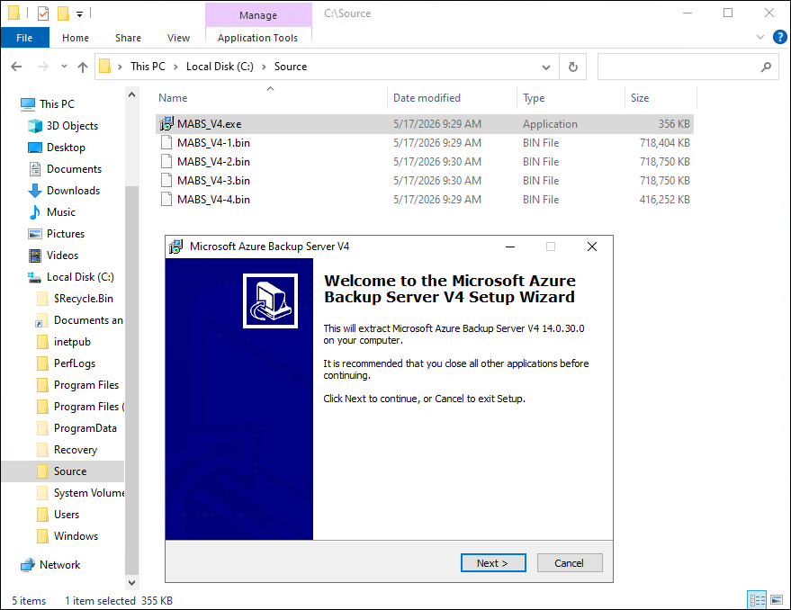
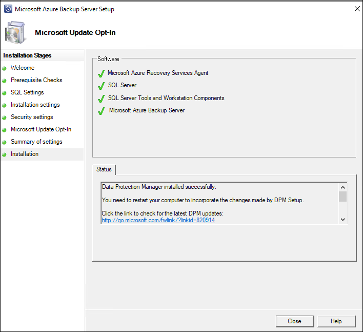
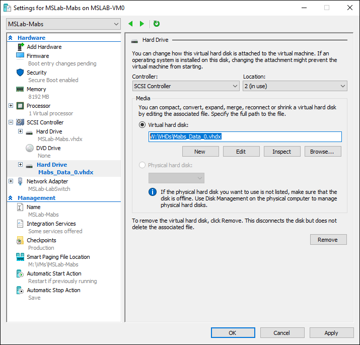
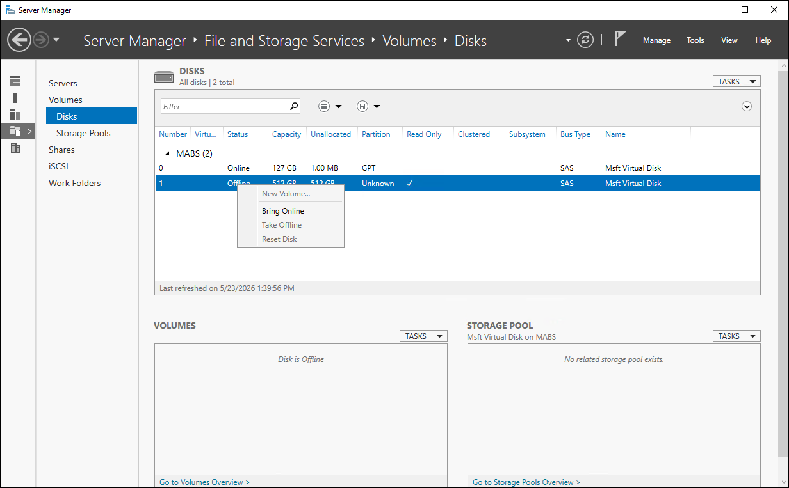
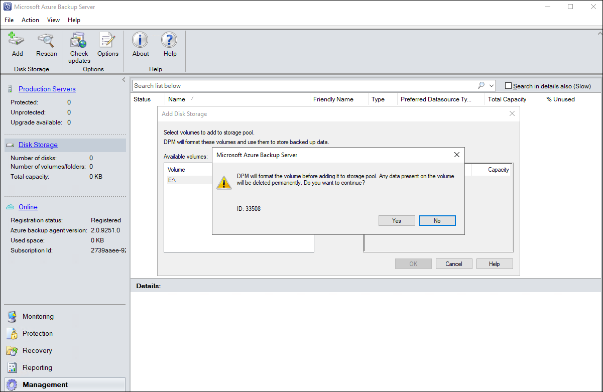
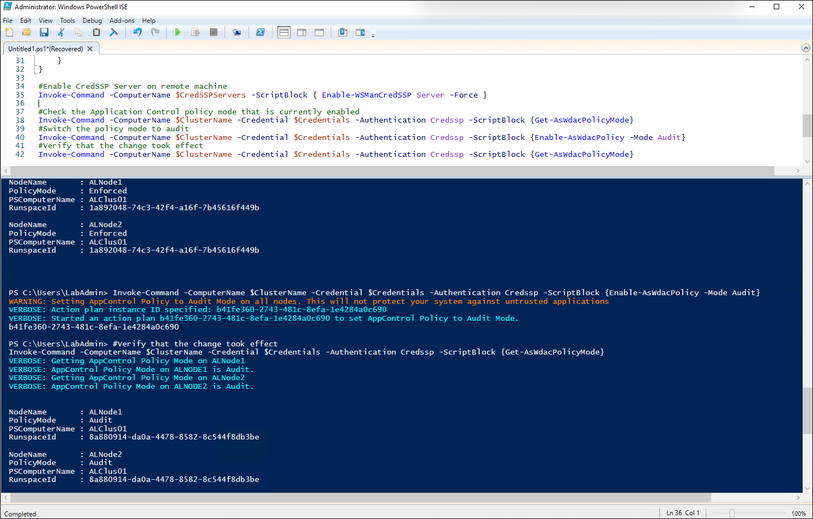
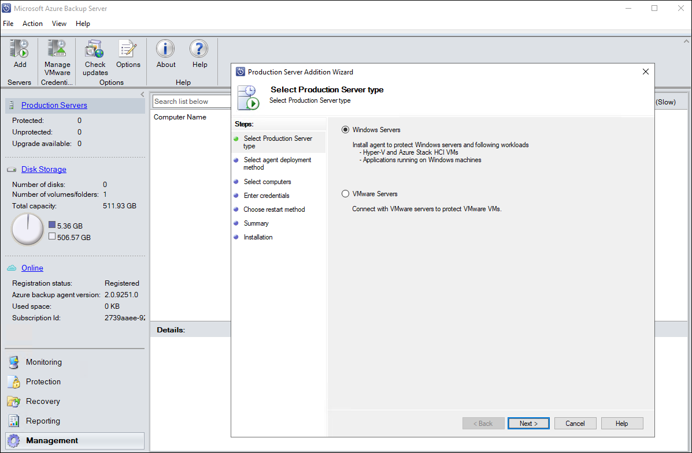
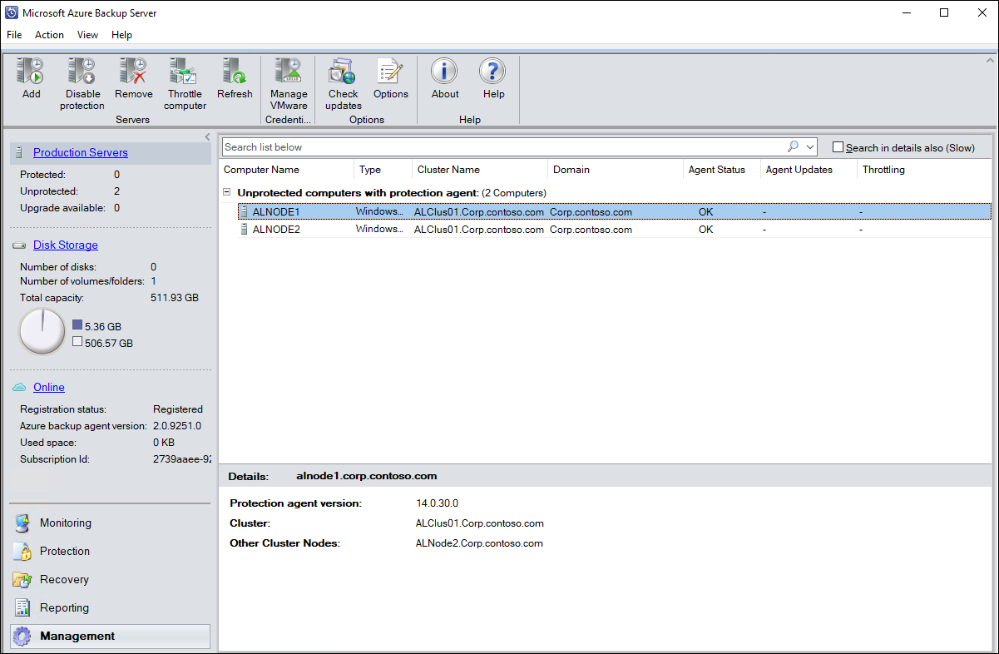
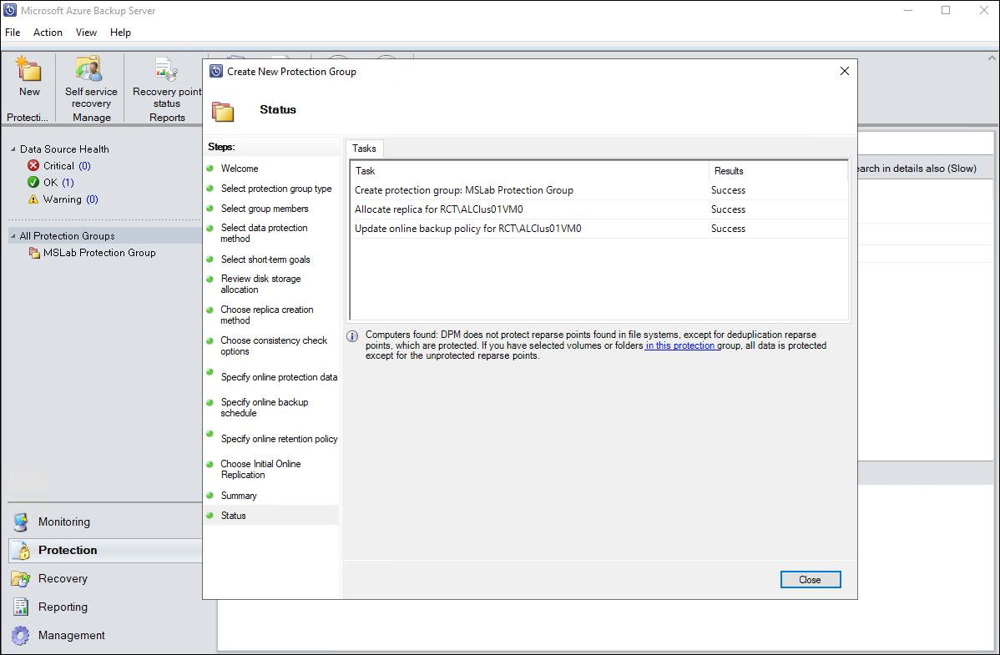

# Workload protection

## About the lab

In this lab you will learn about backup of Azure Local environment by using Microsoft Azure Backup Server (MABS)

## Prerequisites

* Hydrated MSLab containing an Azure Local deployment
* Pre-provisioned **MSLab-Mabs** Hyper-V VM running Windows Server 2022
* Microsoft Azure Backup Server stored in the `C:\Source` folder of **MSLab-Mabs** Hyper-V VM
* An Azure Local VM provisioned in the Azure Local deployment

## The lab

### Preparation

1. From the Hyper-V Manager on the lab VM, if needed, start the MSLab-DC.
1. Ensure that the OS on MSLab-DC VM is running and then, if needed, start the MSLab-Mabs, MSLab-ALNode1 and MSLab-ALNode2 VMs.
1. Connect to MSLab-Mabs VM by using Virtual Machine Connection (using Enhanced Session and Full Screen Mode).
1. Sign in by using the following credentials:

   - Username: *CORP\LabAdmin*
   - Password: *Demo@pass12345*

   > **Note:**: You'll be using the same credentials to sign in throughout the workshop.

   > **Note:**: You'll be running all tasks in this lab from the MSLab-Mabs VM.

### Task 01: Create an Azure Recovery Services vault.

1. In the Virtual Machine Connection to MSLab-Mabs VM, start Microsoft Edge and navigate to [the Azure portal](https://portal.azure.com). Sign in by using the credentials granting you access to the Azure subscription that is used for this lab.
1. In the Azure portal, navigate to the **Recovery Services vaults** page and select **+ Create**
1. On the **Basics** tab of the **Create Recovery Services vault** page, specify the following settings (leave others with their default values):

   > **Note:**: In the name of the **Resource group**, replace the **<username>** placeholder with the name of the Entra ID user account you are using in this lab.

   > **Note:**: In the vault name, replace the **`<xx>`** placeholder with the numeric value assigned to the name of the Entra ID user account you are using in this lab. For example, if your user name is `aluser01`, use `01`. 

   |Setting|Value|
   |---|---|
   |Resource group|**MS-Lab-`<username>`-RG**|
   |Vault name|**ALClus`<xx>`-Bkp-RSVault**|
   |Region|**(Asia Pacific) East Asia**|

1. Select **Next: Redundancy**.
1. On the **Redundancy** tab, set **Backup Storage Redundancy** to **Locally-redundant** and select **Review + create**.

   > **Note:**: Make sure to **NOT** change any of the **Vault properties** settings. In particular, **DO NOT** enable immutability or increase the value of soft delete retention period. 

1. On the **Review + create** tab, select **Create**.

   > **Note:** Wait for the resource provisioning to complete. This should take about 2 minutes.

1. Once the vault is provisioned, select **Go to resource** to navigate to the **ALClus`<xx>`-Bkp-RSVault** page (where the **`<xx>`** placeholder designates the numeric value assigned to the name of the Entra ID user account you are using in this lab).
1. On the **Overview** tab, select **+ Backup**.
1. On the **Backup Goal** page, specify the following settings:

   |Setting|Value|
   |---|---|
   |Where is your workload running?|**Azure Stack HCI**|
   |What you want to backup?|**Virtual Machine**|

1. Select **Prepare infrastructure**.
1. On the **Prepare infrastructure** page, in the section **2. Download vault credentials to register the server to the vault. Vault credentials will expire after 10 days**, select the checkbox **Already downloaded or using the latest Azure Backup Server installation** and then select **Download**.
1. Verify that the vault credentials file has been downloaded to the **Downloads** folder.

### Task 02: Install MABS

1. In the Virtual Machine Connection to MSLab-Mabs VM, open File Explorer, navigate to the `C:\Source` folder, and initiate extraction of Microsoft Azure Backup Server installation files by launching **MABS_V4.exe**.

   

1. Proceed with the extraction by accepting the default settings.

   > **Note:** Wait for the extraction to complete. This might take about 5 minutes.

1. Once the extraction completes, in File Explorer, navigate to the `C:\Microsoft Azure Backup Server V4` folder and initiate installation of Microsoft Azure Backup Server by launching **Setup.exe**.
1. On the Microsoft Azure Backup Server installation page, in the **Install** section, select **Microsoft Azure Backup Server**.
1. Accept the licensing terms and, on the **Welcome** tab of **Microsoft Azure Backup Server Setup**, select **Next**.
1. On the **Prerequisite Check** tab, select **Check** and, once the check completes successfully, select **Next**.
1. On the **SQL Settings** tab, ensure that the **Install new SQL server instance** option is selected and then select **Check and Install**.

   > **Note:** You might need to restart the operating system once the **HyperVPowerShell** module is installed. Once you restart the operating system, sign in back to MSLab-Mabs VM and restart the setup.

1. Back on the **SQL Settings** tab, ensure that the **Install new SQL server instance** option is selected, select **Check and Install**, and then select **Next**.
1. On the **Installation settings** tab, accept the default configuration and select **Next**.
1. On the **Security settings** tab, set the password of the local user accounts of Microsoft Azure Backup Server to **Demo@pass12345** and select **Next**.
1. On the **Microsoft Update Opt-In** tab, select **I do not want to use Microsoft Update** and then select **Next**.

   > **Note:** This is done strictly to minimize duration of and interruptions to the lab. In general, you should consider selecting the option to **Use Microsoft Update when I check for updates**. 

1. On the **Summary of settings** tab, select **Install**.

   > **Note:** This will trigger **Microsoft Azure Recovery Services Agent Wizard**.

1. Switch to **Microsoft Azure Recovery Services Agent Wizard**.
1. On the **Proxy Configuration** tab, select **Next**.
1. On the **Installation** tab, select **Install**.

   > **Note:** Wait for the agent installation to complete. This should take less than 1 minute.

1. On the **Installation** tab, select **Next**.

   > **Note:** This will launch **Register Server Wizard**.

1. On the **Vault Identification** tab of **Register Server Wizard**, select **Browse**, in the **Select Vault Credentials** dialog box, navigate to the **Downloads** folder and select the vault credentials file downloaded in the previous task.
1. On the **Vault Identification** tab, select **Next**.
1. On the **Encryption Settings** tab, select **Generate Passphrase**, then select **Browse**, in the **Browse For Folder** dialog box, navigate to the `C:\Recovery` folder and select **OK**.

   > **Note:** Note that, in production scenarios, you should **NOT** store the passphrase file in a local folder, but rather use for this purpose a secure, external location. This is essential to ensure that backups can be restored in case of the server failure.

1. Back on the **Encryption Settings** tab, select **Next** and acknowledge the warning about the location you chose for the passphrase file by selecting **Yes**.

   > **Note:** This will trigger server registration with the vault. Wait for the registration to complete. Once the registration is completed, the next step of the installation process (SQL Server installation) will continue.

   > **Note:** Wait for the installation to complete. This might take about 15 minutes.

1. On the **Installation** tab of **Microsoft Azure Backup Server Setup**, select **Close**.

   

1. Restart the operating system following the installation. This will automatically close the Virtual Machine Connection to MSLab-Mabs VM.

### Task 03: Configure MABS storage

1. From the lab VM, if needed, start Microsoft Edge and navigate to [the Azure portal](https://portal.azure.com). Sign in by using the credentials granting you access to the Azure subscription that is used for this lab.
1. In the Azure portal, navigate to the **Virtual machines** page.
1. On the **Virtual machines** page, select the **mslab-vm`<xx>`** entry (where the **`<xx>`** placeholder represents the numeric value assigned to the name of the Entra ID user account you are using in this lab). 
1. On the virtual machine page, in the vertical menu on the left side, expand the **Settings** section and then select **Disks**.
1. In the **Data disks** section, select **+ Create and attach a new disk**.
1. In the row representing the newly added disk, specify the following settings (leave others with their defalts) and then select **Apply**.

   > **Note:**: In the disk name, replace the **`<xx>`** placeholder with the numeric value assigned to the name of the Entra ID user account you are using in this lab. For example, if your user name is `aluser01`, use `01`. 

   |Setting|Value|
   |---|---|
   |Disk name|**mslab-vm`<xx>`_DataDisk_2**|
   |Storage type|**Standard_HDD_LRS**|
   |Size (GiB)|**512**|
   |Host caching|**None**|

   > **Note:**: For disks used as a storage target for Azure Backup Server (MABS), the recommended host caching setting is **None**. Backup workloads are large, sequential write-heavy operations, and host caching does not provide meaningful benefit for this pattern, but instead can introduce unnecessary overhead. You should also ensure the disk type is appropriate (typically Premium SSD or Premium SSD v2 depending on throughput requirements). In the lab, you are using Standard HDD strictly to minimize overall cost.

1. While connected to the lab VM, switch to **Server Manager**.
1. In **Server Manager**, in the vertical menu on the left side, select **File and Storage Services** and then select **Disks**.
1. In the list of disks attached to the lab VM, right-click the disk entry listed with the **Unknown** partition, in the context-sensitive menu, select **Initialize** and select **Yes** when prompted whether to proceed.
1. Right-click the same disk again and, in the context-sensitive menu, select **New Volume** to launch **New Volume Wizard**.
1. On the **Select the server and disk** tab, accept the default settings and select **Next >**.
1. On the **Select the size of the volume** tab, accept the default size (512 GB) and select **Next >**.
1. On the **Assign to a drive letter or folder** tab, select the drive letter **W** and then select **Next >**.
1. On the **Select file system settings, ensure that the file system is set to **NTFS**, change the allocation unit to **64K**, in the **Volume label** text box, enter **MABS Storage** and select **Next >**.

   > **Note:**: For disks used as a backup repository with Azure Backup Server, the recommended file system is NTFS, formatted with a large allocation unit size (typically 64 KB). NTFS remains the most stable and fully supported option for MABS workloads, especially for large sequential backup files (like VHDX-based recovery points). The larger allocation unit reduces metadata overhead and improves performance for large file writes, which is the dominant pattern in backup storage.

1. On the **Confirmation** tab, select **Create** and, once the volume creation is completed, select **Close**. 
1. While connected to the lab VM, if needed, open the Hyper-V Manager console.
1. In the Hyper-V Manager console, in the **Actions** pane, select **New** followed by **Hard disk**.
1. On the **Before You Begin** tab, select **Next >**.
1. On the **Choose Disk Format** tab, ensure that the **VHDX** option is selected and then select **Next >**.
1. On the **Choose Disk Type** tab, ensure that the **Dynamically expanding** option is selected and then select **Next >**.
1. On the **Specify Name and Location** tab, in the **Name** text box, enter **Mabs_Data_0.vhdx**, in the **Location** text box, enter **W:\VHDs** (first create the **VHDs** directory on the W: drive), and then select **Next >**.
1. On the **Configure Disk** tab, leave the default option **Create a new blank virtual hard disk** selected, set the size to **512 GB** and select **Next >**.
1. On the **Summary** tab, select **Finish**.
1. Back in the **Hyper-V Manager** console, in the list of virtual machines, select **MSLab-Mabs** and, in the **Actions** pane, select **Settings**. 
1. In the **Settings for MSLab-Mabs** dialog box, select the **SCSI Controller** entry, in the list of drive types to add, select **Hard Drive**, and then select **Add**.
1. In the **Virtual hard disk** text box, enter **W:\VHDs\Mabs_Data_0.vhdx** and select **OK**.

   

1. Sign in back to MSLab-Mabs VM by using Virtual Machine Connection (using Enhanced Session and Full Screen Mode).
1. Once signed in, in **Server Manager**, in the vertical menu on the left side, select **File and Storage Services** and then select **Disks**.
1. In the list of disks attached to the **MABS** server, right-click disk number 1, which at this point, should be in the offline state and, in the context-sensitive menu, select **Bring Online** and confirm when prompted. 

   

1. Right-click the disk number 1 again, in the context-sensitive menu, select **Initialize**, and select **Yes** to confirm that the disk will be initialized as a GPT disk. 
1. Right-click the disk number 1 again, in the context-sensitive menu, select **New Volume** to launch **New Volume Wizard**.
1. On the **Before You Begin** tab, select **Next >**.
1. On the **Select the server and disk** tab, accept the default settings and select **Next >**.
1. On the **Select the size of the volume** tab, accept the default size (**512** GB) and select **Next >**.
1. On the **Assign to a drive letter or folder** tab, accept the default option (drive letter **D:**) and then select **Next >**.
1. On the **Select file system settings, in the **Volume label** text box, ensure that the file system is set to **NTFS**, change the allocation unit to **64K**, in the **Volume label** text box, enter **MABS Storage** and select **Next >**.
1. On the **Confirmation** tab, select **Create** and, once the volume creation is completed, select **Close**. 

   > **Note:** Next, you will add the newly created volume as storage to MABS.

1. From the Virtual Machine Connection to MSLab-Mabs VM, from the Start menu, launch the **Microsoft Azure Backup Server** console.
1. In the verical menu on the left side, select **Management**, select the **Disk Storage** link, and then select the **Add** button in the toolbar.
1. In the **Add Disk Storage** dialog box, select the **D:\** volume and then select **Add >**.
1. When prompted, acknowledge the warning that **DPM wil format the volume before adding it to storage pool** and then select **OK**.

   

### Task 04: Deploy MABS agent to Azure Local nodes

> **Note:** In order to protect Azure Local VMs, you need to install the MABS agent on the Azure Local cluster nodes. However, this requires changes to Defender Application Control running on the nodes, since, by default, it will block the agent installation. While you could configure code integrity policies to permit execution of the required binaries, for the sake of simplicitly, you will temporarily switch from the enforced to audit mode instead. To manage Application Control from MABS, you will also need to enable CredSSP.

1. In the Virtual Machine Connection to MSLab-Mabs VM, launch Windows PowerShell ISE and run the following code to switch from the enforced to audit mode of Application Control.

   > **Note:**: In the value of the `$ClusterName` variable, replace the `<xx>` placeholder with the numeric value assigned to the name of the Entra ID user account you are using in this lab. For example, if your user name is `aluser01`, use `01`. 

   ```powershell
   $ClusterName="ALClus<xx>"
   $CredSSPServers=$ClusterName

   $CredSSPUserName="Corp\LabAdmin"
   $CredSSPPassword="Demo@pass12345"
   $SecureStringPassword = ConvertTo-SecureString $CredSSPPassword -AsPlainText -Force
   $Credentials = New-Object System.Management.Automation.PSCredential ($CredSSPUserName, $SecureStringPassword)

   #Configure CredSSP first
   Enable-WSManCredSSP -Role Client -DelegateComputer $CredSSPServers -Force

   #Since Enable-WSManCredSSP no longer works in WS2025, configure it through the registry
   $key = 'hklm:\SOFTWARE\Policies\Microsoft\Windows\CredentialsDelegation'
   if (!(Test-Path $key)) {
       New-Item $key
   }

   #New-ItemProperty -Path $key -Name AllowFreshCredentialsWhenNTLMOnly -Value 1 -PropertyType Dword -Force
   #New-ItemProperty -Path $key -Name AllowFreshCredentials -Value 1 -PropertyType Dword -Force

   $keys = 'hklm:\SOFTWARE\Policies\Microsoft\Windows\CredentialsDelegation\AllowFreshCredentialsWhenNTLMOnly','hklm:\SOFTWARE\Policies\Microsoft\Windows\CredentialsDelegation\AllowFreshCredentials'
   foreach ($Key in $keys){
       if (!(Test-Path $key)) {
           New-Item $key
       }

       $i=1
       foreach ($Server in $CredSSPServers){
           New-ItemProperty -Path $key -Name $i -Value "WSMAN/$Server" -PropertyType String -Force
           $i++
       }
   }

   #Enable CredSSP Server on remote machine
   Invoke-Command -ComputerName $CredSSPServers -ScriptBlock { Enable-WSManCredSSP Server -Force }

   #Check the Application Control policy mode that is currently enabled
   Invoke-Command -ComputerName $ClusterName -Credential $Credentials -Authentication Credssp -ScriptBlock {Get-AsWdacPolicyMode}

   #Switch the policy mode to audit
   Invoke-Command -ComputerName $ClusterName -Credential $Credentials -Authentication Credssp -ScriptBlock {Enable-AsWdacPolicy -Mode Audit}

   #Verify that the change took effect
   Invoke-Command -ComputerName $ClusterName -Credential $Credentials -Authentication Credssp -ScriptBlock {Get-AsWdacPolicyMode}
   ```

   > **Note:** It might take for the Orchestrator about 3 minutes to switch to the selected mode. You might want to re-run the last `Invoke-Command` statement to confirm that the change took effect.

   

   > **Note:** By default, push installation will fail due to firewall restrictions. As a workaround, you will install the agent manually on the target nodes.

1. Switch back from the Virtual Machine Connection to MSLab-Mabs to the lab VM. 
1. From the lab VM, open the Virtual Machine Connection to MSLab-ALNode1 VM. 
1. Sign in by using the following credentials:

   - Username: *CORP\LabAdmin*
   - Password: *Demo@pass12345*

1. In the **SConfig** menu, enter **15** to **Exit to the command line (PowerShell)**.
1. From the PowerShell prompt, run the following commands:

   ```powershell
   New-Item -ItemType Directory -Path 'C:\Temp'
   Set-Location -Path 'C:\Temp'
   Copy-Item -Path '\\MABS\C$\Program Files\Microsoft Azure Backup Server V4\DPM\DPM\ProtectionAgents\RA\14.0.30.0\amd64\DPMAgentInstaller_x64.exe'
   .\DPMAgentInstaller_x64.exe /q MABS.corp.contoso.com /IAcceptEULA   
   ```
1. From the lab VM, open the Virtual Machine Connection to MSLab-ALNode2 VM. 
1. Sign in by using the following credentials:

   - Username: *CORP\LabAdmin*
   - Password: *Demo@pass12345*

1. In the **SConfig** menu, enter **15** to **Exit to the command line (PowerShell)**.
1. From the PowerShell prompt, run the following commands:

   ```powershell
   New-Item -ItemType Directory -Path 'C:\Temp'
   Set-Location -Path 'C:\Temp'
   Copy-Item -Path '\\MABS\C$\Program Files\Microsoft Azure Backup Server V4\DPM\DPM\ProtectionAgents\RA\14.0.30.0\amd64\DPMAgentInstaller_x64.exe'
   .\DPMAgentInstaller_x64.exe /q MABS.corp.contoso.com /IAcceptEULA   
   ```

1. Switch back to the Virtual Machine Connection to MSLab-Mabs VM.
1. In the Microsoft Azure Backup Server console, in the verical menu on the left side, ensure that the **Management** workspace is selected, select the **Production Servers** link, and then, in the toolbar, select **Add**.

   > **Note:** This will launch **Production Server Additon Wizard**.

   

1. On the **Select Production Server type** tab of **Production Server Additon Wizard**, accept the default option (**Windows Servers**) and select **Next >**.
1. On the **Select agent deployment method** tab, select **Attach agents**, accept the default option **Computers on trusted domain**, and select **Next >**.
1. On the **Select Computers** tab, select **ALNODE1** and **ALNODE2**, select **Add >**, and then select **Next >**.
1. On the **Enter Credentials** tab, in the **User name** text box, enter **LabAdmin**, in the **Password** text box, enter **Demo@pass12345**, accept the default value in the **Domain** text box (**Corp.contoso.com**), and then select **Next >**. 
1. On the **Summary** tab, select **Attach** and, once the task completes successfully, select **Close**.

   

### Task 05: Configure MABS protection

1. In the Microsoft Azure Backup Server console, in the verical menu on the left side, select **Protection** and then select **New** in the toolbar.

   > **Note:** This will launch the **Create New Protection Group** wizard.

1. On the **Welcome** tab of the **Create New Protection Group** wizard, select **Next >**.
1. On the **Select protection group type** tab, accept the default option (**Servers**) and select **Next >**.
1. On the **Select group members** tab, in the **Available members** pane, expand the **ALClus`<xx>` (Cluster)** node, where the **`<xx>`** placeholder designates the numeric value assigned to the name of the Entra ID user account you are using in this lab.
1. In the list of child nodes, expand the node representing the Azure Local VM **ALClus`<xx>`VM0** (where the **`<xx>`** placeholder designates the numeric value assigned to the name of the Entra ID user account you are using in this lab) and note hierarchy consisting of the **HyperV** subnode and its child node named **RTC\ALClus`<xx>`VM0**.

   > **Note:** The HyperV child node represents the standard host-level backup component, allowing you to back up the virtual machine as a whole from the hypervisor level. The nested RTC\ALClus`<xx>`VM0 child node designates the *Runtime Component* (specifically, the Hyper-V Volume Shadow Copy Service), which enables application-consistent, online backups by coordinating with the guest operating system to freeze data transactions during the snapshot process.

1. Select the **RTC\ALClus`<xx>`VM0** child node (where the **`<xx>`** placeholder designates the numeric value assigned to the name of the Entra ID user account you are using in this lab) and then select **Next >**.
1. On the **Select data protection method** tab, set the **Protection group name** to **MSLab VM Protection Group**, keep both checkboxes (**I want short-term projection using Disk** and **I want online protection**) selected, and then select **Next >**.
1. On the **Select short-term goals** tab, set retention range to **3** days and keep the default value of the recovery points and express full backup (**8:00 PM Everyday**).

   > **Note:** Express Full Backup is a backup method that minimizes backup time and storage churn by combining an initial full backup with subsequent incremental backups that are efficiently merged at the recovery point level. Instead of repeatedly transferring full VM data, MABS tracks changes at the block level using the Microsoft Azure Recovery Services (MARS) or Hyper-V/VSS integration, so only changed blocks are backed up after the initial snapshot. The *express* aspect comes from optimizing how recovery points are created and maintained locally on the MABS storage pool, allowing near-full recovery points to be synthesized without repeatedly transferring full datasets. This reduces network bandwidth usage, speeds up backup windows, and lowers storage overhead while still providing full point-in-time VM recovery capabilities.

1. On the **Review disk storage allocation** tab, review the storage allocation based on the backup settings you specified and select **Next >**.
1. On the **Choose replica creation method** tab, accept the default option (**Automatically over the network** and **Now**) and select **Next >**.
1. On the **Choose consistency check option** tab, accept the default settings (**Run a consistency check if a replica becomes inconsistent**) and select **Next >**.
1. On the **Specify online protection data** tab, select the checkbox next to the **RTC\ALClus`<xx>`VM0** entry (where the **`<xx>`** placeholder designates the numeric value assigned to the name of the Entra ID user account you are using in this lab) and then select **Next >**.
1. On the **Specify online backup schedule** tab, set **Schedule a backup every** to every once a **Week** on **Saturday** at **9:00 PM**, and then select **Next >**.
1. On the **Specify online retention policy** tab, accept the default settings and select **Next >**.
1. On the **Choose Initial Online Replication** tab, keep the default option (**Online**) and select **Next >**.
1. On the **Summary** tab, select **Create Group**.
1. Once all tasks are successfully completed, on the **Status** tab, select **Close**.

   
