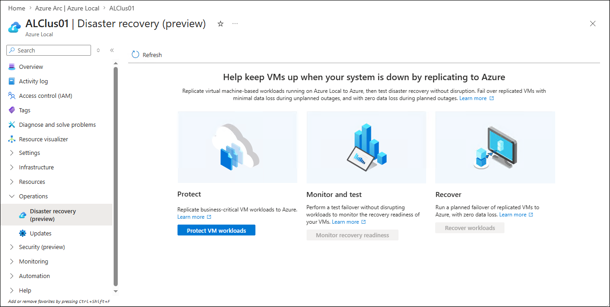
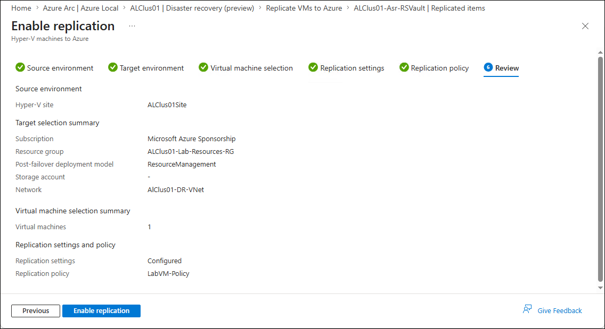
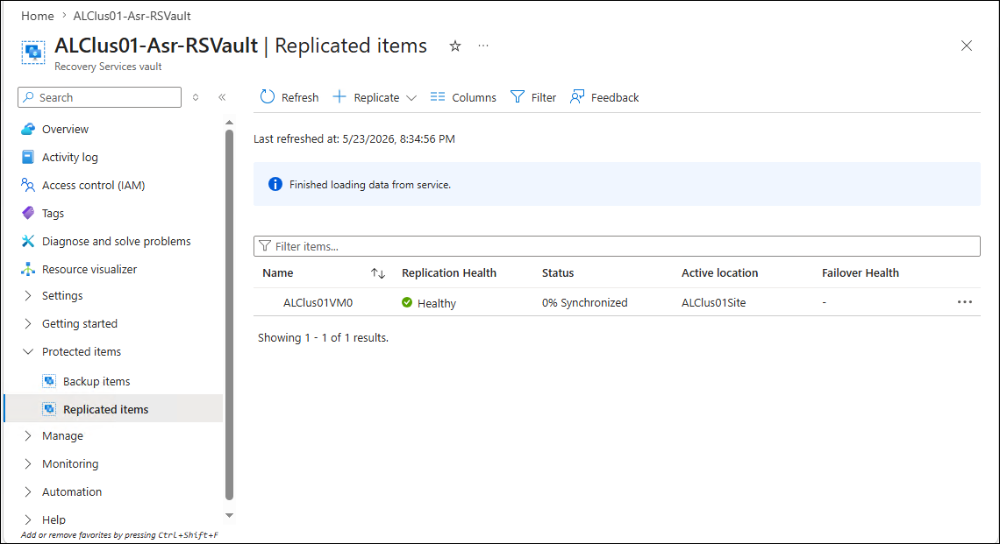
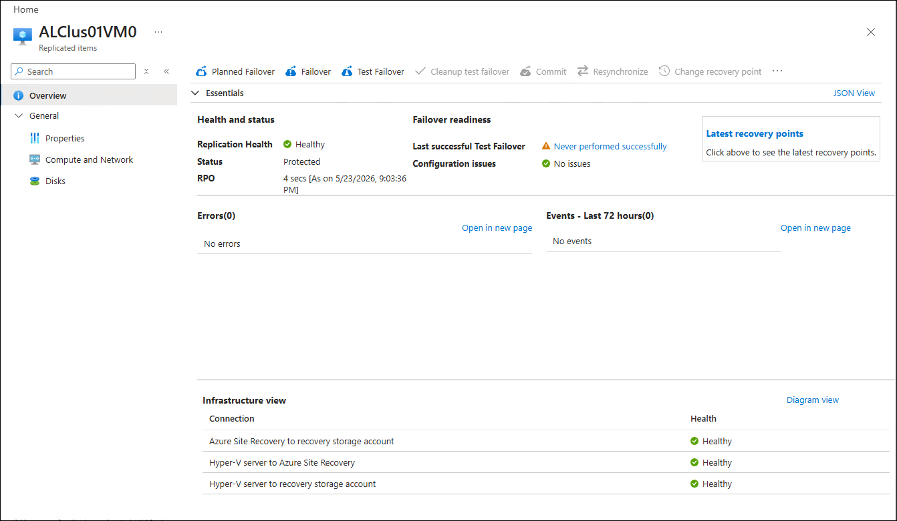

# Disaster recovery

## About the lab

In this lab you will learn how to protect Windows and Linux-based workloads hosted on Azure Local by using Azure Site Recovery to replicate Azure Local VMs to Azure.

> **Note:** As of June 2026, this functionality is in public preview.

## Prerequisites

* Hydrated MSLab containing an Azure Local deployment
* An Azure Local VM provisioned in the Azure Local deployment

## The lab

### Preparation

1. From the Hyper-V Manager on the lab VM, if needed, start the MSLab-DC.
1. Ensure that the OS on MSLab-DC VM is running and then, if needed, start the MSLab-Mabs, MSLab-ALNode1, and MSLab-ALNode2 VMs.
1. Connect to MSLab-Mabs VM by using Virtual Machine Connection (using Enhanced Session and Full Screen Mode).
1. Sign in by using the following credentials:

   - Username: *CORP\LabAdmin*
   - Password: *Demo@pass12345*

### Task 01: Prepare infrastructure to support Azure Site Recovery

> **Note:** This task involves setting up an Azure Recovery Services vault, creating a Hyper-V site, installing the site recovery extension, and creating a replication policy associated with Azure Local machines.

1. In the Virtual Machine Connection to MSLab-Mabs VM, start Microsoft Edge and navigate to [the Azure portal](https://portal.azure.com). Sign in by using the credentials granting you access to the Azure subscription that is used for this lab.
1. In the Azure portal, search for **Azure Local**.
1. On the **Azure Arc \| Azure Local** page, select the **All systems** tab and then select the **ALClus`<xx>`** instance (where the **`<xx>`** placeholder designates the numeric value assigned to the name of the Entra ID user account you are using in this lab).
1. In the vertical menu on the left side, expand the **Operations** section and select **Disaster recovery (preview)**.
1. On the **Disaster recovery (preview)** page, select **Protect VM workloads**.

   

1. On the **Replicate VMs to Azure** page, in the **Step 1: Prepare infrastructure** section, select the **Prepare infrastructure** button.
1. On the **Prepare infrastructure** page, next to the **Vault to prepare infrastructure for** text box, select **Create new vault**.
1. On the **Basics** tab of the **Create Recovery Services vault** pane, specify the following settings (leave others with their default values):

   > **Note:**: In the name of the **Resource group**, replace the **`<username>`** placeholder with the name of the Entra ID user account you are using in this lab.

   > **Note:**: In the vault name, replace the **`<xx>`** placeholder with the numeric value assigned to the name of the Entra ID user account you are using in this lab. For example, if your user name is `aluser01`, use `01`. 

   |Setting|Value|
   |---|---|
   |Resource group|**MS-Lab-`<username>`-RG**|
   |Vault name|**ALClus`<xx>`-Asr-RSVault**|
   |Region|**East Asia**|

1. Select **Next: Redundancy**.
1. On the **Redundancy** tab, set **Backup Storage Redundancy** to **Locally-redundant** and select **Review + create**.

   > **Note:**: Make sure to **NOT** change any of the **Vault properties** settings. In particular, **DO NOT** enable immutability or increase the value of soft delete retention period. 

1. On the **Review + create** tab, select **Create**.
1. Back on the **Prepare infrastructure** page, next to the **Hyper-V site** text box, select **Create new site**.
1. In the **Create Hyper-V site** pane, in the **Name** text box, enter **ALClus`<xx>`Site** (where the **`<xx>`** placeholder designates the numeric value assigned to the name of the Entra ID user account you are using in this lab) and select **OK**.
1. Back on the **Prepare infrastructure** page, next to the **Replication policy** text box, select **Create new policy**.
1. In the **Create replication policy** pane, specify the following settings (leave others with their default values) and select **OK**:

   |Setting|Value|
   |---|---|
   |Name|**MSLab-VM-Policy**|
   |Source type|**Hyper-V**|
   |Target type|**Azure**|
   |Copy frequency|**5 minutes**|
   |Recovery point retention in hours|**4**|
   |App-consistent snapshot frequency (in hours)|**4**|
   |Initial replication start time|**Immediately**|

   > **Note:** App consistent snapshot frequency should be less than or equal to the recovery point retention and its value must be between 0 and 12.

1. Back on the **Prepare infrastructure** page, select **Prepare infrastructure**.

   > **Note:** Do not wait until the **Prepare infrastructure** stage is completed but instead procede to the next step. This starge might take about 5 minutes to complete. 

   > **Note:** As part of preparing infrastructure, you will also create a virtual network in Azure, which will provide networking functionality in a disaster recovery scenario and an Azure storage account to provide caching for replication.

1. In the same web browser window, open another tab and navigate to the **Virtual networks** page in the Azure portal.
1. On the **Virtual networks** page, select **+ Create**.
1. On the **Basics** tab of the **Create virtual network** page, specify the following settings (leave others with their default values) and select **Next**:

   > **Note:**: In the name of the **Resource group**, replace the **`<username>`** placeholder with the name of the Entra ID user account you are using in this lab.

   > **Note:**: In the virtual network name, replace the `<xx>` placeholder with the numeric value assigned to the name of the Entra ID user account you are using in this lab. For example, if your user name is `aluser01`, use `01`. 

   |Setting|Value|
   |---|---|
   |Resource group|**MS-Lab-`<username>`-RG**|
   |Virtual network name|**AlClus`<xx>`-dr-vnet**|
   |Region|**(Asia Pacific) East Asia**|

1. On the **Security** tab, accept the default settings and select **Next**.
1. On the **Address space** tab, set the virtual network address space to **172.16.2`<xx>`.0/24** and change the default subnet to **subnet0** with the IP address range of **172.16.2`<xx>`.0/25** (where the `<xx>` placeholder with the numeric value assigned to the name of the Entra ID user account you are using in this lab. For example, if your user name is `aluser01`, use `01`). Clear the checkbox **Enable private subnet (no default outbound access)**, save the change, and select **Review + create**.
1. On the **Review + create** tab, select **Create**.

   > **Note:** Do not wait for the resource provisioning to complete but proceed to the next step. The provisioning should take less than 1 minute.

1. From the same web browser tab, navigate to the **Storage accounts** page in the Azure portal.
1. On the **Storage accounts** page, select **+ Create**.
1. On the **Basics** tab of the **Create a storage account** page, specify the following settings (leave others with their default values) and select **Next**:

   > **Note:**: In the name of the **Resource group**, replace the **`<username>`** placeholder with the name of the Entra ID user account you are using in this lab.

   |Setting|Value|
   |---|---|
   |Resource group|**MS-Lab-`<username>`-RG**|
   |Storage account name|any valid globally unique name|
   |Region|**(Asia Pacific) East Asia**|
   |Preferred storage type|**Azure Blob Storage or Azure Data Lake Storage**|
   |Performance|**Standard**|
   |Redundancy|**Locally redundant storage (LRS)**|

1. On the **Advanced** tab, accept the default settings and select **Next**.
1. On the **Networking** tab, accept the default settings and select **Next**.
1. On the **Data protection** tab, clear the checkboxes **Enable soft delete for blobs**, **Enable soft delete for containers**, and **Enable soft delete for classic file shares**, and then select **Next**.
1. On the **Security** tab, ensure that the checkbox **Enable storage account key access** is enabled and select **Review + create**.
1. On the **Review + create** tab, select **Create**.

   > **Note:** Wait for the resource provisioning to complete. This should take less than 1 minute.

### Task 02: Enable replication of Azure Local VMs

1. In the web browser displaying the Azure portal, switch back to the **Prepare infrastructure** page.

   > **Note:** Use the **Refresh** button or review the **Notification** area to review the progress of the **Prepare infrastructure** stage. Once this stage is completed, the **Enable replication** button in the **Step 2: Enable replication** section should become enabled.

1. In the **Step 2: Enable replication** section, select the **Enable replication** button.

   > **Note:** Your web browser should be automatically redirected to the **ALClus`<xx>`-Asr-RSVault \| Replicated items** page (where the **`<xx>`** placeholder designates the numeric value assigned to the name of the Entra ID user account you are using in this lab).

1. On the **Replicated items** page, select **+ Replicate** and, in the drop-down menu, select **Hyper-V machines to Azure**.
1. On the **Source environment** tab of the **Enable replication** page, ensure that **ALClus`<xx>`Site** (where the **`<xx>`** placeholder designates the numeric value assigned to the name of the Entra ID user account you are using in this lab) appears in the **Source location** drop-down list and then select **Next**.
1. On the **Target environment** tab, specify the following settings (leave others with their default values) and select **Next**:

   > **Note:**: In the name of the post-failover resource group, replace the **`<username>`** placeholder with the name of the Entra ID user account you are using in this lab.

   > **Note:**: In the name of the virtual network, replace the **`<xx>`** placeholder with the numeric value assigned to the name of the Entra ID user account you are using in this lab. For example, if your user name is `aluser01`, use `01`. 

   |Setting|Value|
   |---|---|
   |Post-failover resource group|**MS-Lab-`<username>`-RG**|
   |Replica Storage type|**Managed disk**|
   |Network|**Configure now for selected machines**|
   |Virtual network|**AlClus`<xx>`-dr-vnet**|
   |Subnet|**subnet0**|

1. On the **Virtual machine selection** tab, select the checkbox next to **ALClus01VM0** and select **Next**.
1. On the **Replication settings** tab, specify the following settings for **ALClus01VM0** (leave others with their default values) and select **Next**:

   |Setting|Value|
   |---|---|
   |OS type|**Windows**|
   |Disk to replicate|**All Disks [1]**|
   |Managed disk type|**Standard HDD**|
   |Cache storage account|the name of the storage account you created in the previous task|

1. On the **Replication policy** tab, accept the default settings defined by the **MSLab-VM-Policy** and select **Next**.
1. On the **Review** tab, select **Enable replication**.

   

   > **Note:** You will be automatically redirected to the **Replicated items** page.

   

1. On the **Replicated items** page, select the **ALClus`<xx>`VM0** VM (where the **`<xx>`** placeholder designates the numeric values assigned to the name of the Entra ID user account you are using in this lab) to review its replication and failover status.

   > **Note:** To explore the remaining Azure Site Recovery functionality, it would be necessary to wait until the replication fully completes. Unfortunately that would extend beyond the time allocated to this lab. For review of that functionality, refer to [Protect VM workloads with Azure Site Recovery on Azure Local (preview)](https://learn.microsoft.com/en-us/azure/azure-local/manage/azure-site-recovery?view=azloc-2604)

   > **Note:** Once the status of the replicated item changes to **Protected**, you are able to perform **Test Failover**, **Planned Failover**, and **Failover** directly from the **Replicated items** page in the Azure portal.

   
