# Testing Azure Local Performance with VMFleet

## About the lab

In this lab you will test performance of an Azure Local deployment by using VMFleet.

## Prerequisites

* Hydrated MSLab containing an Azure Local deployment
* MSLab-Mabs (the VM where the lab will be run) with the Hyper-V server role and the Hyper-V PowerShell module installed
* Windows Server 2022 ISO and the following scripts: [CreateParentDisk.ps1](https://github.com/microsoft/MSLab/blob/master/Tools/CreateParentDisk.ps1), [Convert-WindowsImage.ps1 (downloaded automatically)](https://github.com/microsoft/MSLab/blob/master/Tools/Convert-WindowsImage.ps1), and [CreateVMFleetDisk.ps1](https://github.com/microsoft/MSLab/blob/master/Tools/CreateVMFleetDisk.ps1)

> **Note:**: The lab requires the use of Windows Server 2022 ISO (not Windows Server 2025)

## The lab

### Preparation

1. From the Hyper-V Manager on the lab VM, start the MSLab-DC.
1. Ensure that the OS on MSLab-DC VM is running and then start the MSLab-Mabs, MSLab-ALNode1, and MSLab-ALNode2 VMs.

### Task 01: Create a Windows Server 2022 VHD

> **Note:**: To create a Windows Server 2022 VHD, you will need the Windows Server 2022 ISO, which can be downloaded from the [Windows Server Evaluation Center](https://www.microsoft.com/en-us/evalcenter/download-windows-server-2022). Although you can find there also the prebuilt VHD, it is 127 GB in size. During VMFleet deployment, the VHD is converted to a fixed-size VHD, causing it to expand to its full capacity and consume a significant amount of storage. For this reason, you should create your own VHD with a smaller size, such as 30 GB, to reduce storage consumption. Alternatively, you can use any other Windows operating system ISO, as long as it contains `install.wim` in `Sources` directory.

#### Step 01: Download [CreateParentDisk.ps1](https://github.com/microsoft/MSLab/blob/master/Tools/CreateParentDisk.ps1) script. 

> **Note:**: This script will also download the [Convert-WindowsImage.ps1](https://github.com/microsoft/MSLab/blob/master/Tools/Convert-WindowsImage.ps1) script. If you are working in offline environment, download it separately and place into same directory. 

> **Note:**: Converting the image requires installation of the Hyper-V server role and Hyper-V PowerShell module. 

1. In the lab VM, launch Microsoft Edge and download the CreateParentDisk.ps1 script from [https://github.com/microsoft/MSLab/blob/master/Tools/CreateParentDisk.ps1](https://github.com/microsoft/MSLab/blob/master/Tools/CreateParentDisk.ps1) and copy it to the `C:\Source` folder.

#### Step 02: Execute CreateParentDisk.ps1

1. In the Lab VM, launch Windows PowerShell ISE, open `C:\Source\CreateParentDisk.ps1` and run it. 
1. When prompted to provide the location of the Windows Server 2022 ISO, navigate to `C:\Source\SERVER_EVAL_x64FRE_en-us.iso` and select **Open**.
1. When prompted to provide the location of the Windows Server 2022 msu packages, select **Cancel**.
1. When prompted, select Windows Server 2022 Standard (core) and select **OK**.

   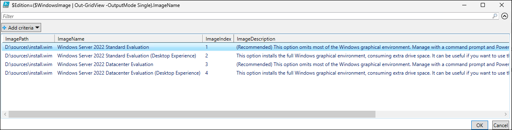

1. When prompted to type the VHD name, type **Win2022Core_G2.vhdx** and press the Enter key.
1. When prompted to type the size of the image in GB, type **30** and press the Enter key.

   > **Note:** Wait for the script to complete. This might take about 5 minutes.

   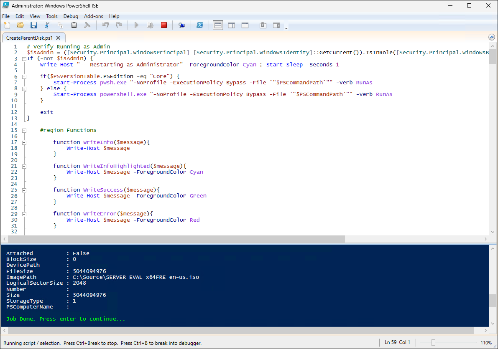

1. From the lab VM, connect to MSLab-Mabs VM by using Virtual Machine Connection (using Enhanced Session and Full Screen Mode).
1. Sign in by using the following credentials:

   - Username: *CORP\LabAdmin*
   - Password: *Demo@pass12345*

   > **Note:**: You'll be running the remaining tasks in this lab from the MSLab-Mabs VM.

1. Switch back to the lab VM, open File Explorer, navigate to the `C:\Source` folder, and copy the file `Win2022Core_G2.vhdx`.
1. Switch to the Virtual Machine Connection to MSLab-Mabs VM, open File Explorer, navigate to the `C:\Source` folder, and paste the file `Win2022Core_G2.vhdx` to the `C:\Source` folder.

   > **Note:**: Wait for the copy to complete. This might take about 10 minutes.

### Task 02: Create the VMFleet OS disk

1. In the Virtual Machine Connection to MSLab-Mabs VM, launch Microsoft Edge and download the [CreateVMFleetDisk.ps1](https://github.com/microsoft/MSLab/blob/master/Tools/CreateVMFleetDisk.ps1) script and copy it to the `C:\Source` folder.
1. In the Virtual Machine Connection to MSLab-Mabs VM, launch Windows PowerShell ISE, open `C:\Source\CreateVMFleetDisk.ps1` and run it. 
1. When prompted, navigate to the `C:\Source\Win2022Core_G2.vhdx` file and select **Open**.
1. When prompted to provide the password that will be asisgned to the local built-in Administrator account, type **Demo@pass12345** and press the Enter key. 

   > **Note:**: Wait for the VMFleet OS disk to be created. This might take about 3 minutes.

   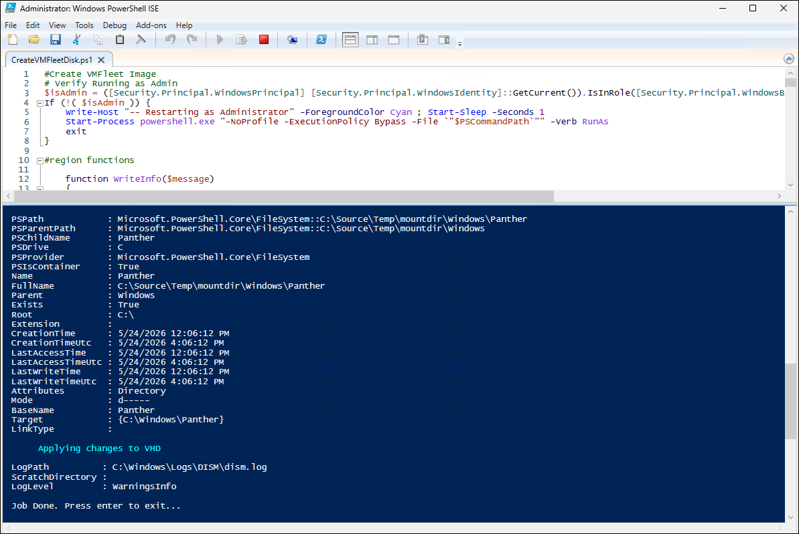

### Task 03: Configure VMFleet prerequsites

1. In the Virtual Machine Connection to MSLab-Mabs VM, in Windows PowerShell ISE, run the following code to install the required PowerShell modules:

   ```powershell
   Install-PackageProvider -Name NuGet -MinimumVersion 2.8.5.201 -Force
   Install-Module -Name VMFleet -Force
   Install-Module -Name PrivateCloud.DiagnosticInfo -Force 
   ```

1. From Windows PowerShell ISE, run the following code to create volumes for VMFleet VMs:

   > **Note:**: In the name of the cluster, replace the `<xx>` placeholder with the numeric values assigned to the name of the Entra ID user account you are using in this lab. For example, if your user name is `aluser01`, use `01`. 

   ```powershell
   $ClusterName="ALClus<xx>"
   $Nodes=(Get-ClusterNode -Cluster $ClusterName).Name
   $VolumeSize=256GB
   $StoragePool=Get-StoragePool -CimSession $ClusterName | Where-Object OtherUsageDescription -eq "Reserved for S2D"

   #Create Volumes for VMs (thin provisioned)
   Foreach ($Node in $Nodes){
       if (-not (Get-Virtualdisk -CimSession $ClusterName -FriendlyName $Node -ErrorAction Ignore)){
           New-Volume -CimSession $Node -StoragePool $StoragePool -FileSystem CSVFS_ReFS -FriendlyName $Node -Size $VolumeSize -ProvisioningType Thin
       }
   }

   #Create Collect volume (thin provisioned)
   if (-not (Get-Virtualdisk -CimSession $ClusterName -FriendlyName Collect -ErrorAction Ignore)){
       New-Volume -CimSession $CLusterName -StoragePool $StoragePool -FileSystem CSVFS_ReFS -FriendlyName Collect -Size 100GB -ProvisioningType Thin
   }
   ```

   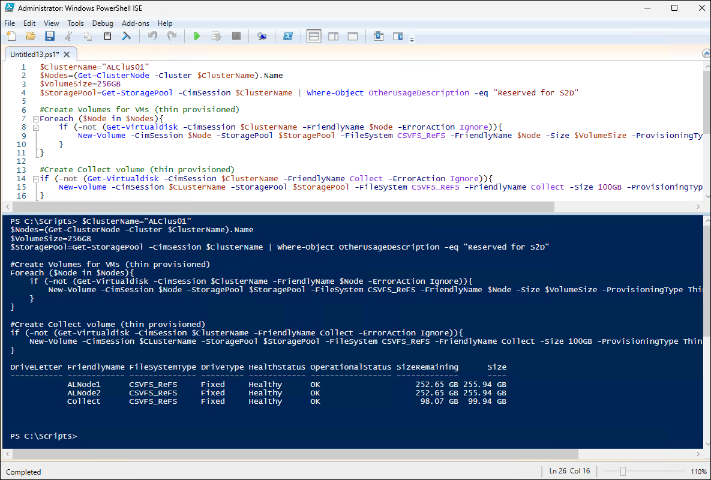

   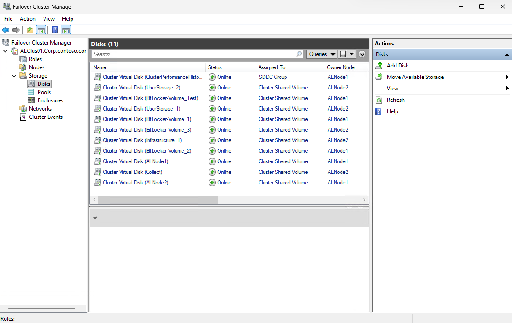

1. From Windows PowerShell ISE, run the following code to copy the VMFleet VHDX file into the cluster's Collect volume and distribute the VMFleet PowerShell module to all cluster nodes for later use:

   ```powershell
   #Prompt for VHDX location
   Write-Output "Select VHD created using CreateVMFleetDisk.ps1"
   [reflection.assembly]::loadwithpartialname("System.Windows.Forms")
   $openFile = New-Object System.Windows.Forms.OpenFileDialog -Property @{
      Title="Select VHD created using CreateVMFleetDisk.ps1"
   }
   $openFile.Filter = "vhdx files (*.vhdx)|*.vhdx|All files (*.*)|*.*" 
   If($openFile.ShowDialog() -eq "OK"){
      Write-Output "File $($openfile.FileName) selected"
   }
   $VHDPath=$openfile.FileName

   #Copy VHD to collect folder
   Copy-Item -Path $VHDPath -Destination \\$ClusterName\ClusterStorage$\Collect\

   #Copy VMFleet PowerShell modules to cluster nodes
   $Sessions=New-PSSession -ComputerName $Nodes
   Foreach ($Session in $Sessions){
      Copy-Item -Recurse -Path "C:\Program Files\WindowsPowerShell\Modules\VMFleet" -Destination "C:\Program Files\WindowsPowerShell\Modules\" -ToSession $Session -Force
   }
   ```
1. When prompted, navigate to the `C:\Source` folder, select **FleetImage.vhdx**, and then select **Open**.

   > **Note:**: Wait for the code execution to complete. This might take about 2 minutes.

   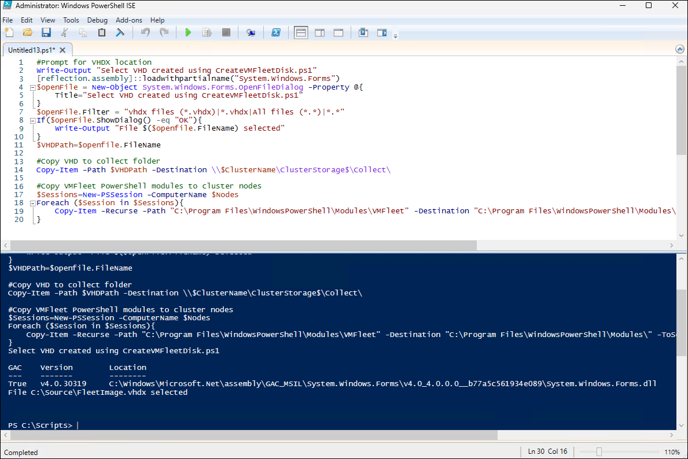

### Task 04: Deploy VMFleet and measure performance

1. From Windows PowerShell ISE, run the following code to set the variables used for VMFleet deployment:

   ```powershell
   #generate variables
   #generate VHD Name from path (path was created when you were asked for VHD)
   $VHDName=$VHDPath | Split-Path -Leaf

   #domain account credentials
   $AdminUsername="CORP\LabAdmin"
   $AdminPassword="Demo@pass12345"
   $securedpassword = ConvertTo-SecureString $AdminPassword -AsPlainText -Force
   $Credentials = New-Object System.Management.Automation.PSCredential ($AdminUsername, $securedpassword)
   #Or simply ask for credentials
   #$Credentials=Get-Credential
   #credentials for local admin located in FleetImage VHD
   $VHDAdminPassword="Demo@pass12345" 
   ```

1. From Windows PowerShell ISE, run the following code to enable CredSSP and install VMFleet

   > **Note:**: CredSSP has to be enabled because the cmdlet to install VMFleet (`Install-Fleet`) has to be invoked on one of the nodes, as per [https://github.com/microsoft/diskspd/issues/172](https://github.com/microsoft/diskspd/issues/172).

   > **Note:**: Installing VMFLeet will create folder structure (including the DiskSpd utility and associated scripts) in the CSV *Collect* volume created earlier in this lab.

   ```powershell
   #Enable CredSSP
   # Temporarily enable CredSSP delegation to avoid double-hop issue
   foreach ($Node in $Nodes){
       Enable-WSManCredSSP -Role "Client" -DelegateComputer $Node -Force
   }
   Invoke-Command -ComputerName $Nodes -ScriptBlock { Enable-WSManCredSSP Server -Force }

   #
   Invoke-Command -ComputerName $Nodes[0] -Credential $Credentials -Authentication Credssp -ScriptBlock {
       Install-Fleet
   }
   ```

1. From Windows PowerShell ISE, run the following code to deploy new VMFleet environment and disable CredSSP:

   > **Note:**: This step will create VMs. By default, their number would match the number of CPU cores on cluster nodes. In the lab environment, you will limit that number to 2. 

   ```powershell
   # Deploy VMFleet

   # By default, the number of deployed VMs would match the number of cores in failover cluster.
   <# 
   Invoke-Command -ComputerName $Nodes[0] -Credential $Credentials -Authentication Credssp -ScriptBlock {
      New-Fleet -BaseVHD "c:\ClusterStorage\Collect\$using:VHDName" -AdminPass $using:VHDAdminPassword -Admin Administrator -ConnectUser $using:AdminUsername -ConnectPass $using:AdminPassword
   }
   #>
 
   $VMCount = 2
   Invoke-Command -ComputerName $Nodes[0] -Credential $Credentials -Authentication Credssp -ScriptBlock {
      New-Fleet -VMs $using:VMCount -BaseVHD "c:\ClusterStorage\Collect\$using:VHDName" -AdminPass $using:VHDAdminPassword -Admin Administrator -ConnectUser $using:AdminUsername -ConnectPass $using:AdminPassword
   }
   ```

   > **Note:**: Wait for the code execution to complete. This might take about 20 minutes.

   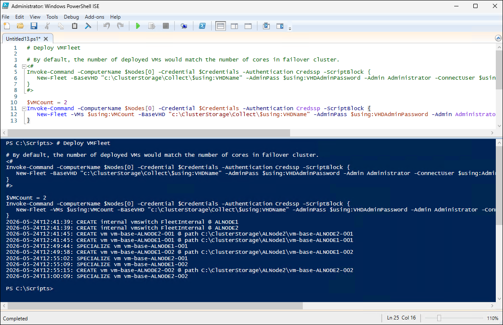
   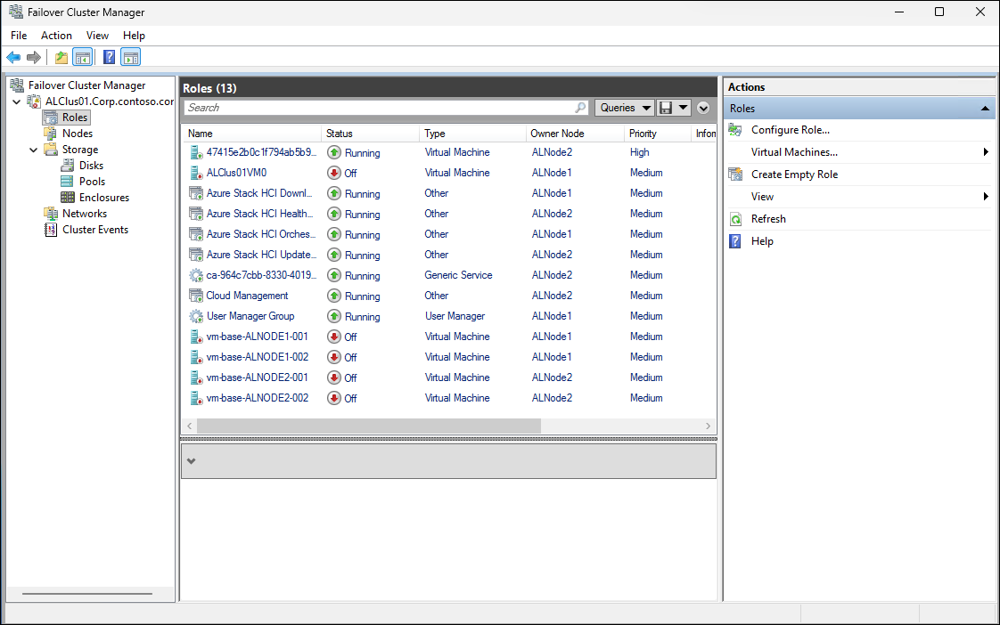

1. From Windows PowerShell ISE, run the following code to copy the `PrivateCloud.DiagnosticInfo` PowerShell module to the cluster nodes:

   ```powershell
   $Sessions=New-PSSession $Nodes
   foreach ($Session in $Sessions){
       Copy-Item -Path 'C:\Program Files\WindowsPowerShell\Modules\PrivateCloud.DiagnosticInfo' -Destination 'C:\Program Files\WindowsPowerShell\Modules\' -ToSession $Session -Recurse -Force
   }
   $Sessions | Remove-PSSession 
   ```

1. From Windows PowerShell ISE, run the following code to start measuring the performance characteristics of the cluster storage:

   ```powershell
   Invoke-Command -ComputerName $Nodes[0] -Credential $Credentials -Authentication Credssp -ScriptBlock {
       Measure-FleetCoreWorkload
   }
   ```

   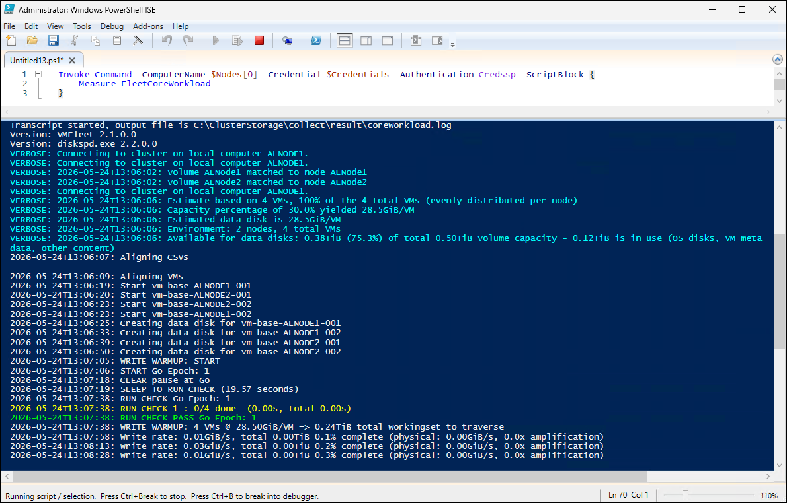

1. You can launch another Windows PowerShell ISE and run the following code to monitor the progress of the `Measure-FleetCoreWorkload` cmdlet by using the `Watch-FleetCluster`-based dashboard:

   > **Note:**: In the name of the cluster, replace the `<xx>` placeholder with the numeric values assigned to the name of the Entra ID user account you are using in this lab. For example, if your user name is `aluser01`, use `01`. 

   ```powershell
   Watch-FleetCluster -Cluster ALClus`<xx>` -Sets *
   ```

   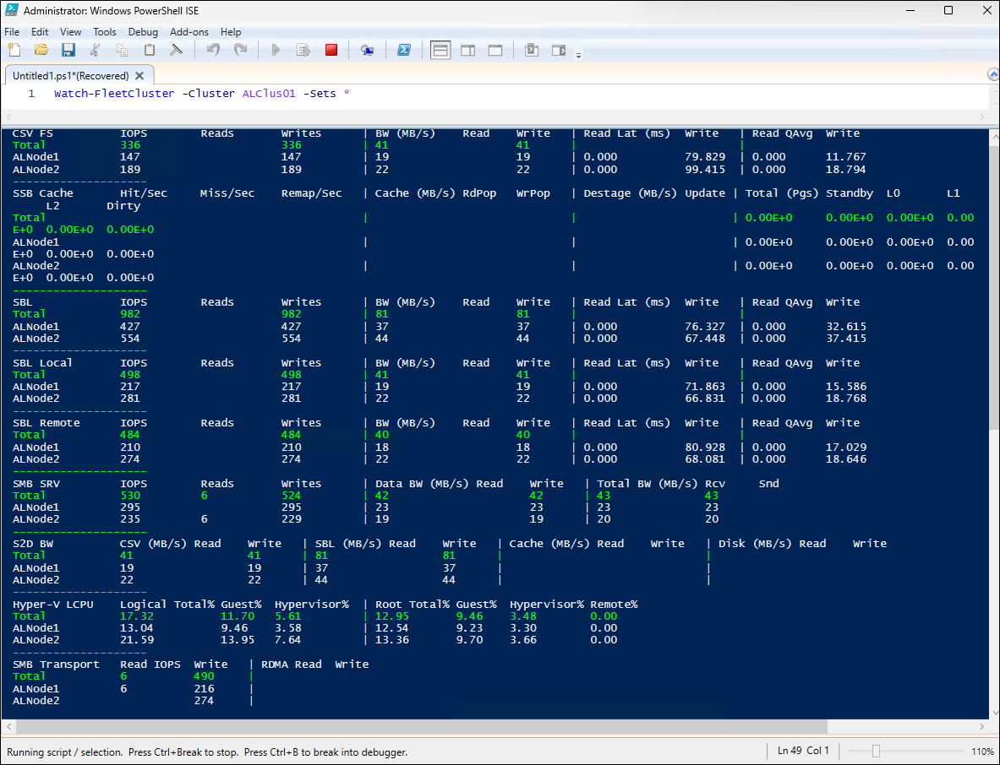

   > **Note:**: Code execution (`Measure-FleetCoreWorkload`) takes several hours to complete. Unfortunately that would extend beyond the time allocated to this lab. For review of its functionality, refer to [VMFleet 2.0 - Quick Start Guide](https://techcommunity.microsoft.com/blog/azurestackblog/vmfleet-2-0---quick-start-guide/2824778) and [VMFleet's predefined workload profiles](https://techcommunity.microsoft.com/blog/azurestackblog/vmfleets-predefined-workload-profiles/2804130).

   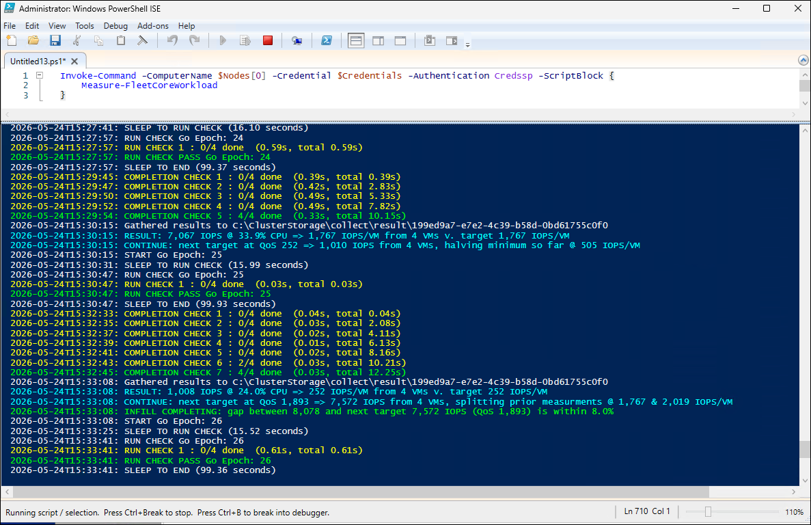

   > **Note:**: Once the code execution completes, the resulting TSV file will be stored in `\\ALClus<xx>\ClusterStorage$\Collect\result\result.tsv` (where the `<xx>` placeholder designates the numeric values assigned to the name of the Entra ID user account you are using in this lab). To explore performance results, you can copy result.tsv to any computer which has Microsoft Excel installed and using it to open the file.

   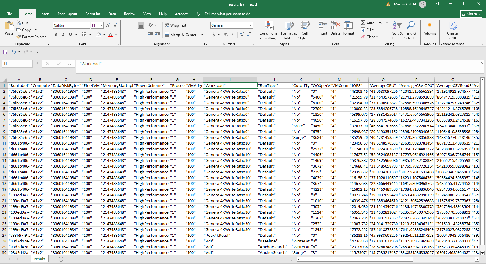

   > **Note:**: Based on the sample results, the VMFleet results reflect the test environment using four A1v2 virtual machines across a variety of workloads, including read-only (General4KWriteRatio0), mixed read/write workloads (General4KWriteRatio10 and General4KWriteRatio30), Peak4kRead, and VDI scenarios. The data indicates that the storage subsystem was (not suprisingly, given the underlying architecture of our lab environment) the primary limiting factor throughout the testing rather than CPU resources.

   - For read-only workloads, the environment achieved its highest performance at approximately 43,000 IOPS with about 177 MB/s of read throughput. Average read latency remained below 3 milliseconds during the best-performing runs, while 99th-percentile latency stayed near 10 milliseconds. Several additional read-only runs delivered between 32,000 and 37,000 IOPS with similar latency, demonstrating consistency under predominantly read-intensive conditions.

   - The Peak4kRead workload produced results that closely matched the read-only General4KWriteRatio0 tests. Peak performance reached roughly 36,000 IOPS with approximately 148 MB/s of throughput. Average latency was around 3.4 milliseconds, while 99th-percentile latency remained below 13 milliseconds. This confirms that random 4 KB reads are handled with in the manner similar to General4KWriteRatio0.

   - Performance declined as write activity increased. In the 10% write workload, the highest observed throughput was about 23,500 IOPS. Average read latency increased to approximately 4.4 milliseconds, while average write latency exceeded 12 milliseconds. Although throughput remained relatively unchanged, the introduction of writes clearly increased storage response times.

   - The impact became much more significant in the 30% write workload. Maximum throughput dropped to approximately 8,100 IOPS, while average read latency increased to nearly 8 milliseconds and average write latency reached about 34 milliseconds. The 99th-percentile read latency rose to nearly 47 milliseconds, indicating that the storage subsystem experienced substantial contention under heavier write pressure.

   - Latency trends reveal that the system performs well when operating below saturation. Lower-QoS runs maintained average read latencies between approximately 1.3 and 1.6 milliseconds regardless of workload type. As throughput increased, latency rose gradually for read-only workloads but increased much more sharply for write-intensive workloads. This behavior is typical of storage systems approaching their performance limits.

   - CPU utilization remained moderate throughout all tests. The highest observed CPU usage was slightly above 52%, with most runs remaining in the 40–50% range. Since CPU resources were never fully utilized, there is little evidence that compute capacity constrained performance. Instead, the results point to storage I/O as the dominant bottleneck.

   - The QoS-controlled tests behaved as expected. As the configured QoS per VM increased, total IOPS scaled almost linearly across the four VMs. For example, a QoS setting of 675 IOPS per VM produced approximately 2,700 total IOPS, while a setting of 5,400 IOPS per VM produced approximately 21,600 total IOPS. This indicates that VMFleet's QoS controls were functioning correctly and that the test environment was configured properly.

   - Overall, the environment appears capable of sustaining approximately 40,000 random 4 KB read IOPS, around 23,000 IOPS for a 90/10 read/write mix, and roughly 8,000 IOPS for a 70/30 read/write mix. The storage platform delivers low latency under light and moderate loads but exhibits increasingly higher latency as write intensity grows. The results suggest a storage-limited environment with acceptable read scalability but significantly reduced efficiency under heavier write workloads.

### Task 05: Perform cleanup

1. From Windows PowerShell ISE, run the following code to set variables required to perform the cleanup:

   > **Note:**: The `Remove-VMFleet` cmdlete will remove all of the VMFleet VMs from cluster along with the corresponding VMFleet virtual switch.

   > **Note:**: In the name of the cluster, replace the `<xx>` placeholder with the numeric values assigned to the name of the Entra ID user account you are using in this lab. For example, if your user name is `aluser01`, use `01`. 

   ```powershell
   #generate variables
   #generate VHD Name from path (path was created when you were asked for VHD)
   $ClusterName="ALClus<xx>"
   $Nodes=(Get-ClusterNode -Cluster $ClusterName).Name

   #domain account credentials
   $AdminUsername="CORP\LabAdmin"
   $AdminPassword="Demo@pass12345"
   $securedpassword = ConvertTo-SecureString $AdminPassword -AsPlainText -Force
   $Credentials = New-Object System.Management.Automation.PSCredential ($AdminUsername, $securedpassword)

   #Temporarily enable CredSSP delegation to avoid double-hop issue
   foreach ($Node in $Nodes){
      Enable-WSManCredSSP -Role "Client" -DelegateComputer $Node -Force
   }
   Invoke-Command -ComputerName $Nodes -ScriptBlock { Enable-WSManCredSSP Server -Force }

   #Remove VMFleet
   Invoke-Command -ComputerName $Nodes[0] -Credential $Credentials -Authentication Credssp -ScriptBlock {
      Remove-Fleet
   }

   #Disable CredSSP
   Disable-WSManCredSSP -Role Client
   Invoke-Command -ComputerName $nodes -ScriptBlock { Disable-WSManCredSSP Server }
   ```

1. From Windows PowerShell ISE, run the following code to delete previously created volumes:

   ```powershell
   foreach ($Node in $Nodes){
       Remove-VirtualDisk -FriendlyName $Node -CimSession $ClusterName -Confirm:0
   }
   Remove-VirtualDisk -FriendlyName Collect -CimSession $ClusterName -Confirm:0 
   ```
